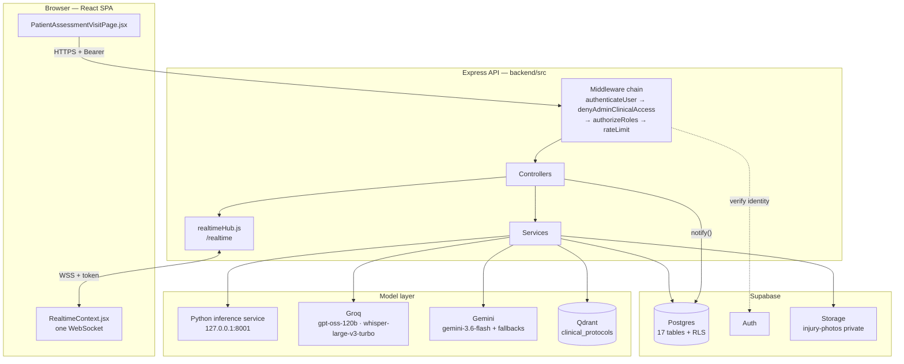
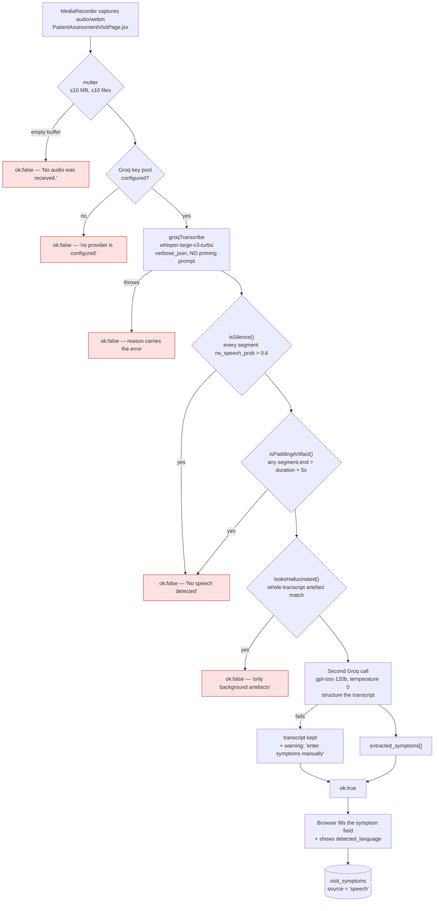
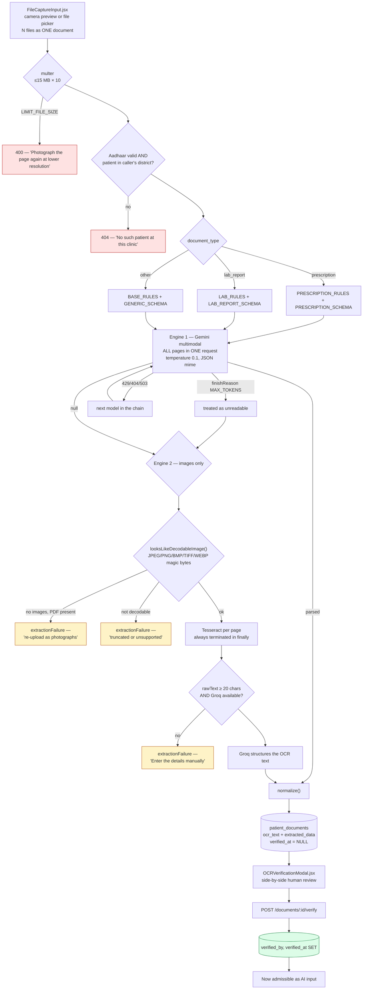
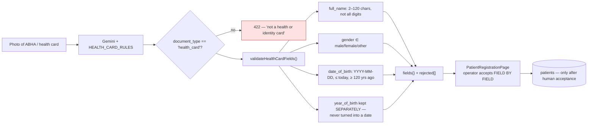
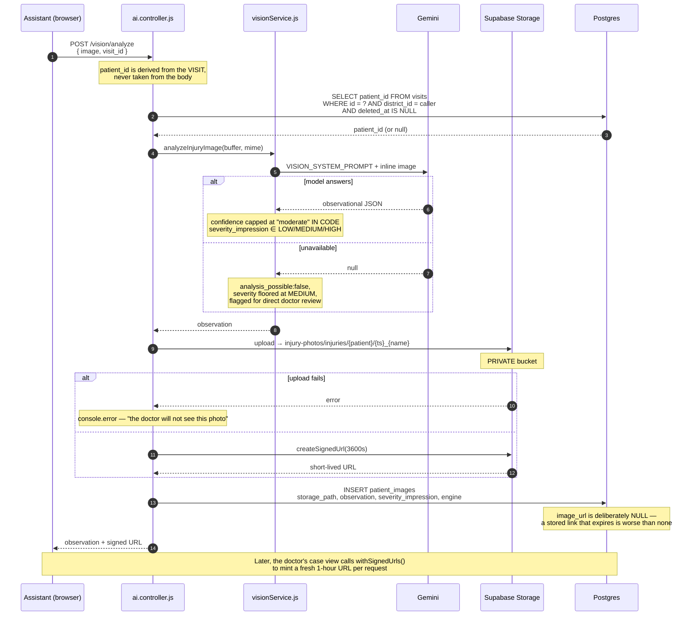
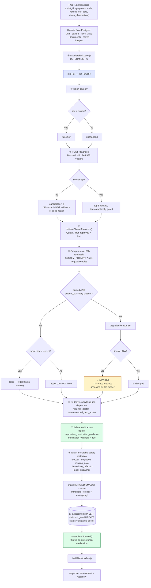
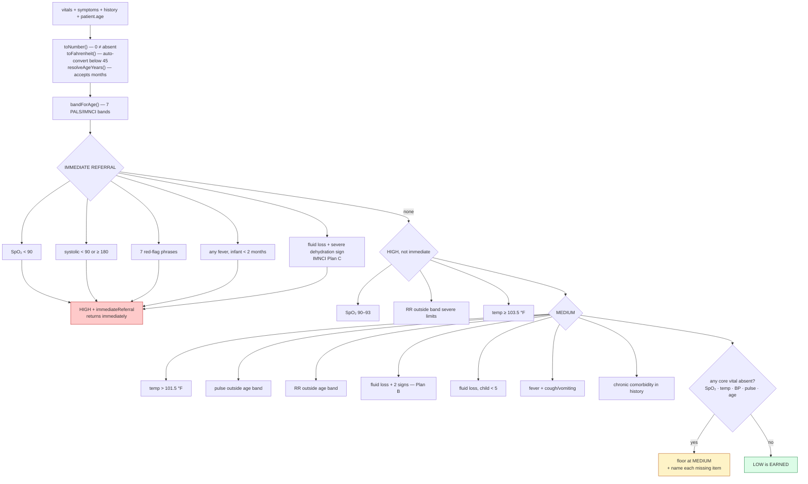
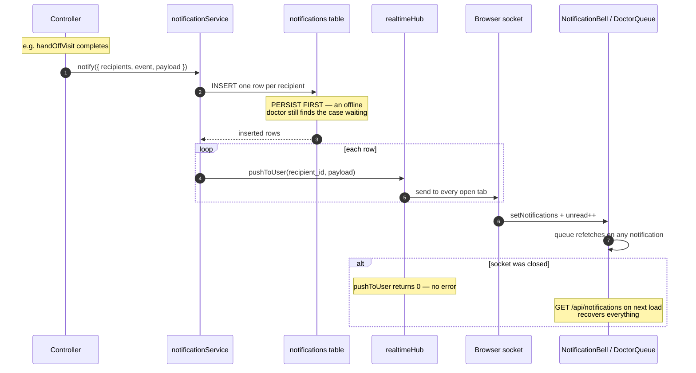
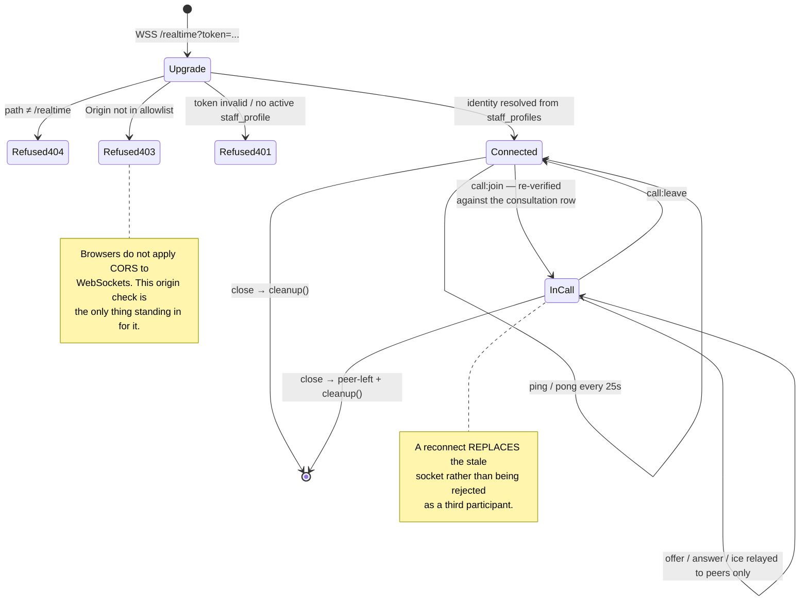
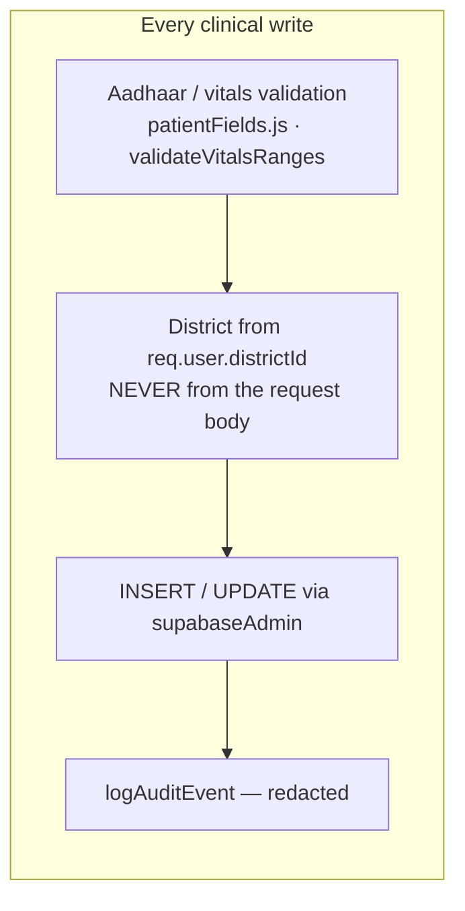

# 03 — Data Flow

> **Navigation:** [Index](README.md) · Previous: [02 — Dependencies](02-dependencies.md) · Next: [04 — Workflow](04-workflow.md)

How data moves from the health worker's input, through validation and storage,
into the AI pipeline, to the doctor, and back. Five paths are traced separately
because they have genuinely different failure modes: **speech**, **OCR**,
**image**, **triage**, and **realtime notification**.

---

## 1. System-level flow



Two rules hold across every path:

1. **Persist, then push.** Every notification is written to `notifications`
   before it is sent over the socket, so a doctor whose laptop was asleep still
   sees what happened.
2. **Fail visibly, never plausibly.** Every model call has a defined failure
   value, and none of them is a substitute for real data.

---

## 2. The speech path

`POST /api/voice/transcribe` → `ai.controller.js` `transcribeSpeech` →
`speechService.js` `transcribeAndExtractSymptoms`



**Every red terminal returns an empty `transcript` and an empty
`extracted_symptoms`.** The browser leaves the symptom field untouched and shows
the reason instead (`PatientAssessmentVisitPage.jsx:159–172`).

### Why three independent rejection gates

`no_speech_prob` alone is not usable. On one second of pure digital silence
Whisper returned *"Thank you."* with `no_speech_prob: 0` — fully confident in
speech that does not exist. The structural detector catches what the probability
misses: Whisper pads short audio to a 30-second window, and when it hallucinates
it labels the whole padded window rather than the real audio. Genuine
one-second speech produces a segment ending at about one second.

The structuring step is explicitly forbidden from adding anything: *"Extract ONLY
symptoms explicitly stated in the transcript… If the transcript mentions no
symptom, return an empty array. An empty array is a correct answer."*

### What this prevents

An earlier version substituted a fixed Hindi sentence describing fever, dry
cough and body pain when transcription produced nothing, and defaulted
`extracted_symptoms` to the same three. *Fever + cough* is a MEDIUM-tier rule in
`riskEngine.js`, so a silent or failed recording produced a triaged case
describing a patient who did not exist. A doctor cannot tell an invented symptom
from a real one.

---

## 3. The OCR path

`POST /api/documents/upload` → `document.controller.js` `uploadDocument` →
`ocrService.js` `processMedicalDocument`



### The four things this path does that a naive OCR integration would not

**Pages travel together.** One upload may be several files, sent in a single
model call so cross-page context survives. Splitting them loses the header on
page 1 and the reference ranges on page 3 — the things that make a lab report
readable.

**Two schemas, not one.** A prescription carries medicines, strengths,
frequencies and durations; a lab report carries panels, values, units, reference
ranges and flags. A single generic schema read neither well. Indian `1-0-1`
frequency notation is preserved as written, not translated.

**Magic-byte screening before Tesseract.** Tesseract.js reports a failed decode
by throwing from its worker thread on a later tick, which escapes every
`try/catch` around the call and killed the whole Node process — one truncated
upload from one assistant took the backend down for every clinic.

**Nothing is invented.** Every failure path returns `needs_manual_entry: true`
with an empty `medications`, empty `panels` and an `extraction_error` string.
Ambiguous handwriting is transcribed with a `(unclear)` marker appended rather
than dropped or guessed.

### Health-card OCR — a separate path that stores nothing

`POST /api/documents/health-card` → `readHealthCard()`



Nothing is persisted by the scan itself. There is no patient record yet, and the
output is a proposal. A rejected field is simply **absent**, and the response
reports which ones were refused — a card whose date of birth failed validation
should say so rather than silently returning three fields when the operator can
see four printed. Most Indian cards print only a year; that is returned as
`year_of_birth` and the form asks the operator for the rest.

---

## 4. The image path

`POST /api/vision/analyze` → `ai.controller.js` `analyzeImageAI` →
`visionService.js` `analyzeInjuryImage`



### Design points

- **The patient is derived from the visit.** An earlier version read `patient_id`
  from the request body, which the screen never sent — so the entire storage
  block was skipped, every time. Deriving it also removes the client's ability to
  attach a photograph to a different patient, and the visit lookup is
  district-scoped so a foreign visit id resolves to nothing.
- **The bucket is private and the row stores a path, not a URL.** A permanent
  link to a clinical photograph of an identifiable patient would be viewable by
  anyone who ever saw it — after the case closes, after the staff member leaves,
  after the link is forwarded. Readers mint a one-hour signed URL
  (`imageAccess.js`).
- **The observation is stored with the file.** It is what the doctor actually
  reads, and re-running the model on an old photo would cost money and could
  return something different.
- **Failures are `console.error`, not `console.warn`.** Both the upload failure
  and the insert failure were previously warnings, which is exactly why they went
  unnoticed for the lifetime of the feature: nothing user-facing broke, the
  screen still showed the analysis, and the doctor simply never saw the
  photograph.
- **Severity can only raise the tier.** In `aiOrchestrator.js` §1,
  `RISK_RANK[sev] > RISK_RANK[finalRiskLevel]` — never the reverse.

---

## 5. The triage path

`POST /api/ai/assess` → `ai.controller.js` `analyzePatientCase` →
`aiOrchestrator.js` `runFullPatientAssessment`

This is the central pipeline. Eight ordered stages; the order **is** the safety
argument.



### The tier combination rule

```
final_tier = MAX(rule_tier, vision_tier, model_tier)
```

Implemented by `higherTier()` in `riskEngine.js` and by explicit `RISK_RANK`
comparisons in `aiOrchestrator.js`. The single most consequential decision in the
system is made by deterministic code, and every probabilistic component can only
push it upward.

Three sub-rules follow from it:

| Rule | Where |
|---|---|
| Missing data escalates — each absent core vital is named and the tier floors at MEDIUM | `riskEngine.js`, missing-data block |
| Degraded AI fails safe to MEDIUM, never LOW | `aiOrchestrator.js` §5 `degradedReason` |
| A reading of `0` is a reading, not an absence | `riskEngine.js` `toNumber()` |

### Inside `calculateRiskLevel()`



### Vocabulary translation at the storage boundary

The rule engine speaks `LOW / MEDIUM / HIGH`. The `risk_level` database enum is
`low / moderate / high / emergency`. **`medium` is not a value the enum accepts**,
and writing it was a silent insert failure for the most common tier there is.
Two translators exist:

- `ai.controller.js` → `RISK_TO_ENUM`, plus `immediate_referral ⇒ 'emergency'`
- `visit.controller.js` → `normaliseRiskTier()`, which accepts either vocabulary
  and returns `null` rather than guessing for anything unrecognised

Eight tests in `backend/tests/visitRiskTier.test.js` assert that it only ever
returns a value the enum accepts.

### The disease-candidate bound

The Python service returns ranked candidates. The prompt gives them to the model
as **evidence to reason over, not as an answer**: the model may re-rank and
reject, but may not introduce a disease outside the list. That bound is what
keeps the final output traceable to 244,938 labelled training rows rather than to
the language model's imagination.

Because the system prompt also forbids naming a definitive diagnosis, the model
never writes the candidates into its prose — which is correct, and would also
mean a doctor could not see what the trained model contributed. So
`disease_candidates` is attached to the response as a **separate, labelled
block**, carrying `confident`, `confidence_note`, `unrecognised_text` and
`excluded_for_demographics`. That separation is the product's core principle
rendered as a data structure.

---

## 6. The realtime notification path

`notificationService.js` `notify()` → `realtimeHub.js` `pushToUser()` →
`RealtimeContext.jsx`



### Socket lifecycle and authentication



**Identity never comes from the query string except as an opaque token.** The
token is verified, then resolved against `staff_profiles`, and the socket's role
is whatever that row says. The original signalling server accepted `role=DOCTOR`
in a URL as sufficient to join a live consultation.

**Membership is re-verified per call.** `isParticipant()` queries the
`consultations` row: the caller must be `doctor_id` or `assistant_id`, and the
consultation must not be `COMPLETED` or `CANCELLED`. A leaked or replayed token
alone does not admit anyone.

### Client resilience

`RealtimeContext.jsx` maintains one socket for the whole app:

- **Exponential backoff** from 1 s to a 15 s ceiling, so a server restart does not
  become a reconnect storm from every open tab.
- **Outbound buffering**, 50 messages, **10-second TTL**. The socket
  authenticates via a database lookup, so it is still opening for a few hundred
  milliseconds after the page starts working; a `call:join` sent into a
  `CONNECTING` socket is silently dropped. The TTL is what keeps the buffer safe
  across a genuine outage — the startup race resolves in well under a second, so
  real messages survive, while stale SDP and ICE are dropped rather than replayed.
- **The scheme is derived from the page**, never from configuration. An HTTPS
  document may not open a `ws://` socket; the browser blocks it as mixed content
  and throws synchronously from the constructor, which — uncaught — would escape
  the effect and take the reconnect loop with it. Only host and path come from
  config.
- **Sign-out clears the outbox**, so the previous user's queued messages are never
  replayed onto the next session's socket.

### The eight notification events

| Event | Fired by | Recipients |
|---|---|---|
| `CONSULTATION_SCHEDULED` | `createConsultation` | doctor + assistant |
| `CONSULTATION_REMINDER` | `consultationSweeper` (~10 min before) | doctor + assistant |
| `CONSULTATION_STARTED` | `joinConsultation` / `createInstantConsultation` | doctor + assistant |
| `CONSULTATION_CANCELLED` | `cancelConsultation`, and `sweepMissed` with `status: MISSED` | doctor + assistant |
| `CONSULTATION_COMPLETED` | `endConsultation` | doctor + assistant |
| `CONSULTATION_FAILED` | `joinConsultation` when the video provider fails | doctor + assistant |
| `CASE_ASSIGNED` | `handOffVisit` | the named doctor |
| `DOCTOR_REVIEW_COMPLETED` | `recordDoctorReview` | the assistant who opened the visit |

The last two carry no consultation, so `consultation_id` is `NULL` — which the
column already allows.

---

## 7. The write path and its invariants



| Invariant | Enforced by |
|---|---|
| Tenancy comes from the caller's profile, never the request | `createPatient`, `createVisit`, `uploadDocument`, `analyzeImageAI` all read `req.user.districtId` |
| Vitals are range-checked before they reach the rule engine | `validateVitalsRanges` — a transposed digit produces a physiologically impossible value, and the triage rules would treat it as a genuine red flag |
| Diastolic must be lower than systolic | Cross-field check in the same function |
| Clinical records are append-only | Only soft delete exists (`visits.deleted_at`), guarded four ways |
| The primary key never changes | `updatePatient` strips `aadhaar_number` from the patch — a wrong Aadhaar means a new record, not an edited one, or the visit history follows the wrong person |
| An audit failure never breaks the request it records | `logAuditEvent` catches everything |
| Aadhaar travels in request bodies, never in a URL | `POST /patients/lookup`, `POST /patients/detail` — URLs reach access logs, proxy logs and browser history |
