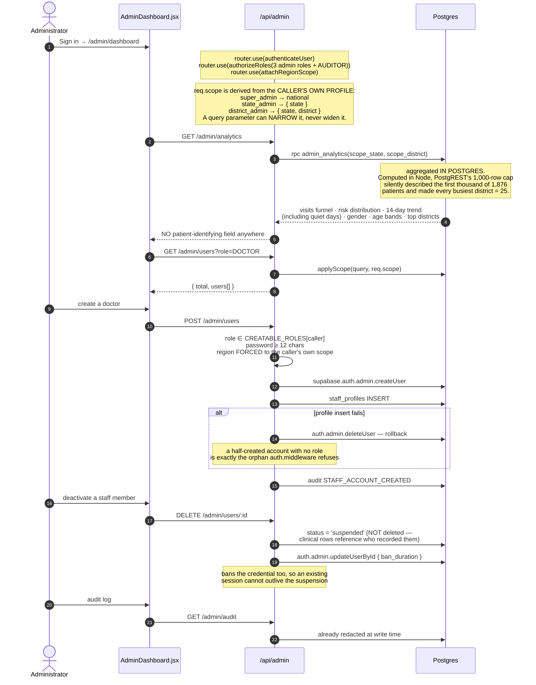
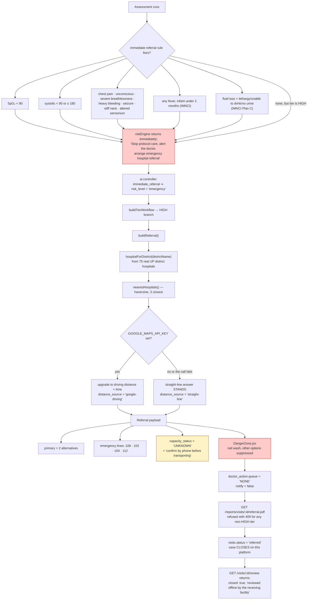
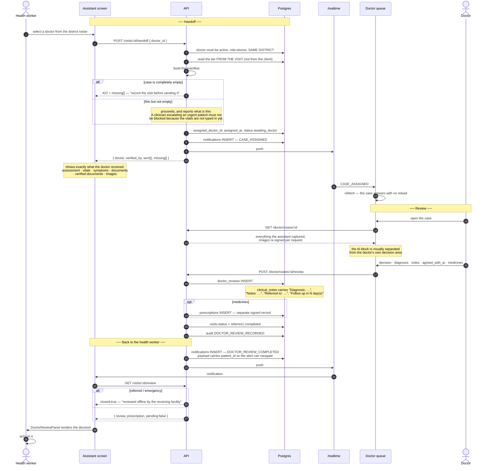
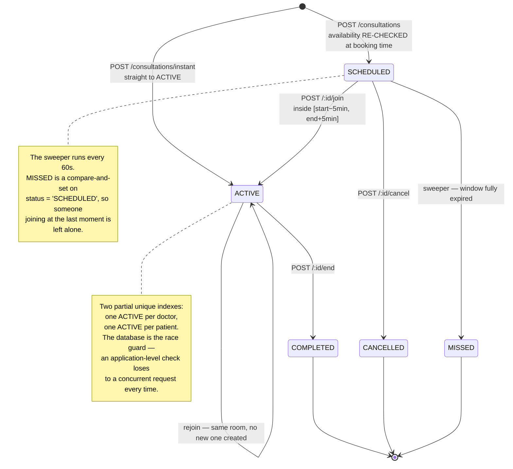
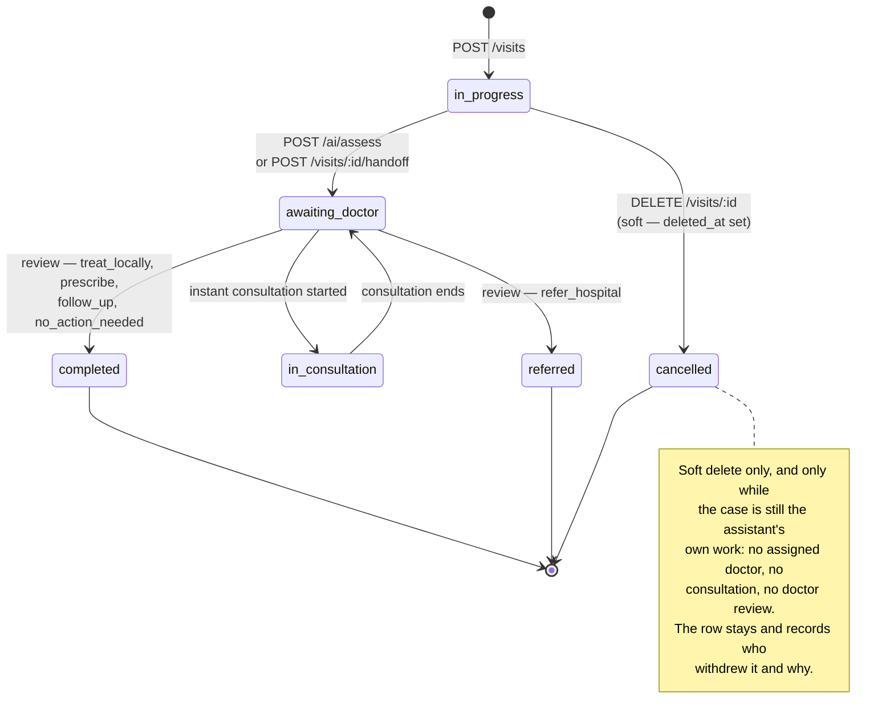

# 04 — Workflow

> **Navigation:** [Index](README.md) · Previous: [03 — Data Flow](03-data-flow.md) · Next: [05 — Directory Structure](05-directory-structure.md)

The end-to-end clinical journey, then each role's journey as its own sequence,
then the two branches that matter most: the emergency/referral path and the
doctor review-and-approval loop.

---

## 1. The end-to-end clinical journey

```mermaid
flowchart TD
    START(["Patient arrives at the village sub-centre"]) --> ID{"Has documents?"}

    ID -->|no, and urgent| URG["POST /patients/urgent<br/>Guest ID beginning '1'<br/>estimated age REQUIRED"]
    ID -->|yes| LOOK["POST /patients/lookup<br/>by Aadhaar"]
    LOOK -->|found| VISIT
    LOOK -->|not found| REG["PatientRegistrationPage<br/>6 fields · optional health-card scan"]
    REG --> POSTP["POST /patients"]
    POSTP --> VISIT
    URG --> VISIT

    VISIT["POST /visits — created lazily<br/>on first document upload or assessment"] --> CAPTURE

    subgraph CAPTURE["Capture — PatientAssessmentVisitPage.jsx, 4 tabs"]
        direction LR
        T1["Symptoms<br/>typed or spoken<br/>+ duration value/unit<br/>+ history + allergies"]
        T2["Vitals<br/>7 fields, range-checked<br/>confirmed-field tracking"]
        T3["Documents<br/>prescription · lab report<br/>· wound photos"]
        T4["Assessment"]
    end

    CAPTURE --> VERIFY{"any document uploaded?"}
    VERIFY -->|yes| OCRV["OCRVerificationModal<br/>MANDATORY human confirmation<br/>POST /documents/:id/verify"]
    VERIFY -->|no| ASSESS
    OCRV --> ASSESS

    ASSESS["POST /ai/assess<br/>rule engine → vision → classifier<br/>→ RAG → LLM → tier"] --> TIER{"final tier"}

    TIER -->|LOW| LOW["Complete plan issued<br/>first aid · precautions · diet<br/>NO medication shown<br/>daily doctor review"]
    TIER -->|MEDIUM| MED["Video consultation required<br/>before any treatment<br/>speciality-routed"]
    TIER -->|HIGH| HIGH["DANGER ZONE<br/>nearest district hospital<br/>108 / 102 / 104 / 112<br/>printable referral"]

    LOW --> HAND["POST /visits/:id/handoff<br/>select a district doctor<br/>returns a MANIFEST"]
    MED --> SCHED["ScheduleConsultationModal<br/>instant or scheduled"]
    SCHED --> CALL["/call/:id — P2P WebRTC"]
    CALL --> HAND

    HIGH --> REFER["Referral PDF<br/>case CLOSES on this platform<br/>reviewed offline by the facility"]
    REFER --> END2(["Patient transported"])

    HAND --> QUEUE["Doctor queue<br/>worst-first, day-wise"]
    QUEUE --> REVIEW["DoctorCaseViewPage<br/>full evidence: vitals, symptoms,<br/>documents, wound photos,<br/>AI assessment, disease candidates"]
    REVIEW --> DEC["POST /doctor/cases/:id/review<br/>decision + MANDATORY diagnosis"]
    DEC --> RX{"decision"}
    RX -->|prescribe| SIGN["prescriptions row<br/>RX code, itemised, signed_at"]
    RX -->|refer_hospital| REF2["status = referred"]
    RX -->|treat_locally / follow_up /<br/>no_action_needed| COMP["status = completed"]
    SIGN --> COMP

    COMP --> NOTIF["DOCTOR_REVIEW_COMPLETED<br/>→ the assistant who opened the visit"]
    REF2 --> NOTIF
    NOTIF --> BACK["DoctorReviewPanel on the assistant's screen<br/>GET /visits/:id/review"]
    BACK --> END(["Patient receives the doctor's decision"])

    style HIGH fill:#fecaca,stroke:#b91c1c
    style REFER fill:#fecaca,stroke:#b91c1c
    style OCRV fill:#dbeafe,stroke:#1d4ed8
    style DEC fill:#dcfce7,stroke:#15803d
```



### The visit is created lazily

`ensureVisit()` in `PatientAssessmentVisitPage.jsx` creates the `visits` row the
first time it is actually needed — a document upload or an assessment — carrying
the real complaint and vitals rather than an empty shell. Opening the screen does
not create a record.

---

## 2. Health worker (`CLINIC_ASSISTANT`)

The only role that touches a patient. Everything below is district-scoped by the
server, never by the UI.

```mermaid
sequenceDiagram
    autonumber
    actor HW as Health worker
    participant UI as React SPA
    participant API as Express API
    participant AI as Model layer
    participant DB as Postgres

    HW->>UI: Sign in
    UI->>API: POST /auth/login
    API-->>UI: token + user{ role, districtId, home }
    UI->>UI: navigate to /assistant/dashboard

    Note over UI: Recency stack — 8 most recent patients.<br/>The same patient is often seen twice in a week;<br/>making the worker search for someone they<br/>saw an hour ago is the wrong default.

    alt Returning patient
        HW->>UI: type Aadhaar
        UI->>API: POST /patients/lookup
        API->>DB: WHERE aadhaar = ? AND clinic_district_id = caller
        API-->>UI: patient (or 404)
    else New patient
        HW->>UI: optional — photograph the health card
        UI->>API: POST /documents/health-card
        API->>AI: Gemini + HEALTH_CARD_RULES
        API-->>UI: fields{} + rejected[] + confidence
        Note over HW: accepts FIELD BY FIELD — nothing auto-fills
        HW->>UI: complete the 6 fields
        UI->>API: POST /patients
        API->>DB: INSERT (district from the caller's profile)
    else Emergency, no documents
        HW->>UI: gender + estimated age
        UI->>API: POST /patients/urgent
        API->>DB: guest Aadhaar '1…', identity fields NULL
        API-->>UI: next: /assistant/assessment/{id}
    end

    HW->>UI: open the assessment screen

    rect rgb(240,247,255)
    Note over HW,DB: Tab 1 — Symptoms
    HW->>UI: hold to record, speaks in Hindi
    UI->>API: POST /voice/transcribe
    API->>AI: Whisper + 3 rejection gates
    alt intelligible
        API-->>UI: transcript + detected_language
    else silence / artefact
        API-->>UI: ok:false + reason — field left UNTOUCHED
    end
    HW->>UI: duration value + unit, history, allergies
    end

    rect rgb(255,251,240)
    Note over HW,DB: Tab 2 — Vitals
    HW->>UI: adjust from typical adult defaults
    Note over UI: confirmedVitals tracks which fields<br/>were actually touched; the screen warns<br/>before assessing on defaults alone
    end

    rect rgb(245,243,255)
    Note over HW,DB: Tab 3 — Documents
    HW->>UI: camera preview, shoot page after page
    UI->>API: POST /documents/upload (all pages, ONE request)
    API->>AI: Gemini multimodal → Tesseract+Groq fallback
    API->>DB: patient_documents, verified_at NULL
    API-->>UI: extraction + raw OCR
    HW->>UI: OCRVerificationModal — corrects side by side
    UI->>API: POST /documents/:id/verify
    API->>DB: verified_by, verified_at SET

    HW->>UI: photograph the injury
    UI->>API: POST /vision/analyze (one photo per call)
    API->>AI: Gemini vision
    API->>DB: private upload + patient_images row
    end

    rect rgb(240,253,244)
    Note over HW,DB: Tab 4 — Assessment
    HW->>UI: Run assessment
    UI->>API: POST /ai/assess
    API->>AI: rules → vision → classifier → RAG → LLM
    API->>DB: ai_assessments; visits.risk_level, status
    API-->>UI: assessment + tier workflow
    Note over UI: TierResult renders one of three<br/>genuinely different screens
    end

    alt LOW or MEDIUM
        HW->>UI: pick a doctor (DoctorSelectGrid)
        UI->>API: POST /visits/:id/handoff
        API->>DB: assigned_doctor_id, status awaiting_doctor
        API-->>UI: manifest — what the doctor will receive
        API->>API: CASE_ASSIGNED notification
    else HIGH
        Note over UI: DangerZone. Nearest hospital,<br/>emergency lines, referral PDF.<br/>Nothing is queued to a doctor.
    end

    Note over HW,DB: Later — DOCTOR_REVIEW_COMPLETED arrives
    UI->>API: GET /visits/:id/review
    API-->>UI: decision, diagnosis, prescription
    HW->>HW: acts on the doctor's decision
```

### What the health worker is refused

| Action | Response | Why |
|---|---|---|
| See a patient from another district | 404 "No such patient at this clinic" | `clinic_district_id` filter on every read |
| Review a case or record a decision | 403 | `DOCTOR_ONLY` on `/doctor/queue`, `/doctor/cases/*` |
| Issue a prescription | 403 + RLS `prescriptions_insert_by_doctor` | Only the signing doctor, only for their own case |
| See **any** medication suggestion | Absent by construction | `tierWorkflowService.js` `medicationFor()` returns `emitted: false` at every tier |
| Withdraw a case a doctor has touched | 409, naming which guard applied | Assigned doctor, consultation, or existing review |
| Create a staff account | 403 | `/admin/users` requires an admin role |
| Change a visit's risk tier by hand | Server reads the stored tier | `handOffVisit` ignores any client-supplied tier |

---

## 3. Doctor (`DOCTOR`)

```mermaid
sequenceDiagram
    autonumber
    actor DR as Doctor
    participant UI as React SPA
    participant API as Express API
    participant WS as /realtime
    participant DB as Postgres

    DR->>UI: Sign in → /doctor/queue
    UI->>WS: open socket with the bearer token
    WS->>DB: verify token → staff_profiles (active)
    WS-->>UI: connected { role, name }

    UI->>API: GET /doctor/queue?date=today (IST)
    API->>DB: WHERE assigned_doctor_id = me AND visit_date = ?<br/>AND status NOT IN (completed, cancelled, referred)
    Note over API: sorted emergency → high → moderate → low,<br/>then oldest first. Postgres would sort the enum<br/>in declaration order, which is the wrong direction.
    API-->>UI: { date, is_past, read_only, total, counts, cases }

    UI->>API: GET /doctor/queue/dates
    Note over API: EXACTLY the same filter as the queue —<br/>when these disagreed, the picker advertised<br/>"Aug 26: 1" and then showed an empty list

    WS-->>UI: CASE_ASSIGNED
    UI->>UI: refetch the queue — the case appears with no reload

    DR->>UI: open a case
    UI->>API: GET /doctor/cases/:id
    Note over API: ownership is checked INSIDE the query,<br/>so a guessed visit id resolves to nothing
    API->>DB: visit + patient + vitals + symptoms<br/>+ documents + images + reviews + prescriptions
    API->>API: withSignedUrls() — fresh 1-hour URLs
    API->>DB: audit CASE_OPENED
    API-->>UI: full case

    Note over UI: AIDoctorVisualSeparation renders<br/>"AI assistance" and "Doctor decision" as<br/>visually distinct regions.<br/>disease_candidates shown as labelled<br/>statistical evidence, never as prose.

    alt Case needs a live consultation
        DR->>UI: join
        UI->>API: POST /consultations/:id/join
        API->>DB: participant + terminal-state + window checks
        API-->>UI: credentials { token, roomId, iceServers }
        UI->>WS: call:join — re-verified against the consultation row
        Note over UI: perfect negotiation, DOCTOR is the polite peer
        DR->>DR: consultation
        DR->>UI: end
        UI->>API: POST /consultations/:id/end
        API->>DB: COMPLETED + actual_end_time; visit → awaiting_doctor
    end

    DR->>UI: record the review
    Note over UI: decision + diagnosis (mandatory),<br/>notes, agreed_with_ai, prescription lines
    UI->>API: POST /doctor/cases/:id/review
    API->>API: decision ∈ 5 allowed values<br/>diagnosis non-empty<br/>prescribe ⇒ ≥1 medicine<br/>refer_hospital ⇒ hospital named<br/>visit_date ≥ today (re-checked server-side)
    API->>DB: doctor_reviews INSERT
    opt medicines present
        API->>DB: prescriptions INSERT — RX code, items[], signed_at
    end
    API->>DB: visits.status = referred | completed
    API->>DB: audit DOCTOR_REVIEW_RECORDED
    API->>WS: DOCTOR_REVIEW_COMPLETED → the assistant
    API-->>UI: { review, prescription_id, visit_status }
```

### What the doctor is refused

| Action | Response | Why |
|---|---|---|
| Open a case not assigned to them | 404 "That case is not assigned to you" | `.eq('assigned_doctor_id', req.user.id)` inside the query |
| Close a case from a previous day | 409, read-only | Re-checked in `recordDoctorReview` — a tab left open overnight |
| Review the same case twice | 409 "already been reviewed" | `status` is `completed` or `referred` |
| Record a decision with no diagnosis | 400 | `if (!diagnosis)` |
| Choose `prescribe` with no medicine | 400 | Explicit check |
| Choose `refer_hospital` with no hospital | 400 | Explicit check |
| Register a patient | 403 | `POST /patients` is `CLINIC_ASSISTANT` only |
| Hand a case to another doctor | 403 | `/visits/:id/handoff` is assistant-only — reassignment is a different decision with different rules |
| Withdraw a visit | 403 | `DELETE /visits/:id` is assistant-only |

---

## 4. Administrator (`SUPER_ADMIN` / `STATE_ADMIN` / `DISTRICT_ADMIN`)



### What every administrator is refused

| Action | Response |
|---|---|
| **Read any patient record** | 403 — *"Administrator and auditor accounts cannot access patient clinical records. This restriction is deliberate and cannot be granted per account."* |
| Read a visit, vitals, document, image, assessment, review or prescription | Same. `denyAdminClinicalAccess` is mounted on the **router**, so a route added later that forgets its own role list still fails closed |
| Reach clinical data by direct PostgREST call | RLS. **No admin role appears in any policy** on `patients`, `visits` or their children |
| Create a `SUPER_ADMIN` | 403. Provisioned only by `npm run seed:root`, never through the API |
| Modify or remove the super admin | 403 in both `updateUser` and `deactivateUser` |
| Act outside their region | 403 "That state/district is outside your administrative region" |
| Deactivate their own account | 400 |
| Hard-delete a staff member | Not offered — suspension only |
| Alter or delete an audit entry | No UPDATE or DELETE policy exists on `audit_logs` for any role |

### `AUDITOR`

Reaches `GET /admin/audit`, `GET /admin/analytics` and `GET /admin/regions`, and
nothing else — `ADMINS_ONLY` guards every mutating route. Also blocked from
clinical data by `denyAdminClinicalAccess`. The role exists so compliance review
never requires issuing an admin account, because every admin account can mutate
the roster.

---

## 5. The emergency / referral branch

Triggered when `riskEngine.js` sets `immediateReferral: true`, or when the final
tier is HIGH.



### Three deliberate design choices

**Nothing is queued to a doctor.** A HIGH case leaves the platform. Queuing it to
a doctor's daily review would imply someone is going to look at it, when the
patient needs to be in a hospital now.

**No bed count is displayed.** `capacity_status` is hard-coded to `'UNKNOWN'`,
and the `_meta` block in `up_district_hospitals.json` states the reason: there is
no public real-time bed-availability feed for UP district hospitals, so any
number here would be invented, and an invented bed count on a referral screen is
the single most dangerous thing this system could display.

**No hospital switchboard numbers.** Only the four nationally published
emergency lines. There is no authoritative public register of district-hospital
numbers, and a wrong number on a referral screen costs minutes at exactly the
wrong moment.

**The referral is rebuilt, not stored.** Precautions, medicine availability and
the nearest hospital can all change between the assessment and a reprint. A
stale referral distance is worse than a slower render.

---

## 6. The doctor review-and-approval loop

The loop that makes "the doctor makes the medical decision" true rather than
stated.



### `agreed_with_ai` — why it is a column

`doctor_reviews.agreed_with_ai BOOLEAN` (nullable) records whether the doctor
agreed with the AI assessment. It is the ground-truth signal for measuring
whether the AI is actually helping, and it is the labelled data that
[Section 12](12-next-generation-model-roadmap.md) is designed to consume. It is
optional, because forcing a judgement the doctor has not formed would corrupt the
signal.

### Why the loop closes back to the health worker at all

The health worker is standing with the patient, waiting to know what to do.
Before `DOCTOR_REVIEW_COMPLETED` existed, the doctor's decision lived only in the
doctor's portal and the assistant had no way to learn it without telephoning.
`GET /visits/:id/review` and `DoctorReviewPanel.jsx` are the return leg.

---

## 7. The consultation state machine



Every transition is server-side. `decorate()` attaches `join_action`,
`join_label`, `minutes_until_joinable` and `can_cancel` to each response, so the
button in the browser can never disagree with what the join endpoint will
actually allow.

On a provider failure during `join`, the row is rolled **back** to `SCHEDULED`
and a `CONSULTATION_FAILED` notification is sent, so a video outage does not
leave a consultation stuck ACTIVE and block the doctor entirely.

---

## 8. Visit status transitions



The `visit_status` enum also declares `awaiting_ai`, which no code path currently
sets — the assessment runs synchronously, so a visit never sits in that state.
Noted in [16 — Known Limitations](16-known-limitations-and-risks.md#l14) along
with `consultation_scheduled`, which the code writes but the v2 enum does not
contain.
