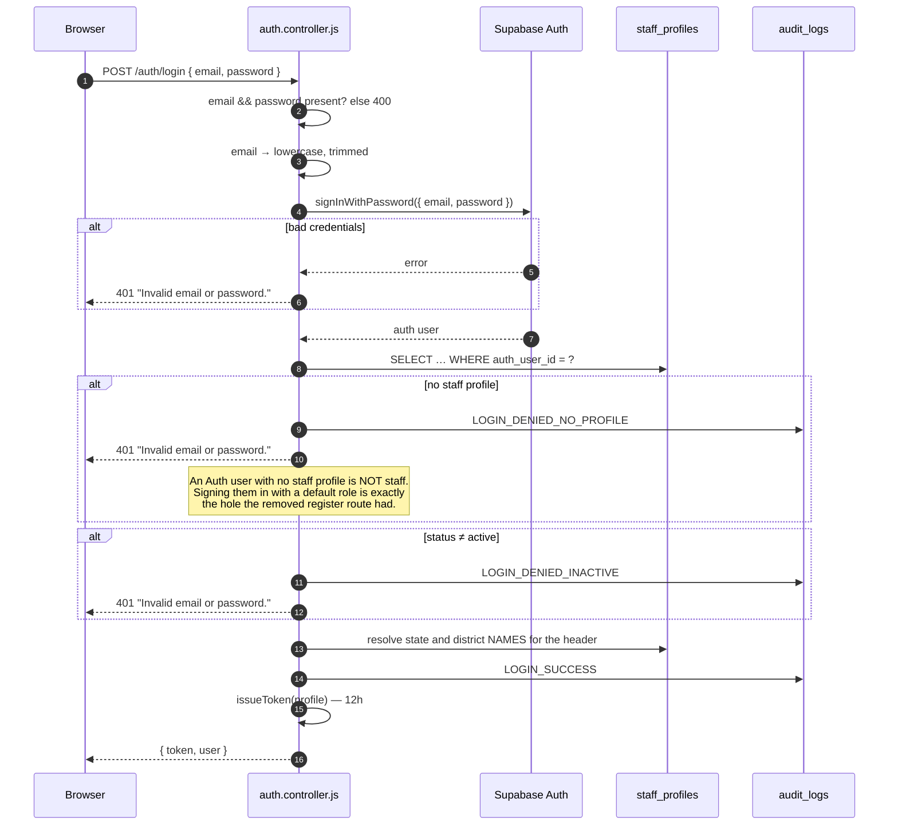
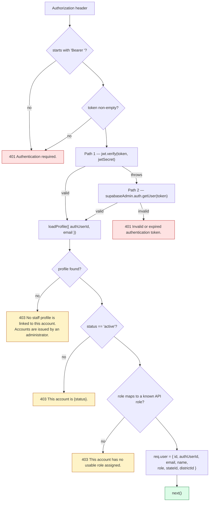
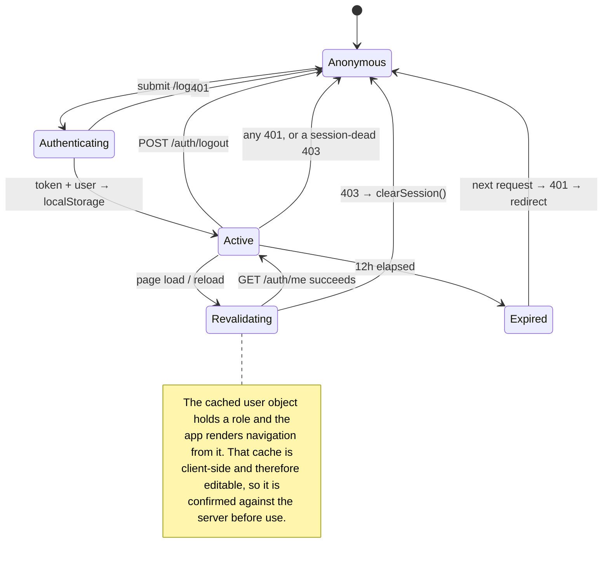
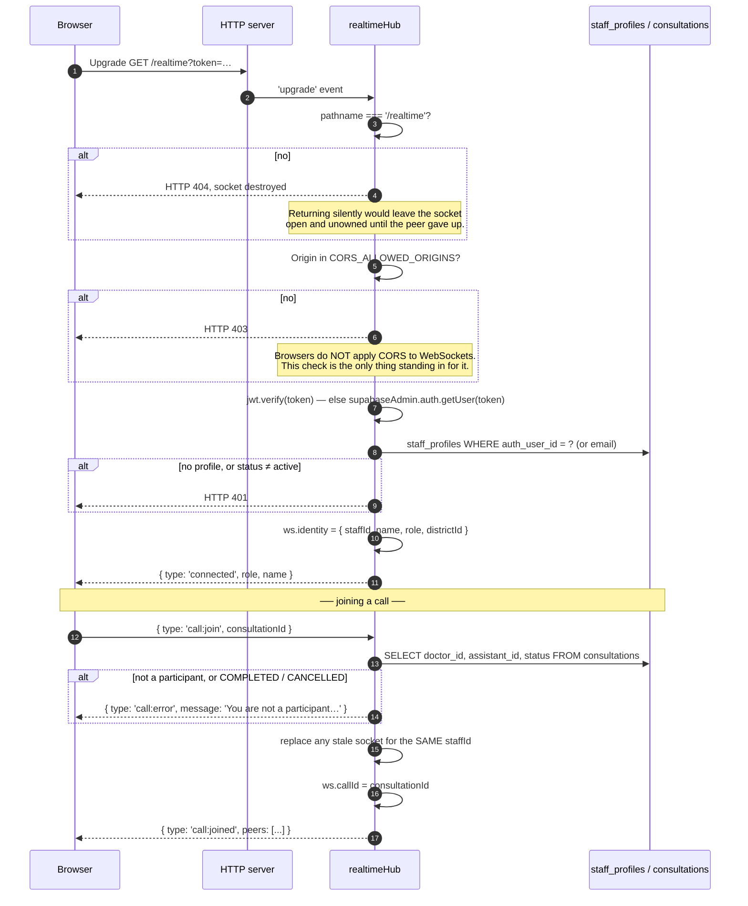

# 09 — Authentication

> **Navigation:** [Index](README.md) · Previous: [08 — Security](08-security.md) · Next: [10 — Authorisation](10-authorisation.md)

The full mechanism: how an identity is established, how a token is issued and how
long it lives, how credentials are handled, how the session behaves in the
browser, and how the realtime layer authenticates.

**Authentication answers "who are you?". Authorisation — "what may you do?" — is
[Section 10](10-authorisation.md).**

---

## 1. The model in one sentence

> Supabase Auth verifies the password; `staff_profiles` decides everything else,
> on every single request.

A token proves who you are. It does **not** prove you are staff, and it does not
carry authority. Both facts are re-established from the database per request.

---

## 2. There is no registration endpoint

Deliberate, and stated in the code:

```js
// backend/src/routes/auth.routes.js
// There is deliberately no POST /register.
//
// Doctors and Clinical Assistants are government-assigned roles: only an Admin
// creates these accounts, via POST /api/admin/users. The route that used to
// live here accepted an unauthenticated `role` field, so anyone who could
// reach the API could issue themselves an ADMIN account.
```

The frontend matches: `App.jsx` has no `/register` route, and `LoginPage.jsx`
tells the user *"Staff accounts are issued by an administrator. There is no
public sign-up — doctor and clinic assistant roles are assigned, not
self-selected."*

Three routes exist on `/api/auth`:

| Route | Guard |
|---|---|
| `POST /login` | `loginRateLimiter` (10 per 15 min, successful requests skipped) |
| `POST /logout` | `authenticateUser` |
| `GET /me` | `authenticateUser` |

---

## 3. Sign-in



### One rejection message for every failure

```js
const reject = () => res.status(401).json({ error: 'Invalid email or password.' });
```

No such account, wrong password, no staff profile, suspended — all return the
identical response. The distinctions are recorded in the audit log, where only
oversight roles can read them. This prevents using the endpoint to enumerate
valid emails or account states.

### The response

```json
{
  "token": "<JWT>",
  "user": {
    "id": "<staff_profiles.id>",
    "email": "…", "name": "…",
    "role": "CLINIC_ASSISTANT",
    "phone": "…",
    "state": "Uttar Pradesh", "district": "Ballia",
    "stateId": "<uuid>", "districtId": "<uuid>",
    "home": "/assistant/dashboard"
  }
}
```

`home` comes from `HOME_ROUTE` in `config/roles.js`, so the server decides where
each role lands rather than the browser inferring it.

---

## 4. Token issuance and lifetime

```js
const issueToken = (profile) =>
  jwt.sign(
    {
      sub: profile.id,
      authUserId: profile.auth_user_id,
      email: profile.email,
      // Role is carried for convenience only. Every request re-reads it from
      // staff_profiles in auth.middleware — a token claim is never trusted for
      // authorisation, so an old token cannot preserve a revoked role.
      role: ROLE_DB_TO_API[profile.role]
    },
    config.jwtSecret,
    { expiresIn: '12h' }
  );
```

| Property | Value |
|---|---|
| Algorithm | HS256 (`jsonwebtoken` default) |
| Lifetime | **12 hours** — one clinic working day plus margin |
| Claims | `sub`, `authUserId`, `email`, `role`, `iat`, `exp` |
| Secret | `JWT_SECRET`, validated at boot |
| Storage | `localStorage` under `vvc_token` |

**The `role` claim is decoration.** `authenticateUser` never reads it for
authorisation — it re-queries `staff_profiles` and uses that row's role. This is
what makes a role change or a suspension take effect on the very next request
rather than at token expiry.

### Why 12 hours

There is no server-side revocation list, so expiry is the only bound on a stolen
token's window. Twelve hours covers a working day without forcing a re-login
mid-consultation. A shorter window would sign a health worker out while they are
with a patient; a longer one widens the exposure with no operational benefit. A
deny-list is the real fix and is not built — §7.

### The signing secret

`config/env.js` refuses to start in production when the secret is missing,
shorter than 32 characters, or one of two values previously committed to a public
repository:

```js
const KNOWN_LEAKED_SECRETS = new Set([
  'virtual_village_clinic_jwt_secret',
  'virtual_clinic_jwt_secret_key_2026'
]);
```

Booting anyway would serve traffic anyone can forge tokens against, and a forged
token carries whatever role it claims — including `ADMIN`. In development a
random 48-byte secret is generated per boot, so there is no fixed value to leak;
the only cost is that tokens do not survive a restart.

---

## 5. Request authentication

`authenticateUser` in `middleware/auth.middleware.js`, mounted on every router.



### Two token types, one identity resolution

The middleware accepts a token this API issued **or** a Supabase session token.
Both paths converge on `loadProfile()`, which is the only source of role and
region scope — never the token body, never a request field.

### The hole this closes

v1 fell back to `roleMap[profile?.role] || 'CLINIC_ASSISTANT'`, so **any valid
Supabase token with no staff profile was silently granted clinical access** —
reintroducing exactly the self-registration path that removing
`POST /api/auth/register` was meant to close. No profile now means 403, in every
path.

### `req.user`

```js
{
  id,           // staff_profiles.id — the id everything else keys on
  authUserId,   // auth.users.id
  email, name,
  role,         // API name, from staff_profiles.role
  stateId,      // scope
  districtId    // scope — every clinical filter uses this
}
```

`districtId` is read directly from the profile. **No endpoint accepts a district
from the request.**

---

## 6. Credential handling

### Passwords are never stored by this application

There is no password column, no hash column, and no hashing code anywhere in the
repository. Supabase Auth holds the credential; `staff_profiles.auth_user_id` is
the link, and `02_schema.sql` says so in a comment: *"the password lives there,
never here."*

### Account creation

`POST /api/admin/users` is the only path. It:

1. Requires an admin role, and the requested role must be in
   `CREATABLE_ROLES[caller.role]`.
2. Enforces a **12-character minimum**.
3. Creates the Supabase Auth user with `email_confirm: true`.
4. Inserts the `staff_profiles` row.
5. **Rolls back the Auth user** if the profile insert fails — a half-created
   account with no role attached is precisely the orphan `authenticateUser`
   refuses to sign in.
6. Writes `STAFF_ACCOUNT_CREATED` to the audit log.

### Deactivation revokes the credential too

```js
await supabaseAdmin.from('staff_profiles').update({ status: 'suspended' }).eq('id', id);
if (target.auth_user_id) {
  await supabaseAdmin.auth.admin.updateUserById(target.auth_user_id, { ban_duration: '876000h' });
}
```

Suspension alone would leave the credential valid, so a user could simply sign in
again. Banning it closes that. The profile is **suspended, not deleted**, because
clinical rows reference the staff member who recorded them.

An already-issued JWT still survives until expiry — §7.

### The super administrator

Provisioned only by `npm run seed:root`, from environment variables the operator
supplies at run time:

- No default. *"A super_admin with a known password is the same as no password."*
- Minimum 12 characters.
- Re-running with the same email **rotates** the password rather than failing.
- Never seeded, never in the repository, never in the frontend bundle, never in
  `DEMO_CREDENTIALS.md`.
- The API refuses to create, modify or remove a `super_admin` in every path.

`LoginPage.jsx` notes why there is no separate admin door: *"A distinct 'admin
login' link would advertise the existence of the account the spec asks to keep
quiet."*

### Demo accounts

Seeded accounts share one password so a demonstration is usable — a reasonable
trade for accounts holding no real patient data. The mitigations:

- Written to `database/v2/DEMO_CREDENTIALS.md`, which is **gitignored**.
- **Never compiled into the frontend bundle.** `LoginPage.jsx` shows demo
  **emails** only, and only when `VITE_DEMO_MODE=true`.
- Emails use `@vvc-demo.example.com` (RFC 2606 reserved), so they cannot reach a
  real inbox.
- `npm run rotate:demo` rotates the shared password, touching only the demo
  domain, and refuses to run against anything else. The rationale is stated in
  the script: a shared password reaches everyone shown the system, gets pasted
  into chats and tickets, and never expires on its own.
- The generated password is two words plus digits and a symbol, because it has to
  be typed on a phone during a demonstration and an unreadable password gets
  written on a sticky note — which is worse than a slightly weaker one.

---

## 7. Session lifecycle in the browser



### Revalidation on load

`AuthContext.jsx` calls `GET /auth/me` on mount. `getMe` **re-reads the profile**
and returns 403 if it is no longer active, so a suspended account or a changed
role is caught at page load rather than on the first failed action.

`RequireRole` renders *"Checking your session…"* until `ready` is true —
otherwise a suspended account flashes its old dashboard before being redirected.

### Automatic session teardown

`services/api.js` response interceptor:

```js
const sessionDead =
  status === 401 ||
  (status === 403 && /no longer active|no staff profile|no usable role/i.test(message));

if (sessionDead && localStorage.getItem('vvc_token')) {
  localStorage.removeItem('vvc_token');
  localStorage.removeItem('vvc_user');
  if (!window.location.pathname.startsWith('/login')) window.location.assign('/login');
}
```

The 403 patterns match exactly the three messages `authenticateUser` produces for
a dead identity, so those clear the session while an ordinary
*"this operation requires…"* 403 does not.

### Logout is honest about its limits

```js
// The JWT stays valid until it expires — there is no server-side revocation
// list yet. Short expiry (12h) limits the window; a token deny-list is the
// real fix and is not built.
```

`POST /auth/logout` writes a `LOGOUT` audit entry and returns success; the client
clears local storage regardless of whether the call succeeded, so a failed
request cannot strand the user in a signed-in-looking state.

### Corrupt local state

`readStoredUser()` catches a JSON parse failure, removes the entry and returns
`null` — a corrupt cache should log the user out, not white-screen the app.

---

## 8. Realtime authentication

The WebSocket at `/realtime` carries notifications **and** live consultation
signalling, so it admits a caller into a clinical session. It is authenticated as
strictly as the HTTP surface.



### Why the token is a query parameter

The browser `WebSocket` API cannot set an `Authorization` header. The token
travels in the query string, is short-lived, and is **not logged** — the client
logs only the base URL:

```js
console.info('[realtime] connecting to', base);   // no token
```

### Identity comes from the database, never the URL

```js
ws.identity = {
  staffId: profile.id,
  name: profile.full_name,
  role: ROLE_DB_TO_API[profile.role],
  districtId: profile.district_id
};
```

The original signalling server took `role=DOCTOR` from a query parameter, which
was enough to join a live consultation. That server has been removed entirely
rather than left mounted — it also served a call path that had become unreachable
from the UI and booked consultations with a payload the API rejects.

### Participation is re-verified, not inferred from the token

`isParticipant()` queries the consultation row on **every** `call:join`. A leaked
or replayed token alone does not admit anyone to a call — the caller must be
`doctor_id` or `assistant_id` on that specific consultation, and the consultation
must not be terminal.

### Reconnect replaces, rather than being refused

```js
for (const peer of [...room]) {
  if (peer !== ws && peer.identity.staffId === ws.identity.staffId) {
    removeSocket(callRooms, consultationId, peer);
    peer.close(4000, 'Replaced by reconnection');
  }
}
```

Without this, a reconnecting doctor would be treated as a third participant.

### Room membership cannot be hopped

```js
case 'call:offer': case 'call:answer': case 'call:ice': …
  if (!ws.callId) return send(ws, { type: 'call:error', message: 'Join the call first.' });
  return relayToCall(ws.callId, ws, { ...msg, from: ws.identity.role });
```

`roomId` is **never read from the message body**. It is fixed at join, so a
connected socket cannot relay into another call. `from` is stamped from the
verified identity, not accepted from the sender.

### Liveness

A 25-second ping/pong sweep terminates sockets that stop responding, so a dead
connection does not hold a call room open indefinitely.

Ten tests in `backend/tests/realtimeHub.test.js` drive a real `ws` server and
cover: refusing a socket with no token, refusing a non-`/realtime` path,
introducing two participants, refusing a non-participant, relaying an offer to
the other peer only, notifying on drop, restoring membership on rejoin, and
replacing a stale socket.

---

## 9. Video join credentials

A **second, separate** token, issued by the video provider on
`POST /api/consultations/:id/join`:

```js
const token = jwt.sign(
  { consultationId, userId, role, roomId, peer: crypto.randomUUID() },
  config.jwtSecret,
  { expiresIn: '2h' }
);
```

| Property | Value |
|---|---|
| Lifetime | 2 hours — long enough for a consultation, short enough to be useless later |
| Scope | One consultation, one user, one room |
| `peer` | A fresh UUID per join, so two devices are distinguishable |
| What it is **not** | A provider secret. Provider credentials never cross the `VideoProvider` boundary |

The signalling socket verifies this **and** re-checks participation against the
consultation row, so the token alone does not admit anyone.

Room ids are random UUIDs. An earlier build used
`room_<patient_code>_<timestamp>`, which was guessable — and leaked through an
unauthenticated endpoint.

---

## 10. What the frontend does and does not decide

| Component | Role |
|---|---|
| `AuthContext` | Holds the session; revalidates it against the server |
| `RequireRole` | Decides what to **render**, not what a user may reach |
| `config/roles.js` | Navigation only. Its header comment: *"These drive navigation and which controls render. They are a convenience, never a security boundary — the API re-checks every role on every request, because anything in this bundle is editable by whoever is holding the browser."* |
| `api.js` interceptors | Attach the token; tear down a dead session |

The guard's own comment states the same: *"Its job is to stop the app showing a
doctor an admin console it would only fail to populate."*

---

## 11. Known gaps

| Gap | Impact | What closes it |
|---|---|---|
| **No token revocation list** | A stolen JWT stays valid for up to 12 hours. `deactivateUser` bans the Supabase credential so re-authentication fails, but an already-issued token survives | A deny-list keyed on `jti`, checked in `authenticateUser`. Needs a shared store to work across replicas |
| **No refresh-token rotation** | One long-lived token instead of a short access token plus a rotating refresh token | Standard refresh flow; would also give a natural revocation point |
| **No multi-factor authentication** | A password is the only factor, including for `super_admin` | Supabase Auth supports TOTP; enabling it for admin roles is configuration plus a UI step |
| **`localStorage`, not `httpOnly` cookies** | A successful XSS could read the token. Mitigated by React's default escaping and the absence of `dangerouslySetInnerHTML`, but not eliminated | `httpOnly` + `SameSite=Strict` cookies, which needs CSRF protection added alongside |
| **No account-lockout after repeated failures** | Rate limiting slows guessing but does not lock an account | A failure counter on `staff_profiles` with a time-boxed lock |
| **No password-complexity rule beyond length** | Only a 12-character minimum | A complexity or breach-list check at `createUser` |
| **No password reset flow** | An administrator must re-provision, or `seed:root` rotates the super admin | An email reset flow via Supabase Auth — `RESEND_API_KEY` is already configured but unwired |
