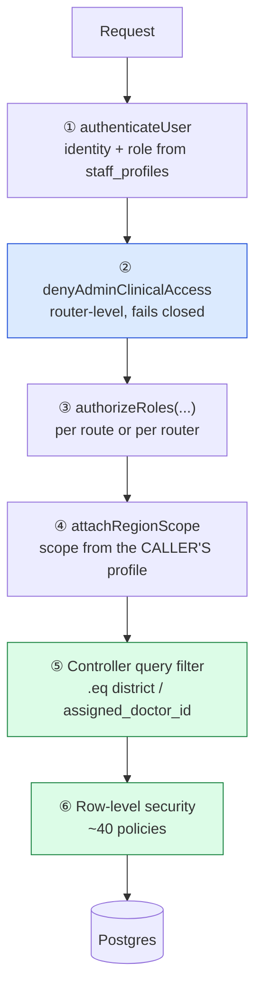

# 10 — Authorisation

> **Navigation:** [Index](README.md) · Previous: [09 — Authentication](09-authentication.md) · Next: [11 — AI Model Training](11-ai-model-training.md)

The role model, the complete permission matrix per role per endpoint, how
district scoping is enforced on every read, and the specific actions each role is
refused.

Authorisation runs **after** [authentication](09-authentication.md) has
established `req.user` from `staff_profiles`.

---

## 1. The six roles

Defined in `backend/src/config/roles.js` and as the `staff_role` enum.

| API name | DB value | Scope | Purpose |
|---|---|---|---|
| `SUPER_ADMIN` | `super_admin` | National | The operator's own account. Creates state admins. Provisioned out of band only |
| `STATE_ADMIN` | `state_admin` | One state | Manages doctors, assistants, district admins and auditors within that state |
| `DISTRICT_ADMIN` | `district_admin` | One district | Manages doctors and assistants within that district |
| `DOCTOR` | `doctor` | One district | Reviews cases **assigned to them**, consults, prescribes |
| `CLINIC_ASSISTANT` | `clinic_assistant` | One district | Registers patients, captures data, opens visits, requests consultations |
| `AUDITOR` | `auditor` | National or one state | Reads audit logs and aggregate counts. Changes nothing |

### Why six rather than the three the problem statement implies

`roles.js` states the reasoning for each addition:

**`SUPER_ADMIN`** — the specification describes an administrator who "logs in via
a secret email/password known only to the developer". That is a different account
class from the regional administrators who manage rosters day to day, and
collapsing them means the day-to-day account also holds nationwide delete rights.

**`STATE_ADMIN` / `DISTRICT_ADMIN`** — the specification asks for management "on
a region basis… state-wise, then district-wise". A region basis is only
enforceable if the admin's own scope is a **column**, not a UI filter.

**`AUDITOR`** — not in the baseline. Added because compliance review otherwise
requires handing someone an admin account, and every admin account can mutate the
roster. An auditor reads the log and changes nothing, which is what that job
actually needs.

### Role groupings

```js
ADMIN_ROLES    = { SUPER_ADMIN, STATE_ADMIN, DISTRICT_ADMIN }
CLINICAL_ROLES = { DOCTOR, CLINIC_ASSISTANT }
```

`ADMIN_ROLES ∪ { AUDITOR }` is the set blocked from all clinical data.
`CLINICAL_ROLES` is the set that sees a patient record at all. **The two sets are
disjoint** — there is no role that both administers and treats.

### `CREATABLE_ROLES` — deliberately asymmetric

| Creator | May create |
|---|---|
| `SUPER_ADMIN` | `STATE_ADMIN`, `DISTRICT_ADMIN`, `DOCTOR`, `CLINIC_ASSISTANT`, `AUDITOR` |
| `STATE_ADMIN` | `DISTRICT_ADMIN`, `DOCTOR`, `CLINIC_ASSISTANT`, `AUDITOR` |
| `DISTRICT_ADMIN` | `DOCTOR`, `CLINIC_ASSISTANT` |
| `DOCTOR` | — |
| `CLINIC_ASSISTANT` | — |
| `AUDITOR` | — |

**`SUPER_ADMIN` appears in no list.** It is provisioned only by
`npm run seed:root`, never through the API.

A district admin cannot mint a peer or a superior, so **a single compromised
district account cannot widen its own blast radius** — it stays confined to the
district it started in.

---

## 2. The enforcement layers



Layers ⑤ and ⑥ state the same rules independently. The backend's service-role key
bypasses RLS **by design**, which is why the Express guards remain — either layer
failing alone is not a breach. `database/v2/README.md` states the maintenance
rule: *"If you change a rule in one, change it in both."*

### Layer ② — the structural admin lockout

```js
const BLOCKED = new Set([...ADMIN_ROLES, ROLES.AUDITOR]);

export const denyAdminClinicalAccess = (req, res, next) => {
  if (req.user && BLOCKED.has(req.user.role)) {
    return res.status(403).json({
      error: 'Administrator and auditor accounts cannot access patient clinical records. ' +
             'This restriction is deliberate and cannot be granted per account.'
    });
  }
  return next();
};
```

Mounted with `router.use()` on **seven** routers — patients, visits, documents,
ai, vision, voice, doctor, consultations, reports — so a route added later that
forgets its own `authorizeRoles` still fails closed. Its own comment:

> This sits in addition to each route's own role list, not instead of it… The
> same rule is expressed again as RLS policy in `database/v2/03_rls.sql`: no
> admin role appears in any policy on patients, visits or their children. Either
> layer failing alone is not a breach.

### Layer ④ — scope is derived, never accepted

```js
export const attachRegionScope = (req, res, next) => {
  const { role, stateId, districtId } = req.user || {};
  if (role === ROLES.SUPER_ADMIN)                            req.scope = { kind: 'national' };
  else if (role === ROLES.STATE_ADMIN || (role === ROLES.AUDITOR && stateId))
                                                             req.scope = { kind: 'state', stateId };
  else if (role === ROLES.DISTRICT_ADMIN)                    req.scope = { kind: 'district', stateId, districtId };
  else if (role === ROLES.AUDITOR)                           req.scope = { kind: 'national' };
  else                                                       req.scope = { kind: 'district', stateId, districtId };
  return next();
};
```

`applyScope(query, scope)` applies it to a Supabase query builder. A query
parameter can **narrow** a result but never widen it.

---

## 3. Permission matrix — every endpoint

Legend: ✅ allowed · ❌ 403/404 · ⚪ not applicable

### `/api/auth`

| Endpoint | SUPER | STATE | DISTRICT | DOCTOR | ASSISTANT | AUDITOR | Guard |
|---|:--:|:--:|:--:|:--:|:--:|:--:|---|
| `POST /login` | ✅ | ✅ | ✅ | ✅ | ✅ | ✅ | Public + rate limit |
| `POST /logout` | ✅ | ✅ | ✅ | ✅ | ✅ | ✅ | `authenticateUser` |
| `GET /me` | ✅ | ✅ | ✅ | ✅ | ✅ | ✅ | `authenticateUser` |
| `POST /register` | ⚪ | ⚪ | ⚪ | ⚪ | ⚪ | ⚪ | **Does not exist** |

### `/api/patients` — `denyAdminClinicalAccess` on the router

| Endpoint | SUPER | STATE | DISTRICT | DOCTOR | ASSISTANT | AUDITOR | Scope |
|---|:--:|:--:|:--:|:--:|:--:|:--:|---|
| `GET /` | ❌ | ❌ | ❌ | ✅ | ✅ | ❌ | `clinic_district_id = caller` |
| `POST /lookup` | ❌ | ❌ | ❌ | ✅ | ✅ | ❌ | same |
| `POST /detail` | ❌ | ❌ | ❌ | ✅ | ✅ | ❌ | same |
| `POST /` | ❌ | ❌ | ❌ | ❌ | ✅ | ❌ | district forced from profile |
| `POST /urgent` | ❌ | ❌ | ❌ | ❌ | ✅ | ❌ | same |
| `PATCH /` | ❌ | ❌ | ❌ | ❌ | ✅ | ❌ | same |

### `/api/regions`

| Endpoint | All active staff | Note |
|---|:--:|---|
| `GET /states` | ✅ | Reference data — 36 states and UTs |
| `GET /districts?stateId=` | ✅ | Authentication still required so it is not an open endpoint |

### `/api/visits` — `denyAdminClinicalAccess` on the router

| Endpoint | DOCTOR | ASSISTANT | Others | Scope |
|---|:--:|:--:|:--:|---|
| `POST /` | ❌ | ✅ | ❌ | Patient must be in the caller's district |
| `GET /:id` | ✅ | ✅ | ❌ | Doctor → `assigned_doctor_id`; assistant → `district_id` |
| `GET /:id/review` | ✅ | ✅ | ❌ | same |
| `PATCH /:id` | ✅ | ✅ | ❌ | same, and `deleted_at IS NULL` |
| `POST /:id/handoff` | ❌ | ✅ | ❌ | Assistant's action alone |
| `DELETE /:id` | ❌ | ✅ | ❌ | Assistant's own correction, four guards |

### `/api/documents` — `denyAdminClinicalAccess` on the router

| Endpoint | DOCTOR | ASSISTANT | Others |
|---|:--:|:--:|:--:|
| `GET /?visit_id=` | ✅ | ✅ | ❌ |
| `POST /upload` | ❌ | ✅ | ❌ |
| `POST /health-card` | ❌ | ✅ | ❌ |
| `POST /:id/verify` | ✅ | ✅ | ❌ |

### `/api/ai` — `denyAdminClinicalAccess` + `aiRateLimiter` below `/service-status`

| Endpoint | SUPER | STATE | DISTRICT | DOCTOR | ASSISTANT | AUDITOR |
|---|:--:|:--:|:--:|:--:|:--:|:--:|
| `GET /service-status` | ✅ | ✅ | ✅ | ❌ | ❌ | ❌ |
| `POST /assess` | ❌ | ❌ | ❌ | ✅ | ✅ | ❌ |
| `POST /analyze-patient` | ❌ | ❌ | ❌ | ✅ | ✅ | ❌ |
| `POST /transcribe` | ❌ | ❌ | ❌ | ✅ | ✅ | ❌ |
| `POST /analyze-document` | ❌ | ❌ | ❌ | ✅ | ✅ | ❌ |
| `POST /risk-assessment` | ❌ | ❌ | ❌ | ✅ | ✅ | ❌ |
| `POST /analyze-image` | ❌ | ❌ | ❌ | ✅ | ✅ | ❌ |
| `POST /interpret-report` | ❌ | ❌ | ❌ | ✅ | ✅ | ❌ |

`GET /ai/service-status` is the **one route on this router that is for
administrators**, and it is mounted deliberately above both
`denyAdminClinicalAccess` and the AI limiter. The code explains both:

> Above the AI rate limiter on purpose: it costs nothing at an external provider,
> and someone checking whether the inference service is up must not be throttled
> by the very calls that are failing because it is down… Restricted because of
> what it returns: an internal address and the tail of the service's own log,
> which carries stack traces and file paths when something has gone wrong.

### `/api/vision` and `/api/voice`

Alias routers reaching the same controllers as `/api/ai`. Each mounts
`denyAdminClinicalAccess`, `authorizeRoles(CLINIC_ASSISTANT, DOCTOR)` and
`aiRateLimiter` at the **router** level — *"Without these three the alias is a way
around the AI rate limiter and the admin block."*

| Endpoint | DOCTOR | ASSISTANT | Others |
|---|:--:|:--:|:--:|
| `POST /vision/analyze` | ✅ | ✅ | ❌ |
| `POST /vision/analyze-image` | ✅ | ✅ | ❌ |
| `POST /voice/transcribe` | ✅ | ✅ | ❌ |

### `/api/doctor` — `denyAdminClinicalAccess` on the router

| Endpoint | DOCTOR | ASSISTANT | Others | Scope |
|---|:--:|:--:|:--:|---|
| `GET /directory` | ✅ | ✅ | ❌ | Doctors in the caller's district — a roster, not clinical data |
| `GET /queue` | ✅ | ❌ | ❌ | `assigned_doctor_id = me` |
| `GET /queue/dates` | ✅ | ❌ | ❌ | same |
| `GET /cases/:id` | ✅ | ❌ | ❌ | same, checked **inside** the query |
| `POST /cases/:id/review` | ✅ | ❌ | ❌ | same + same-day check |

### `/api/consultations` — `denyAdminClinicalAccess` on the router

| Endpoint | DOCTOR | ASSISTANT | Others | Scope |
|---|:--:|:--:|:--:|---|
| `GET /availability/dates` | ✅ | ✅ | ❌ | Caller's district |
| `GET /availability/slots` | ✅ | ✅ | ❌ | same |
| `GET /availability/doctors` | ✅ | ✅ | ❌ | same |
| `POST /` | ❌ | ✅ | ❌ | Visit must be in the caller's district |
| `POST /instant` | ❌ | ✅ | ❌ | same |
| `GET /` | ✅ | ✅ | ❌ | `doctor_id = me` or `assistant_id = me` |
| `GET /:id` | ✅ | ✅ | ❌ | same |
| `POST /:id/join` | ✅ | ✅ | ❌ | Participant only |
| `POST /:id/end` | ✅ | ✅ | ❌ | Participant only |
| `POST /:id/cancel` | ✅ | ✅ | ❌ | Participant only, `SCHEDULED` only |

Booking is **assistant-only**. A doctor booking their own consultation is a
different decision. Static paths are declared before `/:id` so `"availability"`
is never parsed as a consultation id.

### `/api/notifications`

| Endpoint | All active staff | Scope |
|---|:--:|---|
| `GET /` | ✅ | `recipient_id = caller.id`, applied **inside the service** |
| `POST /read` | ✅ | same |

A `recipient_id` can never be supplied by the client.

### `/api/reports` — `denyAdminClinicalAccess` on the router

| Endpoint | DOCTOR | ASSISTANT | Others | Extra rule |
|---|:--:|:--:|:--:|---|
| `GET /visits/:id/:type.pdf` | ✅ | ✅ | ❌ | `type ∈ {summary, prescription, referral}`; `referral` returns **409** unless the tier is HIGH |

The PDF route carries the same scoping as every other clinical read, *"because a
printable document is the easiest kind of record to forward on."*

### `/api/admin`

Router guards: `authenticateUser` → `authorizeRoles(SUPER, STATE, DISTRICT,
AUDITOR)` → `attachRegionScope`. Mutating routes additionally carry
`ADMINS_ONLY`.

| Endpoint | SUPER | STATE | DISTRICT | AUDITOR | DOCTOR | ASSISTANT |
|---|:--:|:--:|:--:|:--:|:--:|:--:|
| `GET /regions` | ✅ | ✅ scoped | ✅ scoped | ✅ | ❌ | ❌ |
| `GET /users` | ✅ | ✅ scoped | ✅ scoped | ✅ scoped | ❌ | ❌ |
| `POST /users` | ✅ | ✅ | ✅ | ❌ | ❌ | ❌ |
| `PATCH /users/:id` | ✅ | ✅ scoped | ✅ scoped | ❌ | ❌ | ❌ |
| `DELETE /users/:id` | ✅ | ✅ scoped | ✅ scoped | ❌ | ❌ | ❌ |
| `GET /analytics` | ✅ | ✅ scoped | ✅ scoped | ✅ | ❌ | ❌ |
| `GET /audit` | ✅ | ✅ | ✅ | ✅ | ❌ | ❌ |

`GET /audit` is *"the reason that role exists"*, per the route file's comment.

---

## 4. District scoping on every read

### The tenancy column

`patients.clinic_district_id` — **which sub-centre holds the record** — is the
tenancy key. It is separate from `address_district`, where the patient lives.

`database/v2/README.md`: *"a migrant worker seen in Ballia who gives a Bihar
address stays on Ballia's register."*

It is always taken from `req.user.districtId`, which comes from the profile row.
**No endpoint accepts a district from the request.**

### Every clinical read, and its filter

| Controller function | Filter |
|---|---|
| `getPatients` | `.eq('clinic_district_id', req.user.districtId)` |
| `lookupByAadhaar` | same |
| `getPatientDetail` | same, and visit history filtered `deleted_at IS NULL` |
| `updatePatient` | same, before and after |
| `createPatient` / `registerUrgentPatient` | District **written** from the profile |
| `createVisit` | Patient must be in the caller's district; doctor must be too |
| `getVisitById` / `updateVisit` | Doctor → `assigned_doctor_id`; assistant → `district_id` |
| `deleteVisit` | `.eq('district_id', …)` |
| `handOffVisit` | `.eq('district_id', …)`, and the doctor must be in the **visit's** district |
| `getVisitReview` | Role-dependent, as above |
| `getDoctorQueue` / `getQueueDates` | `.eq('assigned_doctor_id', req.user.id)` |
| `getDoctorCaseDetails` | same, **inside the query** |
| `recordDoctorReview` | same |
| `listDoctors` | `.eq('district_id', req.user.districtId)` |
| `uploadDocument` | Patient must be in the caller's district |
| `verifyDocumentExtraction` | Document's patient must be in the caller's district |
| `listDocuments` | Visit must be in the caller's district |
| `analyzeImageAI` | Visit must be in the caller's district and not deleted |
| Report PDF | Doctor → assignment; assistant → district |
| `createConsultation` / `createInstantConsultation` | Visit must be in the caller's district |
| `getConsultations` / `getConsultation` / join / end / cancel | `scopeToCaller` — participant only |
| `listNotifications` / `markRead` | `recipient_id = caller.id` |
| `getUsers` / `updateUser` / `deactivateUser` / `getRegions` / `getAnalytics` | `applyScope(query, req.scope)` |

### Ownership checked inside the query, not after the fetch

```js
const { data, error } = await supabaseAdmin
  .from('visits').select(...)
  .eq('id', req.params.id)
  .eq('assigned_doctor_id', req.user.id)   // ← inside the query
  .maybeSingle();
if (!data) return res.status(404).json({ error: 'That case is not assigned to you.' });
```

A doctor cannot read another doctor's case by guessing a visit id — the row
simply does not come back. Returning 404 rather than 403 also avoids confirming
that the id exists.

### v1's failure, for contrast

`visit.controller.js` records what changed: v1's patient list had **no tenancy
filter at all**, so one assistant could enumerate every patient in the country,
and `getDoctorQueue` returned a global queue with no assignment filter, so every
doctor saw every patient.

---

## 5. Refusals per role

### `CLINIC_ASSISTANT`

| Refused | Response |
|---|---|
| A patient in another district | 404 *"No such patient at this clinic."* |
| A visit in another district | 404 *"No such visit available to you."* |
| Reviewing a case or recording a decision | 403 |
| Issuing a prescription | 403 + RLS `prescriptions_insert_by_doctor` |
| Seeing **any** medication suggestion | Absent by construction at every tier |
| Withdrawing a case a doctor has been assigned | 409 *"already been sent to a doctor… Ask the doctor to close it instead."* |
| Withdrawing a case with a consultation booked | 409 |
| Withdrawing a case with a doctor review | 409 |
| Handing a case to a doctor in another district | 404 *"That doctor is not available in this district."* |
| Handing over a completely empty case | 422 + `missing[]` |
| Creating any staff account | 403 |
| Reading the audit log or analytics | 403 |
| Setting a visit's risk tier by hand | Ignored — the server reads the stored tier |

### `DOCTOR`

| Refused | Response |
|---|---|
| A case not assigned to them | 404 *"That case is not assigned to you."* |
| Another doctor's queue | Structurally impossible — the query filters on `assigned_doctor_id = me` |
| Reviewing a case from a previous day | 409 *"read-only. Ask an administrator to reassign it."* |
| Reviewing an already-reviewed case | 409 |
| A review with no diagnosis | 400 *"A diagnosis is required to close a case."* |
| `prescribe` with no medicine | 400 |
| `refer_hospital` with no hospital named | 400 |
| A decision outside the five allowed values | 400 |
| Registering or editing a patient | 403 |
| Handing a case to another doctor | 403 |
| Withdrawing a visit | 403 |
| Booking a consultation | 403 — `POST /consultations` is assistant-only |
| Joining a consultation they are not part of | 404 *"You are not a participant."* |
| Joining outside the tolerance window | 409 + `minutes_until_joinable` |
| Being in two active consultations | 409, and a partial unique index if the check is raced |
| Reading the audit log or analytics | 403 |

### Every administrator

| Refused | Response |
|---|---|
| **Any patient record** | 403 *"Administrator and auditor accounts cannot access patient clinical records. This restriction is deliberate and cannot be granted per account."* |
| Any visit, vitals, symptom, document, image, assessment, review or prescription | Same |
| Reaching clinical data by direct PostgREST call | RLS — no admin role in any policy on `patients`, `visits` or children |
| Creating a `SUPER_ADMIN` | 403 *"super_admin is provisioned out of band and never through this API."* |
| Modifying the super admin | 403 |
| Removing the super admin | 403 |
| Acting outside their region | 403 *"That state/district is outside your administrative region."* |
| Deactivating their own account | 400 |
| Creating a role above their own tier | 403 listing what they may create |
| Hard-deleting a staff member | Not offered — suspension only |
| Altering or deleting an audit entry | No UPDATE or DELETE policy exists on `audit_logs` |

### `DISTRICT_ADMIN` specifically

| Refused | Why |
|---|---|
| Creating another district admin | `CREATABLE_ROLES` — a compromised district account cannot widen itself |
| Creating a state admin or auditor | same |
| Reading staff in another district | `applyScope` → `.eq('district_id', …)` |
| Querying `?stateId=` for another state | 403 |
| Seeing another district in the region picker | Filtered to their own |

### `AUDITOR`

| Allowed | Refused |
|---|---|
| `GET /admin/audit` | Every mutating admin route — `ADMINS_ONLY` |
| `GET /admin/analytics` | All clinical data — `denyAdminClinicalAccess` |
| `GET /admin/regions` | Creating, updating or deactivating any account |
| | Changing anything at all |

The auditor's scope is national, or one state when `state_id` is set — which the
`staff_scope_matches_role` CHECK permits by requiring only that `district_id` is
NULL for this role.

---

## 6. Row-level security as the second statement

`03_rls.sql` restates the same rules where the data lives. The key policies:

| Table | Policy | Rule |
|---|---|---|
| `patients` | `patients_read_by_clinician` | `auth_serves_district(clinic_district_id)` — doctor or assistant, same district |
| `patients` | `patients_insert_by_assistant` | `auth_role() = 'clinic_assistant' AND clinic_district_id = auth_district()` |
| `visits` | `visits_read_scoped` | Doctor → `assigned_doctor_id = auth_staff_id()`; assistant → `district_id = auth_district()` |
| `visits` | `visits_insert_by_assistant` | Assistant, own district |
| `prescriptions` | `prescriptions_insert_by_doctor` | Doctor **and** `doctor_id = auth_staff_id()` **and** the visit assigned to them — three conditions |
| `consultations` | `consultations_participants` | `doctor_id = me OR assistant_id = me` |
| `notifications` | `notifications_own` | `recipient_id = auth_staff_id()` |
| `audit_logs` | `audit_read_oversight` | The four oversight roles |
| `audit_logs` | — | **No UPDATE or DELETE policy for any role** |
| `staff_profiles` | `staff_read_in_scope` | Admin tiers by scope, **plus** clinicians reading `role = 'doctor'` in their own district |

**A table with RLS on and no policy denies all access**, which is the correct
default for anything not explicitly opened.

### The service-role caveat

The backend uses the service-role key, which bypasses RLS. RLS therefore protects
against direct PostgREST access with the anon key — which matters, because the
anon key ships in the browser bundle by design — while the Express guards protect
the API path. The two must be maintained together.

---

## 7. The frontend is not a security boundary

`frontend/src/config/roles.js`:

> These drive navigation and which controls render. They are a convenience,
> **never a security boundary** — the API re-checks every role on every request,
> because anything in this bundle is editable by whoever is holding the browser.

`RequireRole.jsx`:

> This decides what to **render**, not what a user may reach — every API call is
> authorised again on the server. Its job is to stop the app showing a doctor an
> admin console it would only fail to populate.

`App.jsx` records the correction that made the route table match the backend:

> The clinical routes previously listed `'ADMIN'` alongside `CLINIC_ASSISTANT`
> and `DOCTOR`, which contradicted the spec's "Admin cannot edit patient data" —
> and contradicted the backend, which blocks every admin role from those
> endpoints. No admin role appears on a clinical route below.

`HOME_ROUTE` sends each role to its own landing page, and the server returns
`home` on login so the destination is decided server-side.

---

## 8. Gaps

| Gap | Impact | What closes it |
|---|---|---|
| **No facility-level scoping** | The finest tenancy grain is the district. Two sub-centres in one district see the same patient register | A `facilities` table + `staff_profiles.facility_id`. Additive: scoping is already written against a scope object, not a hard-coded column |
| **No per-record consent or break-glass** | Any clinician in the district can read any patient in it | A consent model plus an audited break-glass path |
| **RLS is untested by an automated suite** | The policies are written but no test connects with an anon key and asserts a denial | A pgTAP or integration suite that authenticates as each role |
| **No role change audit diff** | `STAFF_ACCOUNT_UPDATED` records the patch object but not the previous value | Store before/after in the metadata |
| **`AUDITOR` scope is coarse** | National unless `state_id` is set; no district-level auditor | Relax the `staff_scope_matches_role` CHECK for this role |
