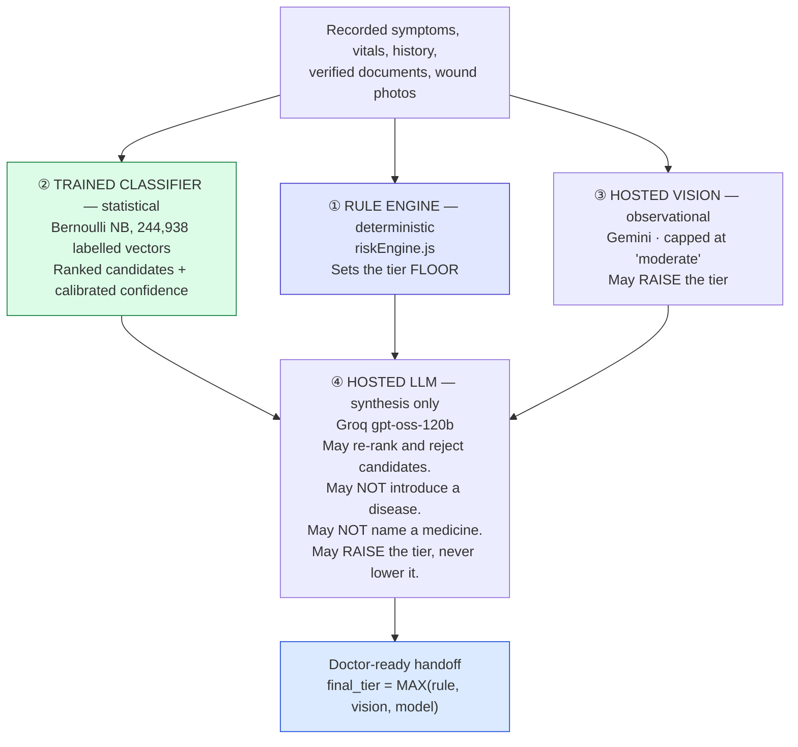

# 11 — AI Model Training (Built)

> **Navigation:** [Index](README.md) · Previous: [10 — Authorisation](10-authorisation.md) · Next: [12 — Next-Generation Model Roadmap](12-next-generation-model-roadmap.md)

**Everything in this section exists and runs today.** The model artifacts are
committed to the repository, the training scripts reproduce them, the accuracy
figures are measured on a held-out split, and the inference service is deployed.

Forward-looking work is in [Section 12](12-next-generation-model-roadmap.md) and
nowhere else.

---

## 1. What "the AI" actually is

Four distinct components, deliberately layered so that no single one can decide a
clinical outcome:



The trained classifier is the part most teams do not have. The rule engine is the
part that makes the whole thing safe. The LLM is the part that writes readable
prose, and it is the least trusted component in the stack.

---

## 2. The datasets

Downloaded from Kaggle by `AI/LLM/training/download.py`. **Not committed** —
`AI/LLM/data/raw/` is gitignored (223 MB). The derived artifacts are committed
instead, so a deploy needs neither a training step nor a dataset download.

| Kaggle reference | Local folder | Shape | Used for |
|---|---|---|---|
| `dhivyeshrk/diseases-and-symptoms-dataset` | `raw/symptoms/` | **246,945 rows × 378 columns** (1 label + 377 binary symptom flags), 190 MB | Pipeline 1 training |
| `choongqianzheng/disease-and-symptoms-dataset` | `raw/precautions/` | **41 rows** × (Disease, Precaution_1..4) | Precaution lists |
| `shudhanshusingh/az-medicine-dataset-of-india` | `raw/medicines/` | **253,973 products**, 32 MB | Medicine availability index |

Kaggle credentials are read from the gitignored `backend/.env`
(`KAGGLE_USERNAME`, `KAGGLE_KEY`) by `training/_env.py`, *"so there is exactly one
place to rotate credentials and one file to keep out of git."*

`training/check_kaggle.py` confirms authentication before anything attempts a
download. `training/inspect_datasets.py` prints the shape, columns and value
ranges of each — the step that established the numbers above.

### The dataset shape that changed the design

`training/probe_medicines.py` exists to answer one question, and its output is
the reason pipeline 2 is not what the original plan described:

```python
hits = [c for c in med.columns if any(k in c.lower()
        for k in ('disease','indication','use','condition','treat'))]
print('  ->', hits or 'NONE — this maps brand -> composition, not disease -> drug')
```

**The medicines dataset has no disease, indication or condition column at all.**
It maps *brand → composition*. There is nothing in it from which "which drug
treats this disease" could be learned — and that is the right outcome. A
drug-choice model trained on an uncurated retail catalogue would be both unsafe
and unlawful to put in front of a patient. §7 covers what was built instead.

---

## 3. The symptom → disease model

`AI/LLM/training/train_symptom_diagnosis.py`

### 3.1 Model selection, and why not KNN

The original plan named KNN. It was rejected on reasoning the script records:

> KNN over 246k × 377 keeps the entire training matrix in memory (~93 M values)
> and scans it on every single prediction. Bernoulli NB is the textbook fit for
> binary presence/absence features, trains in seconds, predicts in microseconds,
> and — the part that matters clinically — returns **calibrated per-class
> probabilities**, so "we do not have a confident match" is expressible. KNN
> gives a distance that is hard to reason about at this dimensionality.

A centroid/cosine-similarity model is fitted alongside as a baseline, *"because a
single number from one model is not evidence that the model is any good."*

### 3.2 Preprocessing

| Step | Detail | Why |
|---|---|---|
| **Rare-class removal** | `MIN_SAMPLES_PER_DISEASE = 30`. 773 labels → **582 kept**, 191 dropped | A class seen once cannot be learned and cannot be evaluated. Leaving it in inflates apparent label coverage while producing predictions nobody should trust |
| **Rows retained** | 246,945 → **244,938** (99.2%) | The dropped classes are rare by definition |
| **Sparse matrix** | dense `int8` → `scipy.sparse.csr_matrix(float32)` | The matrix is **~1.4% non-zero**. scikit-learn's Bernoulli NB internally computes `Y.T @ X`; on a dense int array that promotes to int64 and asks for **564 MB**, which is where this first fell over |
| **Stratified split** | 80/20, `random_state=42` | 195,950 train / **48,988 test**, class proportions preserved |
| **Minibatch fit** | `partial_fit` in 15,000-row chunks | `fit()` builds a dense one-hot label matrix — 582 classes × 196k rows promoted to int64 is **870 MB**. `partial_fit` accumulates the same per-class feature counts a chunk at a time, so peak memory is set by chunk size rather than corpus size. **The fitted model is mathematically identical** |
| **Smoothing** | `BernoulliNB(alpha=1.0)` — Laplace | Standard for sparse binary features |

### 3.3 Measured accuracy

From `AI/LLM/data/models/symptom_model_meta.json`, trained
**2026-08-27T11:08:40Z**, measured on **48,988 held-out cases**:

| Model | top-1 | top-3 | top-5 |
|---|---:|---:|---:|
| **Bernoulli Naive Bayes** | **0.8537** | **0.9525** | **0.9743** |
| Centroid cosine baseline | 0.8445 | — | 0.9784 |

Over **582 classes**. Random-guess top-1 is 0.0017, so top-1 of 0.854 is roughly
500× baseline.

**Top-5 is the number that matters operationally**, because the orchestrator only
ever consumes a top-5 candidate list and hands it to the LLM to re-rank.

### 3.4 An honest discrepancy you should know about

The metadata records `"selected": "centroid"`, because the script picks the
winner on top-5 alone and the centroid baseline scored marginally higher
(0.9784 vs 0.9743):

```python
winner = 'bernoulli_nb' if top5 >= base_top5 else 'centroid'
```

**But the deployed service loads and serves the Bernoulli NB model**
(`joblib.load(MODELS / 'symptom_nb.joblib')`), and `/diagnose` reports
`'model': META.get('selected')` — so the API labels its answers `centroid` while
actually running Bernoulli NB. The accuracy figure it reports
(`model_top5_accuracy`) is read from the `bernoulli_nb` block and is therefore
correct for what is running.

Serving NB is the **right** choice — a 0.4-point top-5 difference is well within
noise, NB wins top-1 by a full point, and only NB gives calibrated per-class
probabilities, which is what makes `confident: false` expressible. The bug is the
label, not the model. Tracked as
[L7](16-known-limitations-and-risks.md#l7).

### 3.5 Exported artifacts — all committed

| File | Size | Contents |
|---|---:|---|
| `symptom_nb.joblib` | 3.6 MB | The fitted `BernoulliNB` estimator |
| `symptom_vocabulary.json` | 22 KB | 377 symptom names, 582 disease labels |
| `symptom_model_meta.json` | 459 B | Training date, row counts, both models' metrics |
| `centroids.npy` | 1.8 MB | The 582 × 377 baseline centroid matrix |

`DEPLOYMENT.md`: *"a deploy needs no training step and no dataset download. If
`/health` reports `symptom_diagnosis: false`, that directory did not reach the
image."*

---

## 4. The symptom matcher

Free text has to reach a 377-term clinical vocabulary. This is where most of the
engineering went, and it went through **four documented iterations**, each fixing
one problem and introducing another.

| Version | Approach | Failure |
|---|---|---|
| v1 | rapidfuzz `WRatio` | `"body ache"` → *foreign body sensation in eye*; `"itchy rash"` → *itchy ear(s)* → **ear diagnoses for a skin case** |
| v2 | + Jaccard, top-2 per fragment | **Invented symptoms.** `"vomiting"` also emitted *vomiting blood*; `"no urine"` emitted *pus in urine*. Together they pushed a dehydration case to a confident 70% *hyperemesis gravidarum* |
| v3 | Containment, strict top-1 | Long sentences diluted the score — `"itchy rash spreading on both forearms"` matched **nothing** |
| v4 | + sub-span windows, body-site penalty, deterministic tie-break | **Current** |

### 4.1 Why pure fuzzy matching is unsafe here

rapidfuzz's default `WRatio` leans on `partial_ratio`, which scores a short input
very highly against any longer term that merely *contains* it. `"body ache"`
matched *"foreign body sensation in eye"* at 90. Both v1 failures were
clinically wrong and both produced a confident, wrong candidate list.

### 4.2 The composite score

`score_candidate(fragment, term)` applies five gates in order, and a failure at
any gate returns **0.0**:

| # | Gate | Prevents |
|---|---|---|
| 1 | **No shared content word ⇒ 0** | `"body ache"` reaching *foreign body sensation in eye* |
| 2 | **Sharing only a body site ⇒ 0** | `"stomach pain"` → *stomach bloating*. The only shared word was the anatomy; the actual symptom was invented wholesale |
| 3 | **A bare generic word cannot pick a specific term** | `"pain"` → *rib pain*, then *mouth pain*, purely on which site word happened to be missing from the site list. This is the general rule that makes the site list a refinement rather than the only defence |
| 4 | **Containment < 0.5 ⇒ 0** | A term whose words are mostly absent from the input |
| 5 | **Wrong-site penalty ×0.55** | `"itchy rash spreading on both forearms"` matching *itchy scalp* as well as *skin rash* |

Final score: `0.4 × token_set_ratio + 0.6 × (containment × 100)`, threshold
**62.0**.

**Containment, not Jaccard**, because Jaccard punished long inputs: *"itchy rash
spreading on both forearms"* scored 0.2 against *skin rash* purely because the
assistant wrote a full sentence, and the match was lost.

### 4.3 Sub-span windows

An assistant writes a sentence; the vocabulary term is two words. Scored
whole-against-whole, the extra words dilute every metric. So a 1–4 word sliding
window is generated over each fragment and each window is scored independently,
letting `"itchy rash"` be compared to `"skin rash"` on its own terms.

### 4.4 Determinism — a clinical requirement, not a nicety

```python
ordered_windows = sorted(windows, key=lambda w: (-len(w.split()), w))
```

`windows` is a `set`, and iterating a set of strings follows Python's
**per-process randomised hash**. Five terms scored exactly 70.0, so with ties
present the winner changed between runs: *"itchy rash spreading on both
forearms"* produced `skin rash` on one run and `itchy ear(s)` on the next, from
identical input.

> Non-determinism in a clinical matcher is not a rough edge; it means the record
> cannot be reproduced.

Ties are broken by scoring each candidate against the **whole fragment**, so a
term whose other words also appear in what the assistant wrote wins over one
sharing a single token.

### 4.5 Strictly one symptom per fragment

Taking the top two was tried and is actively dangerous — it is the v2 failure
above.

> Inventing a symptom is far worse than missing one — a missed match is
> recoverable by re-wording, a fabricated red flag corrupts the whole assessment.

### 4.6 The clinical alias layer

`AI/LLM/data/clinical_aliases.json` — **280 mappings**.

The training vocabulary is US clinical English. The people typing into this
system write Indian English and Hindi transliteration. Those two registers share
**no tokens** for the most common complaint in rural paediatrics — *"loose
motion"* versus *"diarrhea"* — and the matcher's shared-token gate correctly
refuses to bridge that on string similarity alone.

So the bridge is an explicit, reviewed table rather than a looser threshold.
Examples: `loose motion`, `loose motions`, `loose stool`, `loose potty`,
`motions`, `watery stool` → `diarrhea`.

Three properties:

- **Alias hits bypass the threshold entirely** — an exact phrase the reviewed
  table knows is not a guess.
- **Longest-first matching**, so `"loose motion"` wins over the bare word
  `"motion"` inside the same fragment.
- **Whole-word containment**, so `"gas"` does not fire inside `"gastritis"`.
- **Targets are validated against the vocabulary at load**, and a broken alias is
  reported in `/health` as `alias_errors` rather than being ignored — *"an alias
  pointing at a term that does not exist is a silent no-op, which is the worst
  kind of bug in a clinical matcher."*

### 4.7 Unrecognised text is reported, not swallowed

```python
unmatched.append(frag)
```

Returned as `unmatched_fragments` and surfaced in the assessment as
`unrecognised_text`. The difference between *"we found nothing"* and *"we did not
read the thing you were most worried about"* — the assistant can rephrase.

### 4.8 The regression suite

`AI/LLM/eval/test_symptom_matching.py`. **Every case is a failure that actually
happened.** Positive cases confirm the matcher still works; negative cases are
the ones that keep it honest:

- `body ache` must **not** match *foreign body sensation in eye*
- `itchy rash…forearms` must **not** match *itchy ear(s)*
- `vomiting` must **not** also emit *vomiting blood*
- `no urine` must **not** emit *pus in urine*

Run with `cd AI/LLM && ../.venv/bin/python -m pytest eval/ -v`.

---

## 5. Demographic impossibility gates

`gate_candidate(disease, age_years, sex)` in `app.py`.

The classifier was trained on **symptom vectors alone**. It has never been shown
an age or a sex, so nothing stops it ranking *"ovarian cyst"* and *"breast
infection (mastitis)"* for a five-year-old boy with diarrhoea — which is exactly
what it did before this gate existed.

> This is not a confidence adjustment. These are candidates that are
> **anatomically or developmentally impossible** for the patient, and a doctor
> reading a candidate list that contains one immediately (and rightly) stops
> trusting the rest of it.

| Gate | Pattern | Applies when |
|---|---|---|
| `FEMALE_ONLY` | ovarian, uterine, vaginal, vulvar, cervical, endometrial, menstrual, pregnancy, eclampsia, ectopic, mastitis, postpartum, PID, gravidarum, PCOS… | Patient recorded male |
| `MALE_ONLY` | prostate, testicular, penile, epididymal, scrotal, erectile, balanitis, varicocele, phimosis, hydrocele | Patient recorded female |
| `ADULT_ONLY` | prostate, menopause, erectile, infertility, several STIs, PID, endometriosis, alcohol/smoking-related, COPD, emphysema, atherosclerosis, osteoporosis… | Age < 12 |
| `ELDERLY_SKEW` | dementia, Alzheimer's, Parkinson's | Age < 40 |

Three design properties:

1. **Gates only ever remove.** Nothing here can promote a disease or change a
   rank, so a wrong gate costs a candidate and never adds a false one.
2. **Unknown demographics disable the gate** rather than narrowing the list on a
   guess.
3. **Rank first, gate second, then take top-k** — otherwise gating a candidate
   out of the top 5 shortens the list instead of promoting the next plausible
   disease into it.
4. **Excluded candidates are returned**, as `excluded_candidates` with the
   reason, so the exclusion is auditable rather than invisible.

`ADULT_ONLY` is gated at 12 rather than 18, deliberately conservative — only
entries where paediatric occurrence is negligible, not merely uncommon.

---

## 6. Honest confidence reporting

```python
top = candidates[0]['confidence'] if candidates else 0.0
confident = top >= 0.15
```

A top candidate at 5% across 582 classes is the model saying it does not know.

> Printing it as a ranked list invites the reader to treat 5% as a finding.
> `confident` lets the caller render "no confident match" instead of five
> near-tied guesses.

`confidence_note` carries the wording, and `sparse_input: true` flags a
single-symptom input. Both travel through `aiOrchestrator.js` into
`disease_candidates` and are rendered by the UI.

### Refusing to answer at all

```python
if not names:
    return { 'ok': False,
             'reason': 'No recorded symptom could be matched to the clinical vocabulary.',
             'candidates': [] }
```

> An empty vector would make the model return its prior — the most common disease
> in the training set — for a patient it knows nothing about. Refusing is the only
> safe answer.

Every `/diagnose` response also carries an unconditional disclaimer, *"so the
caller cannot present this as a diagnosis by omission."*

---

## 7. The medicine index — and the line safety draws

`AI/LLM/training/build_medicine_index.py`

Because the catalogue has no indication column (§2), pipeline 2 is split along
the line safety already draws:

```
disease  -> molecule    backend/src/data/formulary.js
                        clinician-signed rules. The LLM never touches it.

molecule -> product     AI/LLM/data/models/medicine_index.json
                        real Indian brands, pack sizes, prices.
```

The index answers a question the formulary cannot: *the formulary chose
paracetamol 500 mg — what can this patient actually buy, and for how much.* That
is a real question at a village sub-centre.

### Build steps

1. Load 253,973 products.
2. Drop discontinued items and non-allopathy entries — *"the whole point is what a
   patient can actually get today."*
3. Parse `short_composition1` into molecule and strength via
   `^\s*([A-Za-z][A-Za-z\s\-'()]*?)\s*\(([^)]+)\)\s*$`.
4. Index **only the molecules the signed formulary can emit** — paracetamol /
   acetaminophen, oral rehydration / ORS, zinc, sodium chloride, povidone.
   *"Shipping 250k products the formulary can never select would be a large file
   that answers no question the system is allowed to ask."*
5. Group by strength, sort cheapest first — at a sub-centre, price is the
   deciding factor between two products of the same molecule and strength.
6. Keep the top 6 strengths by product count, with 3 example products each.

**Result:** 5 molecules, 18 KB. Paracetamol alone has **2,503 in-market products**
across 40 strengths; 500 mg ranges ₹2.50–₹15.

### Precautions

Built in the same script: 41 diseases → up to 4 precautions each,
`precautions.json`, 5 KB. Served by `GET /precautions/{disease}` with a
`fuzz_process.extractOne(..., score_cutoff=80)` fallback, and consumed by
`tierWorkflowService.js` for the top disease candidate.

---

## 8. The RAG protocol store

`backend/src/services/ragEngine.js` and `backend/src/scripts/seedQdrant.js`

| Property | Value |
|---|---|
| Store | Qdrant Cloud, collection `clinical_protocols` |
| Vector size | 384, cosine distance |
| Embedding | A deterministic keyword-hash function, **not** a learned embedding |
| Filter | `must: [{ key: 'approved', match: { value: true } }]` |
| Corpus | **3 protocols** |

### The payload index that makes the safety filter real

```js
await client.createPayloadIndex(COLLECTION_NAME, {
  field_name: 'approved', field_schema: 'bool', wait: true
});
```

> A payload index is **REQUIRED** before Qdrant will filter on a field. Without
> it, `filter: { must: [{ key: 'approved', … }] }` returns 400 "Index required but
> not found", the whole vector-search block throws, and retrieval silently falls
> through to the keyword store — **so the approved-only safety filter never
> actually applies.**

Making index creation an explicit, named step is what turns that failure mode into
something visible.

### The three seeded protocols

| id | Title | Source |
|---|---|---|
| 101 | Minor Superficial Wound & Abrasion First-Aid Protocol | MoHFW |
| 102 | Acute Febrile Illness (Fever < 3 days) Triage Protocol | IPHS STG |
| 103 | Emergency Triage Red-Flag Escalation Protocol | MoHFW |

Protocol 101 is the wound-cleaning-and-dressing guidance the problem statement
names explicitly.

### Two honest limitations

**The corpus is 3 demo protocols.** A physician-reviewed MoHFW Standard Treatment
Guidelines corpus is the substantive gap. The ingestion path, the approval flag,
the version stamping and the citation rendering all exist and are exercised — the
content does not.

**The embedding is not semantic.** `generateSimpleEmbedding()` is a
character-code hash, not a learned embedding, so retrieval is closer to
deterministic keyword hashing than to vector similarity. It is honest about that
in its own docstring. Replacing it with a real sentence embedding is the natural
next step and does not require any other change — the store, the filter and the
consumption path are all in place.
[L8](16-known-limitations-and-risks.md#l8).

**The Supabase fallback path is dead.** `ragEngine.js` falls back to a
`clinical_protocols` table, which exists only in the v1 schema that
`01_reset.sql` drops. Qdrant is effectively the only retrieval source.
[L2](16-known-limitations-and-risks.md#l2).

---

## 9. The rule-based triage engine

Not a trained model, and that is the point: the most consequential decision in
the system is made by deterministic code that can be read, tested and audited.

Full clinical content is in
[00 §3.7](00-project-overview.md#37-deterministic-clinical-triage). In summary:

| Feature | Detail |
|---|---|
| Age bands | 7, from under-1-month to adult. PALS / WHO IMNCI derived |
| Temperature | Auto-converted from °C below 45 |
| Zero handling | `toNumber()` — `0` is a reading, not an absence |
| Immediate referral | SpO₂ < 90 · systolic < 90 or ≥ 180 · 7 red-flag phrases · fever in an infant < 2 months · IMNCI Plan C dehydration |
| Dehydration | Assessed as a **syndrome**: fluid-loss terms × 18 dehydration signs × 9 severe signs |
| Missing data | Each absent core vital named; tier floored at MEDIUM |
| Monotonicity | `higherTier()` — a rule may raise, never lower |

**28 tests** in `backend/tests/riskEngine.test.js`, organised by invariant.

### The gap this closed

The IMNCI dehydration rules exist because of a specific case: a five-year-old
with two days of diarrhoea, vomiting and a dry mouth triaged **LOW**. The engine
read pulse 110 against the adult `>110` rule, missed by one beat, and cleared the
case. Diarrhoeal dehydration is a leading cause of under-five death in India and
it is recognised by a **syndrome**, not by any single vital crossing a line.

---

## 10. The inference service API

`AI/LLM/service/app.py` — FastAPI, four endpoints, bound to `127.0.0.1:8001`.

### `GET /health`

```json
{
  "status": "ok",
  "error": null,
  "models": {
    "symptom_diagnosis": true,
    "medicine_index": 5,
    "precautions": 41,
    "clinical_aliases": 280
  },
  "alias_errors": [],
  "meta": { "model": "bernoulli_nb", "trained_at": "...", "metrics": { ... } }
}
```

### `POST /diagnose`

**Request** — Pydantic-validated at the boundary:

| Field | Type | Bounds |
|---|---|---|
| `text` | str | Free text as recorded |
| `symptoms` | list[str] | Already-canonical names |
| `top_k` | int | 1–10, default 5 |
| `min_confidence` | float | 0–1, default 0.02 |
| `age_years` | float \| null | 0–130. **Gating only** |
| `sex` | str \| null | Gating only |

**Response:** `ok`, `confident`, `confidence_note`, `matched_symptoms` (with
per-match score and whether it came via alias or fuzzy), `unmatched_fragments`,
`excluded_candidates`, `sparse_input`, `symptoms_used`, `candidates`, `model`,
`model_top5_accuracy`, `disclaimer`.

### `POST /medicine-availability`

Molecule → real products, strengths, price ranges. Carries its own disclaimer:
*"Availability and price only. The choice of medicine comes from the
practitioner-signed formulary, not from this index."*

**Currently no production code path calls it** —
[L9](16-known-limitations-and-risks.md#l9).

### `GET /precautions/{disease}`

Exact lookup, then fuzzy at score ≥ 80. Consumed by `tierWorkflowService.js`.

### Why the LLM step is deliberately *not* here

> The LLM re-ranking step deliberately does NOT live here. It runs in Node, where
> the Groq key pool already handles rate limits across four keys — duplicating
> that here would mean two independent things believing they own the quota.

---

## 11. The Node client — failing soft, never silently

`backend/src/services/aiInferenceClient.js`

| Property | Value |
|---|---|
| Base URL | `AI_SERVICE_URL`, default `http://127.0.0.1:8001` |
| Timeout | `AI_SERVICE_TIMEOUT_MS`, default 6,000 ms |
| Circuit breaker | 30 s — skips the call entirely after a failure |
| Failure value | `null` |

The circuit breaker exists because *"without this, an assessment run while the
service is down waits the full timeout on every request — turning a degraded
feature into a slow page."*

**The contract callers must honour:** `null` means *"no candidates"*, **never**
*"no disease"*. `aiOrchestrator.js` renders it as:

> `- None. The recorded symptoms did not match the clinical vocabulary, or the
> model was unavailable. Do NOT treat this as evidence of good health.`

`probeInferenceService()` deliberately **ignores** the circuit breaker, because an
operator asking "is it up?" during the cooldown window would otherwise be told
nothing — and would be told the same thing whether the service was down or had
merely failed once a moment ago.

---

## 12. Hosted model APIs and key pooling

### Models in use

| Purpose | Model | Provider | Configured in |
|---|---|---|---|
| Assessment synthesis, symptom structuring, OCR structuring, lab interpretation | `openai/gpt-oss-120b` | Groq | `GROQ_TEXT_MODEL` |
| Speech-to-text | `whisper-large-v3-turbo` | Groq | `GROQ_SPEECH_MODEL` |
| Vision + document OCR | `gemini-3.6-flash` | Google | `GEMINI_VISION_MODEL` |
| Vision fallbacks | `gemini-3.6-flash`, `gemini-3.5-flash`, `gemini-3.1-flash-lite` | Google | `GEMINI_VISION_FALLBACKS` |

**Every id lives in `config/models.js` and nowhere else**, overridable by
environment — so a provider decommissioning a model is a config change, not a
code change.

### The incident that produced that file

> These were previously hardcoded in three separate service files. When Groq
> decommissioned `llama-3.3-70b-versatile`, every one of those call sites started
> returning 404 and each service quietly fell back to its non-AI path. Nothing
> failed loudly, and **the assessment pipeline ran for an unknown period with no
> model in it at all.**

### `verifyModelsAvailable()`

Run by `npm run check`. For Groq it lists models and checks membership. For
Gemini it makes a **real `generateContent` call with a 1×1 PNG**, not a listing —
because:

> `gemini-2.5-flash` was decommissioned for new API keys: it still APPEARS in the
> `/models` listing, but `generateContent` returns 404 "no longer available to new
> users". That combination made the health check pass while every wound photo and
> every prescription silently fell back to the non-vision path.

### The Groq key pool

`backend/src/config/keyPool.js`. Four env var names read
(`GROQ_API_KEY`, `Groq_API_Key1..3`), **duplicates collapsed by value** so two
vars holding the same key do not double the apparent capacity.

| Event | Behaviour |
|---|---|
| Normal | Round-robin across available keys |
| `429` | Bench for `Retry-After`, or the delay parsed from the message, capped at 30 s |
| `401` / `403` | **Retire permanently** — a bad key, not a busy one |
| All benched | Wait for the soonest to free, up to 30 s |
| All retired | Throw |
| No keys | Throw — *"a degraded assessment that looks normal is worse than one that takes two seconds longer"* |

> Four keys were supplied. They are a **capacity pool**, not four spare copies of
> one key — under the demo condition of one doctor device and several assistant
> devices all running assessments at once, a single key hits its rate limit almost
> immediately.

`poolStatus()` exposes per-key call counts, rate-limit hits and bench time
**without ever exposing a key value**.

### The Gemini fallback chain

Gemini free-tier quota is **per model**, so a key can be exhausted on
`gemini-3.6-flash` (429) while `gemini-3.5-flash` answers normally. Without a
chain, one exhausted model silently disables every wound photo and every
prescription — *"which is exactly what happened once already."*

429, 404 and 503 advance to the next model. Other non-OK statuses fail the
request. A `finishReason: 'MAX_TOKENS'` response is treated as **unreadable**,
not as a partial success: *"the JSON will not parse, and a half-read lab report
must not look like a complete one."*

---

## 13. How the layers combine

`backend/src/services/aiOrchestrator.js`, stage 1b:

```js
// A ranked candidate list from the Bernoulli NB model trained on 244,938
// labelled symptom vectors. It is given to the LLM as evidence to reason
// over, NOT as an answer: the model may re-rank and reject candidates, but
// it may not introduce a disease outside this list. That bound is what keeps
// the final output traceable back to the training data instead of to the
// language model's imagination.
```

Because the system prompt also forbids stating a definitive diagnosis, the LLM
never writes the candidates into its prose — which is correct, and would also
mean a doctor could not see what the trained model contributed. So they are
attached as a **separate, labelled block**:

```json
"disease_candidates": {
  "source": "bernoulli_nb over 244,938 labelled symptom vectors",
  "top5_accuracy": 0.9743,
  "recognised_symptoms": ["fever", "chills", "headache"],
  "candidates": [{ "disease": "...", "confidence": 0.46 }],
  "confident": true,
  "confidence_note": null,
  "unrecognised_text": [],
  "excluded_for_demographics": [],
  "note": "Ranked candidates from a statistical model. Not a diagnosis."
}
```

> Attaching them here preserves the product's core separation: this block is AI
> assistance, clearly labelled, and the doctor still makes the decision.

---

## 14. How accuracy is measured today

### What is measured, and how

| Measurement | Method | Result |
|---|---|---|
| Symptom → disease | Stratified 80/20 split, 48,988 held-out cases, top-1/3/5 | 0.854 / 0.952 / 0.974 |
| Baseline comparison | Centroid cosine on the same split | 0.844 / — / 0.978 |
| Symptom matching | `pytest` regression suite over real clinical phrasing | Positive and negative cases pass |
| Live pipeline reachability | `npm run check:ai` — real fixtures through OCR, lab and vision | Reports engine, counts, and whether vision correctly refused a non-clinical image |
| Triage correctness | 28 unit tests organised by invariant | 135/135 suite passes |
| Medication boundary | Word-boundary regex over the serialised workflow at every tier | No drug name reaches the assistant |

### An end-to-end result, recorded in `MASTER_PLAN.md` §10

```
"sharp chest pain, shortness of breath, sweating" + SpO2 93, pulse 112, BP 146/94

  model      mitral valve disease 46% | angina 18% | pulmonary embolism 17% | heart attack 17%
  assessment HIGH risk, groq:openai/gpt-oss-120b
```

### What is **not** measured — stated plainly

| Not measured | Why it matters |
|---|---|
| **Accuracy on real Indian rural presentations** | The training data is a public augmented dataset, not a cohort from Indian sub-centres. Held-out accuracy measures generalisation **within that dataset**, not to the deployment population. This is the single largest caveat on the 0.974 figure |
| **Clinical concordance with a physician** | `doctor_reviews.agreed_with_ai` is the column designed to capture it, and it is populated only by real usage |
| **Triage sensitivity and specificity** | The rules are correct against their published sources and unit-tested, but no confusion matrix against adjudicated cases exists |
| **OCR character or field accuracy** | Verified qualitatively on synthetic fixtures; no labelled ground-truth set |
| **Vision severity agreement** | No labelled wound-photo set |
| **Speech word error rate** | Not measured across the seven supported languages |
| **End-to-end latency under load** | No load test |

Closing each of these is a data-collection problem rather than an engineering one,
and each is an explicit objective of
[Section 12](12-next-generation-model-roadmap.md).

---

## 15. Reproducing everything

```bash
# credentials in backend/.env: KAGGLE_USERNAME, KAGGLE_KEY
AI/LLM/.venv/bin/python AI/LLM/training/check_kaggle.py
AI/LLM/.venv/bin/python AI/LLM/training/download.py           # ~223 MB
AI/LLM/.venv/bin/python AI/LLM/training/inspect_datasets.py
AI/LLM/.venv/bin/python AI/LLM/training/probe_medicines.py
AI/LLM/.venv/bin/python AI/LLM/training/train_symptom_diagnosis.py
AI/LLM/.venv/bin/python AI/LLM/training/build_medicine_index.py

cd AI/LLM && ../.venv/bin/python -m pytest eval/ -v
```

Training is deterministic (`random_state=42`, `SEED=42`) and takes minutes on
CPU. No GPU is required — for what exists today.
