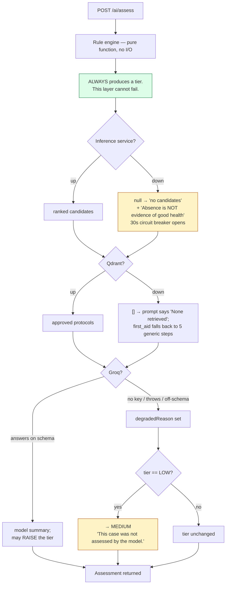

# 15 — Error Handling and Observability

> **Navigation:** [Index](README.md) · Previous: [14 — Testing and Quality](14-testing-and-quality.md) · Next: [16 — Known Limitations and Risks](16-known-limitations-and-risks.md)

How this system fails, what it does when it fails, and how you find out. The
governing rule throughout: **degrade visibly, never plausibly.**

---

## 1. The failure taxonomy

Five classes, each with a different, deliberate response.

| Class | Example | Response |
|---|---|---|
| **Fatal at boot** | Missing `JWT_SECRET` in production | **Refuse to start.** Serving traffic anyone can forge tokens against is worse than not serving |
| **Fatal per request** | Supabase unreachable | 500 with a suppressed message; the full error is logged |
| **Degrade, announced** | Groq down during an assessment | Rule-engine output, tier floored at MEDIUM, `degraded: true`, and an explicit warning that the case was not assessed by the model |
| **Degrade, silent-but-visible** | Inference service down | `null` → "no candidates", with the text *"Absence of candidates is not evidence of good health."* Surfaced at `GET /api/ai/service-status` |
| **Refuse rather than guess** | Whisper returns a hallucination on silence | `ok: false` + reason, **empty** transcript. Never a substitute |

The distinction between the last two matters. A silent degradation that produces
*worse* output is acceptable if it is detectable and states its own limits. A
silent degradation that produces *plausible fabricated* output is not acceptable
under any circumstances, and the codebase treats it as the primary hazard.

---

## 2. Boot-time refusals

`backend/src/config/env.js` — three checks that stop the process in production:

| Check | Message |
|---|---|
| `JWT_SECRET` missing, < 32 chars, or a known-leaked value | `Refusing to start: … Generate one with 'openssl rand -base64 48'` |
| `CORS_ALLOWED_ORIGINS` unset | `Refusing to start: … List the exact origins the frontend is served from.` |
| `SUPABASE_URL` or `SUPABASE_SERVICE_ROLE_KEY` missing | `Refusing to start: … required in production.` |

> Supabase is the only dependency the clinical routes cannot degrade past — a
> missing service-role key means every patient write fails at runtime rather than
> at boot, which is a far worse way to find out.

In development these degrade to warnings with a generated secret and localhost
defaults, so a fresh clone runs without configuration.

---

## 3. Last-resort process guards

`backend/src/server.js`:

```js
process.on('uncaughtException',  (err)    => console.error('UNCAUGHT EXCEPTION — server kept alive:', err?.stack || err));
process.on('unhandledRejection', (reason) => console.error('UNHANDLED REJECTION — server kept alive:', reason?.stack || reason));
```

> A clinical API must not die because one library threw on one bad upload.
> tesseract.js reports a failed image decode by throwing from its worker thread
> on a later tick, which escapes every try/catch around the call and killed the
> whole server — taking every other clinic's session with it.
>
> These handlers log loudly and keep serving. They are a safety net, not a
> substitute for handling errors where they happen: anything landing here is a
> bug that still needs fixing at its source.

The root cause is fixed separately: `looksLikeDecodableImage()` screens the buffer
by magic bytes before the Tesseract worker ever sees it.

---

## 4. The global error handler

```js
app.use((err, req, res, next) => {
  console.error('Unhandled Server Error:', err);
  const status = err.status || 500;
  const body = { error: status === 500 ? 'Internal Server Error' : err.name || 'Request Error' };
  if (!config.isProduction || status < 500) {
    body.message = err.message || 'An unexpected error occurred.';
  } else {
    body.message = 'An unexpected error occurred. Contact an administrator if this persists.';
  }
  res.status(status).json(body);
});
```

Logged in full, returned only outside production. Internal errors routinely carry
table names, query fragments and upstream provider detail, and that is
reconnaissance material.

---

## 5. The degradation ladder

Each AI component fails to a defined, safe value.



**The bottom rung never fails.** `calculateRiskLevel()` is a pure function with no
I/O, so a case always receives a tier even with every external service down.

### Per-component behaviour

| Component | Failure | Value returned | Announced how |
|---|---|---|---|
| Rule engine | — | Cannot fail | — |
| Inference service | Down / timeout / non-200 | `null` | `disease_candidates.source = 'unavailable'` with the reason; `GET /ai/service-status` |
| Qdrant | Unreachable / no index | `[]` | `protocol_matches` empty; prompt states "None retrieved" |
| Groq (assessment) | No key / throw / off-schema | Rule-engine assessment | `degraded: true`, `generated_by: 'rule-engine-fallback'`, warning text, tier floored |
| Groq (speech) | Any failure | `ok: false` | `reason` shown in the UI; symptom field untouched |
| Gemini (vision) | All models fail | `analysis_possible: false` | `cautious_summary` says the photo is flagged for direct doctor review; severity floored at MEDIUM |
| Gemini (OCR) | Declines | Tesseract + Groq | `ocr_engine` names what ran |
| All OCR engines | Fail | `needs_manual_entry: true` | `extraction_error` string; UI prompts for manual entry |
| Supabase Storage | Upload fails | Analysis still returned | `console.error` — *"the doctor will not see this photo"* |
| Video provider | `createMeeting` / `joinMeeting` fails | 503 `{ retryable: true }` | Row rolled back; `CONSULTATION_FAILED` notification |
| Notification insert | Fails | `[]` | `console.warn`; the action itself still succeeded |
| Audit write | Fails | Swallowed | `console.warn`; never breaks the request it records |
| Python build | Fails | `exit 0`, venv deleted | Loud build-log warning; `start.sh` reports it absent; `/ai/service-status` diagnoses it |

---

## 6. The circuit breaker

```js
const CIRCUIT_COOLDOWN_MS = 30000;
const circuitOpen = () => Date.now() - lastFailureAt < CIRCUIT_COOLDOWN_MS;
```

> Without this, an assessment run while the service is down waits the full timeout
> on every request — turning a degraded feature into a slow page.

`probeInferenceService()` deliberately **ignores** it:

> `call()` short-circuits for 30s after a failure, which is right for the clinical
> path and wrong for a health check: an operator asking "is it up?" during that
> window would be told nothing, and would be told the same thing whether the
> service was down or had merely failed once a moment ago.

---

## 7. Rollback on partial failure

Four places where a multi-step operation undoes itself rather than leaving
inconsistent state.

| Operation | Failure point | Rollback |
|---|---|---|
| `createUser` | `staff_profiles` insert fails after the Auth user is created | `auth.admin.deleteUser` — a half-created account with no role is exactly the orphan `authenticateUser` refuses to sign in |
| `joinConsultation` | Video provider fails after the status transition | Row restored to `SCHEDULED` with its original `actual_start_time`, and a `CONSULTATION_FAILED` notification sent — otherwise a video outage leaves the consultation stuck ACTIVE and blocks the doctor entirely |
| `createInstantConsultation` | `attachMeeting` fails | Row set to `CANCELLED` with a reason, rather than leaving an ACTIVE row with no room that blocks the doctor |
| `analyzePatientCase` | `assertRuleSourced` throws | Medication list emptied and a warning appended, rather than returning unsourced medication |

---

## 8. Compare-and-set for concurrency

Optimistic concurrency in four places, so a race produces one winner and a clean
loss rather than a corrupt state.

| Operation | Guard |
|---|---|
| Withdraw a visit | `.eq('id', …).is('deleted_at', null)` — two clicks produce one delete |
| Join a consultation | `.eq('status', 'SCHEDULED')` — loses cleanly to a race |
| Mark a consultation MISSED | `.eq('status', 'SCHEDULED')` — someone joining at the last moment is left alone |
| Send a reminder | `.is('reminder_sent_at', null)`, **marked before notifying** — a crash between notify and mark would otherwise re-send on the next tick, and a duplicate reminder erodes trust in all of them |

Plus the two partial unique indexes on `consultations`, which are the real race
guard: *"An application-level 'is this doctor free?' check loses to a concurrent
request every time; the database does not."*

---

## 9. Observability

There is no APM, no metrics backend and no structured logging. What exists
instead:

### 9.1 The audit log as the observability spine

`audit_logs` is the closest thing to a durable event stream, and it is queryable
through `GET /api/admin/audit`. Nineteen action types cover authentication,
patient lifecycle, visit lifecycle, AI generation, clinical decisions,
consultations, documents, reports and staff administration.

Each row carries actor, role, action, entity type, masked entity id, redacted
metadata, IP and timestamp — enough to reconstruct what happened without exposing
identifiers to the oversight roles who read it.

### 9.2 `GET /api/ai/service-status` — the diagnostic endpoint

Built specifically because verifying a deploy previously meant reading container
logs, *"and a silent failure looked exactly like a working system producing worse
answers."*

When the service is unreachable it distinguishes the two causes, which need
opposite fixes:

```js
const venvPresent = [...paths].some((rel) => fs.existsSync(path.resolve(process.cwd(), rel)));

diagnosis = {
  venv_present: venvPresent,
  cause: venvPresent
    ? 'Dependencies installed but the service is not listening — it failed at startup.'
    : 'The virtualenv is absent, so the build could not install the dependencies.',
  service_log_tail: log   // last 12 lines
};
```

`fetch failed` is the same message for both, which is why the virtualenv's
presence is used to separate them. `start.sh` tees the service's own output to a
file precisely so this endpoint can return it — *"without that, diagnosing a
crash needs log access that whoever is looking at the running system may not
have."*

Restricted to administrators, because it names internal addresses and returns log
tails carrying stack traces and file paths.

### 9.3 `npm run preflight` — the six silent failures

Covered in [14 §5](14-testing-and-quality.md#5-live-service-checks--a-separate-tier-deliberately).
Every check corresponds to something that produces a working-looking system with
wrong behaviour.

### 9.4 Startup banner

```
🏥 VIRTUAL VILLAGE CLINIC AI BACKEND SERVER RUNNING
🚀 API Endpoint: …/api
📡 Realtime + Call: …/realtime
⚡ Groq LLM: CONNECTED | MOCK/FALLBACK
🔍 Qdrant RAG: CONNECTED | MOCK/FALLBACK
📊 Supabase DB: CONNECTED | MOCK/FALLBACK
```

Plus, from `keyPool.js`: `Groq key pool: 4 key(s) — GROQ_API_KEY, Groq_API_Key1, …`
or a warning that LLM features will degrade.

### 9.5 Log conventions

| Level | Used for |
|---|---|
| `console.error` | Something the user is depending on has failed — a photo the doctor will not see, an assessment that could not be persisted, a retired API key |
| `console.warn` | A degradation with a working fallback — a benched key, a Gemini model advancing in the chain, a failed notification insert |
| `console.log` | Pipeline progress — OCR start, RAG hit counts, provider selection |

The escalation from `warn` to `error` on the two `patient_images` failures is
itself the fix for a bug that hid for the lifetime of the feature.

### 9.6 Client-side visibility

| Mechanism | Purpose |
|---|---|
| `ErrorBoundary` around every page | *"A crash in one page must not blank the whole app."* |
| `formatApiError()` | Renders `[HTTP 409 on /visits/x/handoff]: message`, or a network-error variant naming the URL |
| `console.info('[realtime] connecting to', base)` | **Without the token.** A socket silently dialling the wrong host is otherwise invisible: the app keeps working and only calls stop connecting |
| `assessment.generated_by` shown in the UI | The reader can see whether a model or the rule-engine fallback produced the assessment |
| `degraded` flag | Rendered with the warning list |

---

## 10. Performance characteristics

Measured or structurally known. No load test has been run — §12.

### Latency by operation

| Operation | Cost | Notes |
|---|---|---|
| Rule-engine triage | **Microseconds** | Pure function, no I/O |
| Disease classification | **Microseconds** | One `predict_proba` on a 1×377 vector |
| Symptom matching | **Low milliseconds** | Sub-span windows × 377 terms; bounded and deterministic |
| Precaution lookup | **Sub-millisecond** | In-memory dict, fuzzy only on miss |
| Database read | Single-digit ms | Indexed; the doctor queue has a purpose-built composite index |
| `admin_analytics()` | One round trip | Aggregated in Postgres — replaced a loop of Node queries that also truncated at 1,000 rows |
| Groq assessment | **1–4 s** | Dominates the assessment path |
| Whisper transcription | ~1–3 s | Plus a second Groq call to structure it |
| Gemini vision | **2–6 s** | Longer per additional page |
| Gemini OCR, multi-page | **3–10 s** | All pages in one request |
| Tesseract fallback | 2–8 s per page | CPU-bound |
| PDF render | Sub-second | Streamed, not buffered |
| WebSocket delivery | Sub-second | After a synchronous database insert |

### Memory

| Component | Footprint |
|---|---|
| Node API | Baseline, plus buffered uploads (≤ 15 MB × 10 concurrent worst case) |
| Python service | scikit-learn model 3.6 MB + centroids 1.8 MB + indexes ~25 KB, loaded once at start |
| Tesseract worker | Transient; always terminated in a `finally` |

`DEPLOYMENT.md` is honest about the trade: *"This adds a scikit-learn model and a
medicine index to the API container's memory. It is small, but it is not free.
The alternative is dropping the dependency and accepting the rule engine alone —
which is what production has been doing unintentionally all along."*

### Deliberate optimisations

| Optimisation | Effect |
|---|---|
| Model loaded once at service start | Not per request |
| 30-second circuit breaker | A down service costs one timeout per 30 s, not one per request |
| Signed URLs minted **in parallel** (`Promise.all`) | A case with several photographs takes one round trip's time, not N |
| PDF **streamed** | First byte leaves as soon as the header is drawn — a referral sheet is wanted in an emergency |
| `admin_analytics()` in Postgres | One round trip, no row cap |
| Partial indexes | `idx_visits_live`, `idx_notifications_unread`, `idx_patients_unreconciled_emergency` — index only the rows actually queried |
| Sweeper timer `unref()`'d | Does not hold the process open |
| Key pool | Four keys of throughput instead of one |

### Structural bottlenecks

| Bottleneck | Impact |
|---|---|
| **Hosted-model rate limits** | The real ceiling on assessment throughput. [Section 12](12-next-generation-model-roadmap.md) is the structural answer |
| **In-memory rate limiting** | Per process, so behind N instances the limit is N× |
| **In-memory socket registry** | `userSockets` is a per-process `Map`; multi-replica delivery needs sticky sessions or Redis fan-out |
| **`memoryStorage` uploads** | Bounded by the multer limits, but concurrent large uploads are the heap pressure point |
| **PostgREST 1,000-row cap** | Already caused one wrong-but-plausible dashboard. Any new aggregate must be computed in Postgres |

---

## 11. Error messages are written for the person reading them

A consistent practice worth naming: refusals say **what to do next**, and say
which rule applied.

| Instead of | The system says |
|---|---|
| "Upload failed" | *"A file is larger than 15 MB. Photograph the page again at a lower resolution."* |
| "Cannot delete" | *"This case has already been sent to a doctor and cannot be withdrawn. Ask the doctor to close it instead."* |
| "Invalid input" | *"Enter a 10-digit mobile number starting with 6, 7, 8 or 9."* — keyed to the field |
| "Not authorised" | *"Administrator and auditor accounts cannot access patient clinical records. This restriction is deliberate and cannot be granted per account."* |
| "Slot unavailable" | *"This slot is no longer available. Please select another time."* + `refresh: true` |
| "Case incomplete" | 422 + `missing: ["an AI assessment", "recorded vitals"]` |
| "OCR failed" | *"The document could not be read automatically. Enter the details manually."* |
| "No speech" | *"No speech detected in the recording. Ask the patient to speak again."* |
| "Read-only" | *"This case is from a previous day and is read-only. Ask an administrator to reassign it if it still needs review."* |

---

## 12. Observability gaps

| Gap | Impact | What would close it |
|---|---|---|
| **No structured logging** | Logs are human-readable strings, not JSON. Not queryable by field | `pino` with a JSON transport |
| **No request id / correlation id** | A single request's logs cannot be traced across services | Attach a UUID per request, propagate to the inference service |
| **No metrics** | No request rate, latency percentiles, error rate or model-call cost | Prometheus counters and histograms |
| **No alerting** | Nothing pages anyone when the inference service dies | Alerting on the `/health` and `/ai/service-status` endpoints that already exist |
| **No distributed tracing** | The assessment path spans four services | OpenTelemetry |
| **No log aggregation** | Logs live in the container's stream | A hosted log sink |
| **No frontend error reporting** | `ErrorBoundary` catches crashes but reports them nowhere | Sentry or equivalent |
| **No uptime monitoring** | `/api/health` exists but nothing polls it | An external monitor |
| **No load test** | Every latency figure above is either measured single-shot or structurally derived | k6 or Artillery against a staging deployment |
| **`agreed_with_ai` not surfaced** | The clinical-quality signal is collected but not reported anywhere | A dashboard panel — and it is the input to [Section 12](12-next-generation-model-roadmap.md) |

The honest summary: **the system is good at failing safely and poor at telling you
that it did.** The diagnostic endpoints and the audit log cover the specific
failures that had already hurt; general observability is not built.
