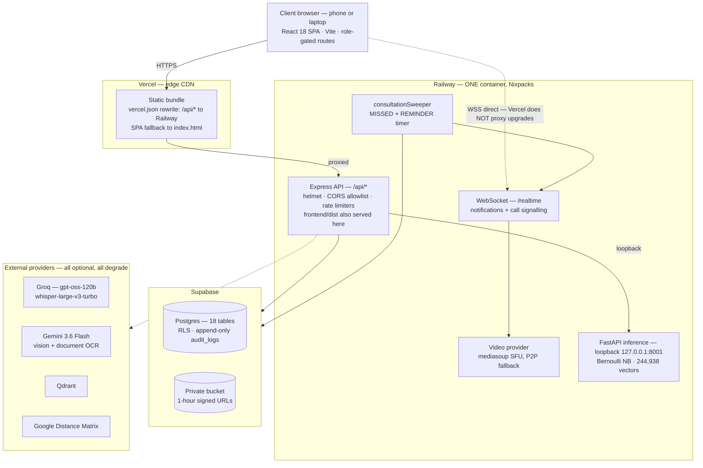
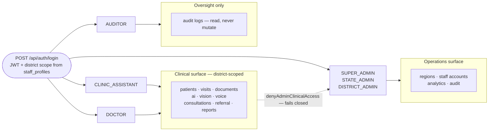
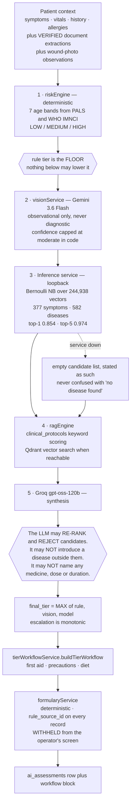
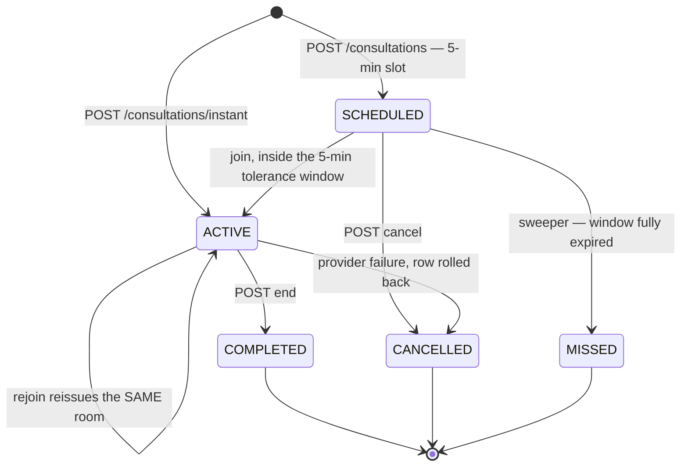
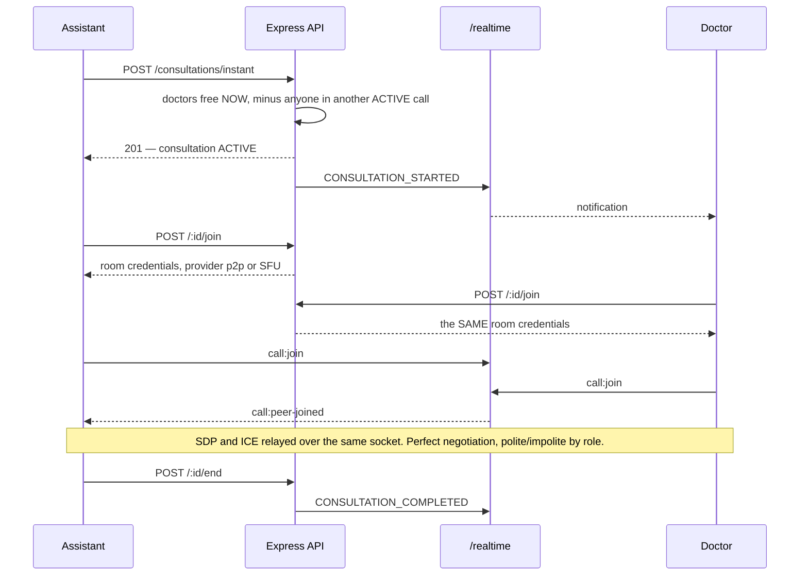
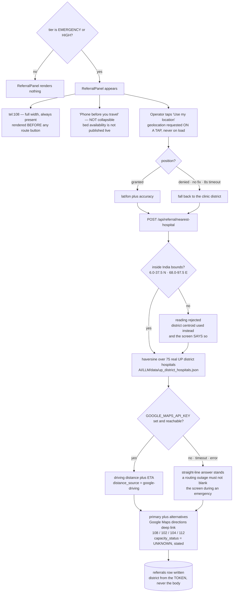
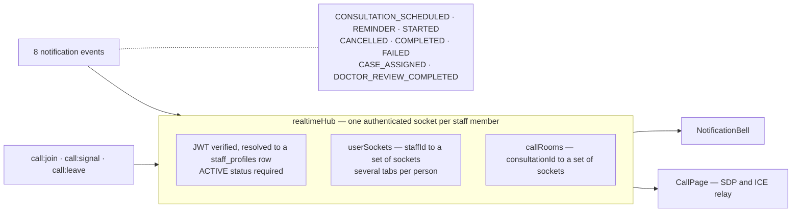
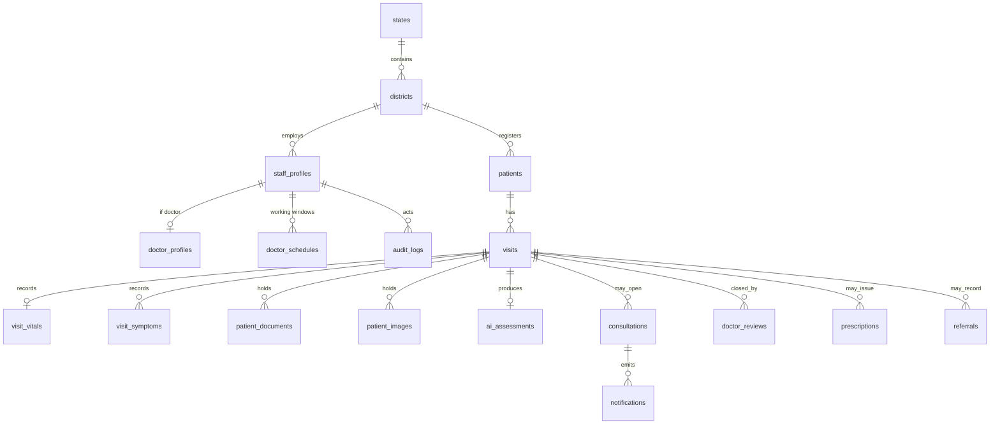

# Architecture and Workflow — the current system

> **Navigation:** [Index](README.md) · Detail: [03 — Data Flow](03-data-flow.md) · [04 — Workflow](04-workflow.md) · [07 — Tech Stack](07-tech-stack.md)

One canonical picture of what is deployed, drawn from the code rather than from
intent. Every box below corresponds to a file in this repository, and every
arrow to a call that exists.

The first architecture drawing for this project described three roles, one "AI
Triage Engine" box, and a doctor portal. All three are still there. What changed
is that each of them turned out to contain a system.

| The first drawing said | The code now says |
|---|---|
| 3 roles | **6 roles.** Admin roles are locked out of every clinical endpoint by `denyAdminClinicalAccess`, not by convention |
| "Patient Info" | Aadhaar lookup, full registration, **guest registration for a patient carrying no documents**, and an ABHA health-card scan that pre-fills fields as a proposal |
| "OCR" | Gemini-native extraction including multi-page PDFs, a Tesseract + LLM fallback, and a **mandatory human verification step** before anything reaches triage |
| "AI Assessment" — one box | A **five-stage chain** in which a deterministic rule engine sets a floor no model may lower, and a trained classifier bounds what the LLM is allowed to say |
| "Video Call" | A scheduling engine, an instant-consultation path, a five-state consultation machine, a background sweeper, and a **provider abstraction** — mediasoup SFU with peer-to-peer fallback |
| "Referral / Immediate" | Live location → nearest of **75 real UP district hospitals** → turn-by-turn deep link → an audited `referrals` row, with the bed-availability claim deliberately withheld |
| "Real-time Notification" | One authenticated WebSocket per staff member carrying **8 notification events and all call signalling** on the same connection |
| — | Streaming **PDF reports**, visit withdrawal, district-scoped admin analytics aggregated in the database, and an append-only audit log |

---

## 1. Deployment topology

**Two facts this diagram exists to record.**

The WebSocket is a **direct** connection to Railway, drawn dashed for a reason:
Vercel rewrites do not proxy WebSocket upgrades. A `/realtime` path routed
through the CDN silently never connects.

The Python inference service runs **inside the same container**, reached on
loopback. It is not a second deployment, it has no public port, and
`build-ai.sh` exits `0` when its dependencies fail — a resolver problem in an
optional subsystem must not become a clinical outage.

---

## 2. Roles and the access boundary

An assistant sees visits in **their own district**. A doctor sees visits
**assigned to them**. That single rule is re-applied at every read — including
the PDF endpoint, because a printable document is the easiest record to forward
on.

---

## 3. End-to-end clinical workflow

The replacement for the original flow drawing.

```mermaid
flowchart TD
    START(["Patient arrives at the village sub-centre"]) --> IDQ{"Carrying documents?"}

    IDQ -->|"no, and urgent"| URG["UrgentRegistrationModal<br/>POST /patients/urgent<br/>guest ID · estimated age required"]
    IDQ -->|yes| LOOK["POST /patients/lookup — Aadhaar"]
    LOOK -->|found| VISIT
    LOOK -->|"not found"| REG["PatientRegistrationPage<br/>optional health-card scan<br/>POST /documents/health-card"]
    REG --> VISIT
    URG --> VISIT

    VISIT["Visit opened — POST /visits<br/>today's open visit adopted if one exists<br/>status = in_progress"]

    VISIT --> CAP

    subgraph CAP["Capture — PatientAssessmentVisitPage"]
        direction LR
        S1["Symptoms<br/>typed or spoken<br/>POST /voice/transcribe"]
        S2["Vitals<br/>range-checked<br/>0 is a reading, not an absence"]
        S3["Documents<br/>POST /documents/upload<br/>prescription · lab report · PDF"]
        S4["Wound photo<br/>POST /vision/analyze<br/>private bucket"]
    end

    CAP --> VER{"any document uploaded?"}
    VER -->|yes| OCRV["OCRVerificationModal — MANDATORY<br/>POST /documents/:id/verify<br/>an extraction is a DRAFT until a human confirms it"]
    VER -->|no| ASSESS
    OCRV --> ASSESS

    ASSESS["POST /ai/assess — see section 4"] --> TIER{"final tier<br/>MAX of rule, vision, model"}

    TIER -->|LOW| LOW["Complete protocol plan<br/>first aid · precautions · diet<br/>NO medicine shown to the operator<br/>doctor queue: DAILY_REVIEW"]
    TIER -->|MEDIUM| MED["Video consultation required<br/>BEFORE any treatment<br/>speciality-routed"]
    TIER -->|"HIGH / EMERGENCY"| HIGH["DANGER ZONE — see section 6<br/>no doctor queue entry<br/>case leaves the platform"]

    LOW --> HAND
    MED --> SCHED["ScheduleConsultationModal<br/>instant, or a 5-minute slot"]
    SCHED --> CALL["/call/:id — see section 5"]
    CALL --> HAND

    HAND["POST /visits/:id/handoff<br/>named doctor in the same district<br/>returns a manifest of what is thin<br/>status = awaiting_doctor"]

    HAND --> NOTIF1["CASE_ASSIGNED to the doctor, over /realtime"]
    NOTIF1 --> QUEUE["DoctorQueueDashboard<br/>worst-first, day-wise"]
    QUEUE --> CASE["DoctorCaseViewPage<br/>vitals · symptoms · documents · photos<br/>AI assessment · disease candidates"]
    CASE --> DEC["POST /doctor/cases/:id/review<br/>diagnosis is MANDATORY"]

    DEC --> DQ{"decision"}
    DQ -->|prescribe| RX["prescriptions row<br/>RX code · itemised · formulary-sourced"]
    DQ -->|refer_hospital| REFD["status = referred"]
    DQ -->|"treat_locally · follow_up · no_action_needed"| DONE["status = completed"]

    RX --> BACK
    REFD --> BACK
    DONE --> BACK

    BACK["DOCTOR_REVIEW_COMPLETED to the assistant, over /realtime"] --> PANEL["DoctorReviewPanel on the assistant's screen<br/>GET /visits/:id/review"]
    PANEL --> PDF["GET /api/reports/visits/:id/:type.pdf<br/>streamed, not buffered"]
    PDF --> END(["Patient treated, or transported"])

    HIGH --> END
```

The loop closes on the assistant's screen. That is the point of the whole
design: a decision that stays in the doctor's portal has not been delivered.

---

## 4. The AI triage pipeline

What the original drawing called one box.

**Three invariants this pipeline exists to enforce.**

A model may raise a triage tier and can never lower one. The language model
cannot name a disease the trained classifier did not propose. Medicine is
selected by a rules engine from a reviewed list, carries the id of the rule that
produced it — and is then not shown to the health worker at all, because a drug
name on an automated summary is the thing a health worker acts on.

> The triage thresholds and the formulary are drawn from published guidance and
> have **not** been reviewed by a registered practitioner for this deployment.
> The system says so on its own pages.

---

## 5. Consultation lifecycle

Availability is computed server-side at the moment it is asked, from
`doctor_schedules` and live consultations — and re-run **inside** the booking
transaction, because a slot list rendered eight seconds ago is a guess.

Identity always comes from the verified token and the `staff_profiles` row, never
from the query string. That was the exact hole in the removed `/signal` server,
where `role=DOCTOR` in a URL was enough to join a live consultation.

---

## 6. Emergency referral path

The district name comes from `req.user.districtId` and never from the request
body. The Maps key lives only in backend environment; it is never prefixed
`VITE_`, never returned in a response, and never enters the frontend bundle.

---

## 7. Realtime fabric

Every notification is **persisted to `notifications` first, then pushed**. A
health worker whose phone dropped off the network still finds the doctor's
decision when they reconnect.

---

## 8. Data model

18 tables under row-level security. `audit_logs` is append-only.
`clinical_protocols` and its steps are retained from the v1 schema and back the
RAG retriever.

`visit_status`: `in_progress` → `awaiting_ai` → `awaiting_doctor` →
`in_consultation` → `completed` | `referred` | `cancelled`.

---

## 9. API surface

| Mount | Endpoints | Who |
|---|---|---|
| `/api/auth` | `login` · `logout` · `me` | all |
| `/api/patients` | `lookup` · `detail` · `GET` · `POST` · `urgent` · `PATCH` | clinical |
| `/api/regions` | `states` · `districts` | all |
| `/api/visits` | `POST` · `:id` · `:id/review` · `PATCH` · `:id/handoff` · `DELETE` | clinical |
| `/api/documents` | `GET` · `upload` · `health-card` · `:id/verify` | clinical |
| `/api/ai` | `assess` · `analyze-patient` · `transcribe` · `analyze-document` · `risk-assessment` · `analyze-image` · `interpret-report` · `service-status` | clinical; status is admin |
| `/api/vision` | `analyze` · `analyze-image` | clinical |
| `/api/voice` | `transcribe` · `translate` | clinical |
| `/api/doctor` | `directory` · `queue` · `queue/dates` · `cases/:id` · `cases/:id/review` | doctor |
| `/api/consultations` | `availability/dates` · `availability/slots` · `availability/doctors` · `POST` · `instant` · `GET` · `:id` · `:id/join` · `:id/end` · `:id/cancel` | clinical |
| `/api/notifications` | `GET` · `read` | all |
| `/api/referral` | `nearest-hospital` | clinical |
| `/api/reports` | `visits/:id/:type.pdf` | clinical |
| `/api/admin` | `regions` · `users` CRUD · `analytics` · `audit` | admin; auditor reads `audit` |
| `wss://…/realtime` | notifications and call signalling | authenticated staff |

---

## 10. What degrades, and to what

Nothing in the list below takes the clinic offline.

| Subsystem down | Behaviour |
|---|---|
| Python inference service | empty candidate list, stated as such — never "no disease found" |
| Groq | rule-engine tier and protocol retrieval still produce a plan |
| Gemini vision | photo stored, flagged for direct doctor review, **no findings invented** |
| Qdrant | Supabase keyword scoring — the effective source of truth today |
| Google Distance Matrix | straight-line distance, labelled as straight-line |
| mediasoup worker | peer-to-peer WebRTC |
| Speech transcription silent | **no transcript** — never a plausible substitute sentence |
