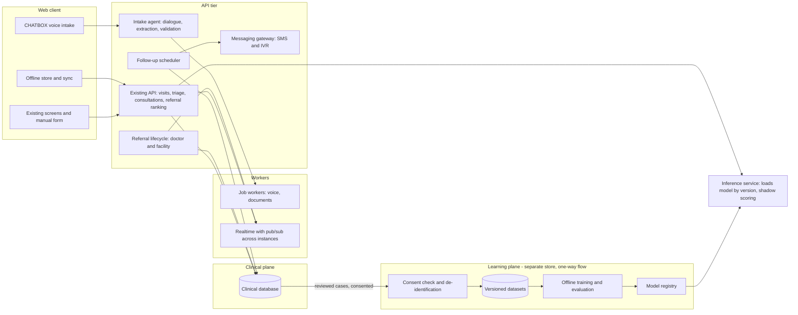
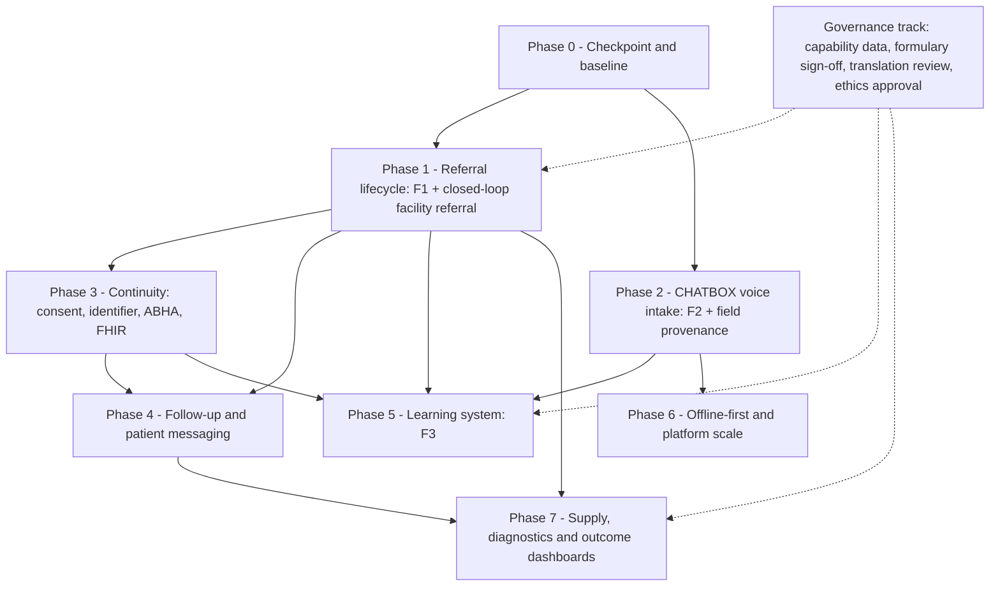

# Roadmap v3 — gaps against PS 26133, and the phased plan

> **Status: IN PROGRESS.** Phase 0 is done. Phases 1 and 2 are built behind feature
> flags that are off — each phase below says exactly what exists and what does not.
> Phases 3–7 are not started.
>
> The system as it ran for the SIH demonstration is frozen at tag
> **`sih2026-live-checkpoint`** (commit `437b877`) and on branch
> **`checkpoint/sih2026-demo`**. The earlier tag `sih2026-demo-checkpoint`
> (`a28118c`) marks the state before the multilingual release. Every phase below
> is built alongside the live checkpoint, and must leave it runnable.

**Problem statement:** SIH 2026 · PS 26133 · Government of Maharashtra —
*Accessibility and quality of public healthcare services, particularly in rural
and underserved areas.*

---

## Contents

1. [Ground rules for every phase](#1-ground-rules-for-every-phase)
2. [Where the system stands against the problem statement](#2-where-the-system-stands-against-the-problem-statement)
3. [What is lagging, ranked](#3-what-is-lagging-ranked)
4. [Feature specifications](#4-feature-specifications)
   - [F1 · Doctor-to-doctor referral](#f1--doctor-to-doctor-referral)
   - [F2 · AI voice intake — the CHATBOX](#f2--ai-voice-intake--the-chatbox)
   - [F3 · Learning from verified case histories](#f3--learning-from-verified-case-histories)
5. [Further advancements](#5-further-advancements)
6. [Target architecture](#6-target-architecture-planned)
7. [The phased plan](#7-the-phased-plan)
8. [Keeping the checkpoint demonstrable](#8-keeping-the-checkpoint-demonstrable)
9. [Decisions the team must make](#9-decisions-the-team-must-make)

---

## 1. Ground rules for every phase

These hold today and are not renegotiated by anything below.

1. **AI prepares the case; a registered doctor makes the decision.** Telemedicine
   Practice Guidelines 2020, cl. 3.7.4. No phase moves a clinical decision into
   software — including the learning system in F3.
2. **A machine's output is a draft until a person confirms it.** Voice capture,
   OCR and any retrained model all obey this. Confirmation is a recorded act, not
   an assumption.
3. **Nothing is fabricated.** An unheard, unread or unknown value stays empty.
   This rule exists because an earlier speech implementation substituted a fixed
   sentence when transcription failed, and fed it to triage.
4. **Manual paths are never removed.** New capture methods are additions reached
   by a button. The typed form remains the path of record, always available.
5. **Database changes are additive.** Expand first; contract only once the
   checkpoint is retired. Otherwise the checkpoint stops running against the live
   database (section 8).
6. **New capability ships behind a feature flag that defaults off,** so the demo
   state can be shown from a current build as well as from the checkpoint. Once a
   feature is released the default flips in the repository — `DEFAULT_FEATURES` in
   `features.js`, so a deploy is the release and nothing depends on a variable set
   by hand in a dashboard. `FEATURE_FLAGS=` still turns everything off.
7. **Measure before changing.** Each phase names the PS outcome it moves and
   records a baseline first. A claim of improvement needs a before.

---

## 2. Where the system stands against the problem statement

Every "today" entry below was checked against the code, not recalled.

| The PS asks for | Today | Gap |
|---|---|---|
| Assisted teleconsultation | Scheduled and instant video; mediasoup SFU with P2P fallback; asynchronous case handoff | Signalling is built around two participants, so a three-way specialist consult needs the SFU path |
| Appointment and queue management | 5-minute slot engine, instant booking, worst-first doctor queue | No reminders reach patients — no SMS, WhatsApp or IVR integration exists |
| Digital triage | Four tiers: deterministic rule floor, symptom model, LLM synthesis | The symptom model is trained on public datasets only → **F3** |
| Longitudinal patient records | Patient record with visit history, documents, images | Records are district-scoped, so a patient who moves to a facility in another district arrives with no history. Aadhaar is the primary key. No ABHA linkage |
| Referral tracking | Facility ranking by capability, PM-JAY, quality and travel; every referral audited | A referral records what was *shown* and has no status — nobody confirms arrival or outcome. **A doctor cannot refer to another doctor** → **F1** |
| Diagnostic coordination | Lab-report OCR and interpretation | No ordering or tracking of tests |
| Medicine availability | Formulary rules engine; molecule index | No stock feed; the formulary is unsigned |
| High-risk follow-up | A doctor can choose `follow_up` with a day count | The day count is written into the notes and **nothing acts on it** — no scheduler, reminder or recall list |
| Facility dashboards | Admin analytics, aggregated in the database | Counts activity, not the outcomes the PS names |
| Frontline health-worker support | Assistant-led intake, voice notes, OCR, 32-language interface | Typing the intake form is the slowest step → **F2** |
| Low-connectivity environments | Client-side compression, asynchronous extraction, 120 s upload deadline | **No offline capability.** No service worker exists, so a dropped connection stops registration |
| Multilingual interaction | 32-language interface; the chosen language reaches the AI prose and the printed PDF report ([20 — Internationalisation](20-internationalisation.md)); speech-to-text in 7 languages including Marathi; browser text-to-speech | Coverage is thin outside Hindi: of 993 interface strings, Hindi has 37% and **Marathi 8%**, most regional languages 1–3%. Only Hindi and English are reviewed by native speakers. No patient-facing voice channel |
| Emergency escalation | EMERGENCY tier routes to referral; 108 prominent | Facility capability data is unsourced, so ranking runs on `unverified` |
| Interoperable records on approved standards | ABHA as an optional field | No FHIR, no ABDM Health Information Provider/User integration, no consent manager |

---

## 3. What is lagging, ranked

Ranked by distance between what the PS names as its core problem and what the
system does today.

### L1 · Care is not continuous across facilities — *highest*

> *"patients may move between sub-centres, primary health centres, rural hospitals
> and district hospitals without continuity of information"*

This is the PS's own statement of the problem. Today every clinical row is scoped
to one district, which is correct for access control and wrong for a patient
referred across a district line: the receiving facility cannot see the case. No
consent model exists that would let it, and there is no ABHA or FHIR path to move
a record between systems.

### L2 · Referral is routed, not tracked

> *Expected outcome: "improved referral completion"*

The platform chooses a destination and records the choice. It never learns
whether the patient arrived, was admitted or was treated, so referral completion
— an outcome the PS names — cannot be measured, let alone improved.

### L3 · A doctor cannot hand a case to another doctor

The doctor's decisions are `treat_locally`, `prescribe`, `refer_hospital`,
`follow_up` and `no_action_needed`. A general physician who needs a paediatrician,
an obstetrician or a second opinion has no way to ask for one inside the system.
→ **F1**

### L4 · Follow-up is written down and then forgotten

> *Expected outcome: "better follow-up for maternal, child and chronic conditions"*

`follow_up` stores a day count in free-text notes. No scheduler reads it, no
reminder is sent, and no list shows who is overdue. For antenatal care,
immunisation and diabetes or hypertension management, follow-up *is* the care.

### L5 · The platform needs a live connection

> *"support … low-connectivity environments"*

The network work done so far — compression, asynchronous extraction, honest
timeouts — makes a slow link usable. It does nothing for a link that drops, and
in a sub-centre the link drops.

### L6 · Intake is slow

Manual entry of complaint, duration, history, allergies, medication and six
vitals is the longest step between a patient arriving and a doctor seeing the
case. → **F2**

### L7 · The AI never learns from the cases it serves

The symptom model was trained once, on public data. Every doctor-confirmed
diagnosis the platform records is thrown away as training signal. → **F3**

### L8 · No channel reaches the patient

> *"limited awareness of available services"* · *"health literacy"*

Every notification goes to staff over the realtime socket. A patient cannot be
reminded, recalled or told where to go.

### L9 · Records are not interoperable

> *"interoperable health records based on approved standards"*

An optional ABHA field is the whole of it. There is no FHIR representation and no
ABDM integration.

### L10 · Dashboards count activity, not outcomes

> *"enhanced quality monitoring"*

The PS's expected outcomes — reduced travel and waiting time, earlier
consultation, referral completion, follow-up — are not instrumented.

### L11 · Medicine and diagnostic visibility

No stock feed, no test ordering, and a formulary that no registered practitioner
has signed.

### L12 · Governance and platform debt

Facility capability data unsourced · formulary unsigned · translations unreviewed
· content security policy disabled · rate limiting counted per process · realtime
delivery confined to one process · Aadhaar used as a primary key.

### Maharashtra-specific

- **MJPJAY alongside PM-JAY.** Maharashtra runs its state scheme, Mahatma Jyotiba
  Phule Jan Arogya Yojana, together with PM-JAY. The affordability line on a
  referral card should know both, or a Maharashtra patient is told "not
  empanelled" for a hospital that would treat them cashless.
- **Role mapping.** The platform's *clinic assistant* corresponds to the Community
  Health Officer, ANM and ASHA roles at Ayushman Arogya Mandirs. Naming them in
  the UI is what makes the product recognisable to the people who would use it.
- **Marathi is already supported** by speech-to-text, which makes Maharashtra the
  natural first region for F2.
- **Marathi interface coverage is 8%.** Of 993 interface strings, 82 are in
  Marathi and the rest fall back to English. For a Maharashtra deployment this is
  the first gap to close, ahead of any new feature.

---

## 4. Feature specifications

### F1 · Doctor-to-doctor referral

**Problem.** A doctor reviewing a case cannot involve another doctor. The only ways
out of a case are to decide it or send the patient to a hospital.

#### Referral types

| Type | Who is accountable afterwards | Use |
|---|---|---|
| **Second opinion** | The referring doctor. The case stays theirs | "Please review this rash and tell me what you think" |
| **Specialist consult** | The referring doctor, advised by the specialist; may include a three-way call with the assistant | Paediatric, obstetric or cardiac input on a case |
| **Transfer of care** | The receiving doctor, from the moment they accept | Wrong speciality, doctor going off duty |
| **Escalation** | The receiving doctor at a higher-level facility | Needs a district-hospital physician, not a sub-centre one |

Accountability is explicit on every referral because TPG 2020 makes the
registered medical practitioner accountable for the consultation. A case must
never reach a state where it is unclear which doctor answers for it.

#### Lifecycle

```
requested ──► accepted ──► in_review ──► completed   (opinion returned / care transferred)
    │             │
    │             └──► returned   (receiving doctor hands it back with a reason)
    ├──► declined  (with a reason; referring doctor is told immediately)
    └──► expired   (urgent referral not accepted within its window)
```

#### Rules

- Only the doctor currently assigned to the visit may refer it.
- A doctor cannot refer to themselves, or to a doctor who has already declined
  this case.
- **Loop guard:** a case has a maximum referral depth, so it cannot circulate
  between doctors indefinitely while the patient waits.
- The receiving doctor must be active, and filterable by speciality and current
  availability — `doctor_profiles.specialization` and `doctor_schedules` already
  hold both.
- **Urgency windows.** An urgent referral not accepted in time expires and the
  referring doctor is prompted to choose another, rather than waiting silently.
- **Scope.** Phase 1 allows referral within the district. Cross-district referral
  needs the consent and record-sharing model from Phase 3 and is not enabled
  before it.
- The previous-day read-only rule continues to apply.
- The receiving doctor gains access to **that one visit**, for the life of the
  referral, and read-only afterwards. Not to the patient's other visits.

#### Data it needs

A **case referral** record per referral: visit, referring doctor, receiving
doctor, type, urgency, clinical question, status, reason for decline or return,
timestamps for each transition, and the accountable doctor after completion.
Every transition writes an audit event. Visit status gains states for "referred
to a doctor" and "with specialist", so the queue can show them.

#### Who sees what

- **Referring doctor** — "Refer to a doctor" beside the existing decisions, a
  specialist directory with live availability, and the status of what they sent.
- **Receiving doctor** — a "Referred to me" section of the queue, with the
  clinical question at the top.
- **Assistant** — the case shows it is with a specialist, and why. The doctor's
  eventual decision still returns to their screen exactly as it does today.

#### Three-way consultation

A specialist consult may need assistant, referring doctor and specialist on one
call. The P2P provider handles two participants; three requires the mediasoup SFU
path, so this is a deployment requirement to verify, not an assumption.

#### Measures

Time from request to acceptance · share completed versus declined or expired ·
loops prevented by the guard · time to final decision with and without a
specialist.

#### Risks

| Risk | Mitigation |
|---|---|
| A case bounces while the patient waits | Loop guard, urgency windows, expiry returns control to the referring doctor |
| Ambiguous accountability | Accountable doctor stored on every transition; shown on the case |
| Specialists overloaded | Availability-aware directory; declines carry a reason and are visible |

---

### F2 · AI voice intake — the CHATBOX

**Problem.** An assistant types every field of the intake by hand while the patient
waits. Much of it is information the assistant already has in their head and could
say in a few seconds.

**What it is.** A **CHATBOX** button on the assessment screen opens a voice
conversation. The assistant speaks naturally — *"Ram Naresh, sixty-eight, thirst
and frequent urination for three days, diabetic nine years on metformin, BP one
forty over ninety, pulse ninety-six"* — and the system fills the same form the
assistant would have typed. It asks only for what is missing or unclear, reads
numbers back before accepting them, and hands a completed draft to the assistant
to confirm.

**What it is not.** A replacement for the form. The manual form stays exactly as
it is, available at every moment, and remains the path of record. The CHATBOX
fills it; it does not bypass it.

#### Fields it captures

The fields the manual form already collects, and no others:

- Chief complaint and symptoms
- Symptom duration — as a value and a unit (days, months, years), matching the
  existing database constraint
- Medical history · known allergies · current medications
- Pregnancy status, where relevant — it changes triage and referral capability
- Vitals — temperature, blood pressure (systolic and diastolic), pulse, SpO₂,
  respiratory rate

#### How a session runs

1. **Push to talk.** Not always-listening — for privacy in a shared room, and so
   audio is only uploaded when someone means to speak.
2. **Speech to text**, reusing the existing speech service and its language
   detection, extended for code-mixed speech ("BP one forty by ninety hai").
3. **Structured extraction** into a fixed schema. The model may only fill defined
   fields; free text never becomes a vital sign.
4. **Validation** through the same vitals range checks the manual form uses. An
   impossible value is questioned, not stored.
5. **Clarifying questions** for missing or ambiguous fields only, spoken back with
   the browser speech synthesis the app already uses.
6. **Read-back of every number** before it is accepted.
7. **Draft review.** Captured values appear in the manual form, visibly marked as
   voice-captured. The assistant corrects anything, then submits through the
   existing flow — which runs the existing validation.

#### Safety rules

- **Never fabricate.** Silence, noise or an unclear phrase fills nothing and asks
  again.
- **Never overwrite a typed value.** The rule that already governs OCR applies:
  what the assistant typed wins.
- **Every field records its origin** — typed, voice, OCR — and whether a person
  confirmed it. This provenance is also the foundation F3 depends on.
- **Confirmation is mandatory.** Nothing reaches triage from the CHATBOX until the
  assistant submits the form.
- **Audio is personal data.** Consent to record is captured; retention is limited
  and stated; transcripts are stored as draft artefacts under the same access
  controls as the visit.
- **Fails to manual, never to a spinner.** Poor connection, unsupported language
  or a provider error returns the assistant to the form with whatever was
  confirmed so far intact.

#### Languages

Start with the speech-to-text set already supported — Hindi, Marathi, English,
Tamil, Telugu, Bengali, Gujarati — with Marathi and Hindi first for Maharashtra.

#### Measures

- **Time to complete intake**, CHATBOX against manual — the claim the feature
  exists to make, and the one that needs a recorded baseline first
- Per-field accuracy, with **exact match required for vitals**
- Word error rate by language
- Share of sessions needing manual correction, and which fields
- Share of sessions abandoned to the form

The demonstration case pack converts directly into a scripted audio test set:
five cases with known correct values for every field.

#### Risks

| Risk | Mitigation |
|---|---|
| A misheard number reaches triage | Read-back, range validation, mandatory confirmation |
| Noisy clinic room | Push to talk; low-confidence segments re-asked, not guessed |
| Latency on a rural link | Short push-to-talk chunks; manual form never locked |
| Assistant over-trusts the draft | Voice-captured fields marked in the form; correction rate monitored |

---

### F3 · Learning from verified case histories

**Problem.** Every doctor-confirmed diagnosis is exactly the labelled data the
symptom model lacks, and the platform discards it. The model knows the 244,938
public records it was trained on and nothing about the patients it serves.

**What it is.** Each completed, doctor-reviewed case is saved as a complete
history, and — with consent, after de-identification and human review — becomes
training data. The model is retrained periodically on public data plus this
growing real-world set, evaluated, and promoted only with human approval.

**What it is not.** Online learning. The model in production never changes itself.
Every new version is trained offline, evaluated against fixed benchmarks, run in
shadow, and approved by a person before it serves a single patient.

**How it relates to [12 — Next-Generation Model Development](12-next-generation-model-roadmap.md).**
Doc 12 owns the in-house clinical language model — compute, training
methodology, evaluation gates, guardrails and staged rollout — and its
data-curation harness is already being built as its P0. F3 does not duplicate
that programme. It adds what the programme needs and does not yet cover:
**consent for training as a separate purpose**, **ethics committee approval as a
hard gate**, continuous capture of complete histories including CHATBOX
provenance (F2) and specialist opinions (F1), retraining of the statistical
symptom classifier, and a model registry that extends doc 12's version pinning
so both models are served from one source of truth.

#### A complete history

For each reviewed visit: intake fields with their provenance (from F2), vitals,
verified documents, the model's candidate list, the doctor's diagnosis and
decision, any specialist opinion (from F1), and — once follow-up exists (Phase 4)
— the outcome.

#### Labels: what may teach the model

- **Only a doctor's recorded diagnosis is a label.** The model's own candidates
  are never labels. A model trained on suggestions doctors accepted learns to
  agree with itself.
- `doctor_reviews.agreed_with_ai` records whether the doctor agreed with the AI.
  Doc 12 uses it as the preference signal for tuning the language model (§5.3).
  The same signal carries an automation-bias risk — a doctor agreeing with a
  plausible suggestion is not independent confirmation — so its rate is
  monitored per model, as doc 12's concordance monitoring intends, and a rise
  without a matching gain in accuracy is treated as a warning, not a win.
- A specialist opinion refines a label; a follow-up outcome confirms or corrects
  it.
- `/diagnose` already returns the symptom phrases it could not match. Those are a
  direct measure of how real patients describe symptoms that the 377-term
  vocabulary misses, and they drive vocabulary expansion.

#### The pipeline

```
completed review
      │
      ▼
consent check ──── no consent ──► excluded, recorded as excluded
      │
      ▼
de-identification      drop direct identifiers · age to bands · shift dates ·
      │                generalise geography where a rare condition makes a
      │                person identifiable · scrub names from free text
      ▼
quarantine + clinician QA sample
      │
      ▼
versioned dataset snapshot     immutable · manifest · datasheet
      │
      ▼
offline training      public data + verified real cases
      │
      ▼
evaluation            frozen public benchmark · held-out real cases ·
      │               per-state and per-district slices · calibration
      ▼
model registry        model card · metrics · data version · approver
      │
      ▼
shadow deployment     runs beside production, output logged, never shown
      │
      ▼
human sign-off ──► promotion ──► drift monitoring ──► rollback when needed
```

#### Compliance

- **DPDP Act 2023.** Training is a different purpose from treatment and needs its
  own consent. Consent captured at registration for care does not cover it.
- **ICMR ethical guidelines** for biomedical and health research, and ICMR's 2023
  guidelines for AI in healthcare, apply to using patient data this way. **Ethics
  committee approval is required before real patient data is used for training.**
  This is a gate, not paperwork to do alongside.
- **TPG 2020, cl. 3.7.4.** Retraining improves what the doctor is shown. It never
  licenses a model to diagnose for, or prescribe to, a patient. Nothing
  model-authored about diagnosis or medication reaches the health worker; any
  medication reasoning stays on the doctor's review surface, bounded by the
  signed formulary, as doc 12 §7 sets out.
- **The rule-engine floor is unchanged by learning.** A retrained model can make
  triage more informed. It cannot lower a tier the rules set.

#### The architecture transformation

Today the inference service loads one model file baked into the container image.
F3 changes that in four ways:

1. **A separate learning plane.** De-identified data lives apart from the clinical
   database, in a separate store with separate access. Data flows one way — from
   clinical to learning — and nothing in the learning plane joins back to a
   patient.
2. **A model registry becomes the source of truth** for which model is serving.
   This is not hypothetical: the current training metadata recorded
   `selected: centroid` while the service actually served a Naive Bayes model,
   and every response named the wrong model until it was caught. A registry that
   the service reads from makes that class of error impossible.
3. **Versioned loading.** The inference service loads a model by version from the
   registry rather than from a file in the image, which is what makes shadow
   running and rollback possible.
4. **Shadow scoring.** A candidate model scores live requests beside production,
   logged for comparison and never shown to a user.

#### Measures

Top-1 / top-5 accuracy against the frozen benchmark and against held-out real
cases · calibration · performance by state and district · agreement rate between
model and doctor, watched for drift upward · share of unmatched symptom phrases
over time.

#### Risks

| Risk | Mitigation |
|---|---|
| Re-identification of a patient in a small district | De-identification with generalisation for rare conditions; clinician QA; separate plane |
| Model learns to agree with itself | Model output never a label; `agreed_with_ai` cases analysed separately |
| A worse model reaches patients | Frozen benchmarks, shadow running, human sign-off, instant rollback |
| Learning without lawful basis | Separate consent; ethics approval as a hard gate before real data |

---

## 5. Further advancements

Beyond the three requested features, in rough order of value to the PS.

| Advancement | Closes | Summary |
|---|---|---|
| **Closed-loop facility referral** | L2 | Receiving hospital acknowledges arrival and outcome; referral completion becomes a measured number. Shares F1's lifecycle engine |
| **Follow-up engine** | L4 | Recall lists and reminders for antenatal visits, immunisation schedules, and diabetes and hypertension review, driven by the doctor's decision rather than notes |
| **Patient messaging** | L8 | SMS and IVR in the patient's language for appointments, follow-up and where to go on referral; IVR matters where literacy is low |
| **Offline-first intake** | L5 | Installable web app that registers patients and records intake with no connection, and syncs with conflict handling when the link returns |
| **Continuity and interoperability** | L1, L9 | Internal patient identifier replacing Aadhaar as the key; ABHA linkage; FHIR R4 representation; consent-based cross-facility access; path to ABDM integration |
| **Outcome dashboards** | L10 | Time from registration to doctor decision, consultation waiting time, referral completion, follow-up adherence — by district, for district health officers |
| **Scheme and capability data** | L12, Maharashtra | Source facility capability and empanelment — PM-JAY and MJPJAY — through the existing ingestion script, so referral ranking runs on real data |
| **Medicine and diagnostics visibility** | L11 | Stock visibility from state drug-inventory systems where available; ordering and tracking of diagnostic tests |
| **Platform hardening** | L12 | Shared-store rate limiting; realtime delivery across instances; a worker pool for voice and document jobs; a real content security policy |

---

## 6. Target architecture *(planned)*

The current architecture is documented in [ARCHITECTURE.md](ARCHITECTURE.md). The
target below adds to it; nothing in the current design is removed.



| Component | Today | Target |
|---|---|---|
| Intake | Manual form, voice notes, OCR | Plus the CHATBOX intake agent, filling the same form |
| Referral | Facility ranking and an audit record | A lifecycle engine for doctor and facility referrals, with status |
| Follow-up | Day count in notes | Scheduler with recall lists and patient reminders |
| Patient contact | None | Messaging gateway |
| Connectivity | Online only | Offline capture with sync |
| Model serving | One model file in the image | Versioned loading from a registry; shadow scoring |
| Training | One-off, public data | Recurring, public plus consented verified cases, in a separate plane |
| Realtime | One process | Pub/sub across instances |
| Records | District-scoped, Aadhaar-keyed | Internal identifier, ABHA, FHIR, consent-based sharing |

---

## 7. The phased plan

Phases are ordered by dependency, not by size. Two tracks can run in parallel
once Phase 0 is done.



**Track A — clinical workflow:** Phase 1 → Phase 3 → Phase 4 → Phase 7
**Track B — data and AI:** Phase 2 → Phase 5
**Cross-cutting:** Phase 6 starts alongside Phase 2; the governance track runs
throughout.

Effort is relative: **S** small, **M** medium, **L** large, **XL** very large.

---

### Phase 0 — Checkpoint and baseline · *S*

**Goal.** Freeze what works, clear operational debt, and measure the starting line.

| Deliverable | Status |
|---|---|
| Production state tagged `sih2026-live-checkpoint` (`437b877`) and branched `checkpoint/sih2026-demo`; the earlier state tagged `sih2026-demo-checkpoint` (`a28118c`) | Done |
| Maharashtra district masters, demo staff, patients and referral hospitals | Done — seeded on production 2026-09-14: 36 districts, 216 clinical staff, 900 patients. The referral-hospital code ships with the next release |
| Migrations 12 and 13 applied on production | Done 2026-09-14. They had never run: `db:migrate` issued queries on a client it never connected, and exited silently. Fixed, applied, verified |
| Seed command removed from the Railway start configuration | To verify |
| Feature-flag mechanism, default off | Built — `FEATURE_FLAGS` on the server, `GET /api/features` for the client; a disabled feature's routes answer 404 |
| Baseline measurements: intake duration, registration to doctor decision, consultation wait | Built behind `baseline_metrics` — `baseline_metrics()` (migration 14), `GET /api/admin/metrics/baseline`, admin dashboard card. Migration 14 applied on production 2026-09-14. **Intake duration was wrong until migration 17:** it started at the visit row, which is created at the first assessment, and read a median of 11 s on the 30 real visits. It now starts when the assistant opens the patient, and older visits are excluded |

**Exit criteria.** The checkpoint deploys and runs unchanged. Baselines recorded.
Flags available for every later phase.

---

### Phase 1 — Referral lifecycle · *L*

> **Status:** built, behind flags that are off.
> - **F1 doctor-to-doctor referral** (`doctor_referral`): migration 15 applied and deployed.
> - **Closed-loop hospital referral** (`referral_tracking`): migration 16, a follow-up
>   worklist for assistants (overdue first), the same status and actions on the
>   assistant's case view, a no-login acknowledgement link for the receiving hospital
>   printed on the referral slip as text and as a QR code, notifications back to the
>   clinic, and **referral completion now measured** in `baseline_metrics()`.
>   Migration 16 was validated on production in a rolled-back transaction and is not
>   applied.
>
> **Not done:** the three-way consult on the SFU path.

**Goal.** One referral engine serving both directions: doctor to doctor (F1) and
doctor to facility (closed loop).

**Why together.** Both are the same state machine — requested, accepted,
declined, completed — with the same notifications and audit. Building it once
avoids two engines that drift apart.

**Scope.**
- F1 within the district: second opinion, specialist consult, transfer of care
- Specialist directory using existing speciality and schedule data
- "Referred to me" queue; referral status on the assistant's case view
- Facility referral gains status: acknowledged, arrived, admitted, outcome
- Loop guard, urgency windows, expiry
- Three-way consult verified on the SFU path
- Referral completion rate on the dashboard

**Depends on.** Phase 0.
**Unlocks.** Phase 3 (cross-district needs the engine), Phase 4 (follow-up after
referral), Phase 5 (specialist opinions as label refinements), Phase 7.

**Exit criteria.** A case can be referred, accepted, reviewed and returned with
accountability recorded at each step. No case can loop past the guard. Referral
completion is a measured number.

---

### Phase 2 — CHATBOX voice intake · *L*

> **Status:** **built behind `voice_intake`**, end to end but unproven. A pure
> rules module (spoken numbers, blood pressure, duration, and the vitals limits
> shared with the manual form), `POST /api/ai/intake-extract` (29 tests), and a
> CHATBOX button on the assessment screen: push to talk, the proposal shown
> before anything moves, numbers read back aloud, and every voice-filled field
> marked *heard — check it* until the assistant touches it. It stores nothing —
> no audio, no transcript, no draft.
>
> **Provenance and measurement (migration 17):** every assessment records where each
> value came from — typed, dictated, voice or a never-touched default — and whether a
> person confirmed it; the intake start is recorded from the client's elapsed time;
> the baseline splits intake time into manual and voice-assisted. A heard value
> carries a *heard — tap when checked* control, the assessment waits until every
> heard value is checked or corrected, and "All measured and correct" no longer
> waves heard vitals through. Recording is disabled until the assistant ticks that
> the patient agreed, and that consent is part of the record.
>
> **Test set (`npm run eval:intake`):** 23 spoken-style transcripts — English, Hindi
> and Marathi, romanised and Devanagari, code-mixed — run through the live prompt,
> model and rules. Vitals must match exactly and any vital nobody said fails the case.
> The first run found four real defects: temperatures read digit by digit ("one oh one
> point four") and numbers followed by a unit ("twenty eight per minute") were
> dropped, weeks were not understood, and Hindi and Marathi durations never parsed; it
> also found "two three days" stored as 2. All fixed. **Now 23/23 cases, 29/29 vitals
> exact, 0 fabricated — the exit criterion is met on text.** It measures extraction,
> not speech recognition.
>
> **Completing F2 (migration 19).** Every field F2 names is now on the form and in
> the database: current medicines and blood glucose had columns but no input,
> pregnancy had neither, and weight and height had an input but no column — the form
> collected them and threw them away. Pregnancy is three-state, because "not asked"
> recorded as "no" is an invented answer. Clarifying questions and the numbers are
> now spoken aloud when the proposal arrives, not only on a button press, with a
> mute for a shared room. The prompt names the wider language set, and the test set
> covers Tamil, Telugu, Bengali and Gujarati. Corrections and abandoned sessions are
> counted: `voice_fields_corrected`, and `voice_sessions_opened` against
> `voice_sessions_applied`. **Consent and retention are now written down** —
> 08-security.md §10.4: nothing is kept, and what it would take to keep anything.
>
> Known variance: on repeat runs of the test set, one Marathi phrase ("मधुमेह आहे")
> sometimes lands in symptoms rather than medical history. Vitals were exact on
> every run; the gate only fails on a vital, which is the rule that matters.
>
> **Not done:** recorded audio for the test set (this measures extraction, not
> speech recognition); a real result for intake time, which needs the flags on and
> real intakes; and triage does not yet read pregnancy — it is recorded and shown,
> not acted on. It has never been run against a real microphone.
>
> The doctor's case view names vitals that were never measured (a default nobody
> confirmed) and values heard by voice, checked or not.

**Goal.** Voice-driven intake that fills the manual form, measured against typing.

**Scope.**
- CHATBOX button; manual form unchanged
- Push-to-talk capture; speech-to-text with code-mixed speech
- Constrained extraction into existing form fields
- Existing vitals validation; numeric read-back; clarifying questions
- **Per-field provenance** — typed, voice, OCR — and confirmation state
- Consent to record; transcript retention policy
- Scripted audio test set built from the demonstration case pack
- Hindi and Marathi first

**Depends on.** Phase 0 (baseline intake time, feature flag).
**Unlocks.** Phase 5 — provenance is how the learning system knows which values a
person confirmed. Phase 6 — voice adds load that needs the worker pool.

**Exit criteria.** Vitals captured by voice are exact-match on the test set.
Intake time is measurably below the manual baseline. Every voice-captured field is
confirmed before submission, and no typed value is ever overwritten.

---

### Phase 3 — Continuity and interoperability · *XL*

**Goal.** A patient's history follows them across facilities and district lines,
with consent, on approved standards.

**Scope.**
- Consent model: treatment, sharing with another facility, and — separately —
  training use
- Internal patient identifier; Aadhaar kept as an optional, consented attribute
- ABHA linkage
- FHIR R4 representation of patients, encounters, observations, diagnostic
  reports and medication requests
- Consent-based cross-district access; cross-district doctor referral enabled
- Groundwork for ABDM Health Information Provider registration

**Depends on.** Phase 1.
**Unlocks.** Phase 4 (longitudinal follow-up), Phase 5 (consent for training).

**Exit criteria.** A patient referred to another district arrives with their
history visible to the receiving doctor, under recorded consent. Records export
as valid FHIR R4. No patient is keyed on Aadhaar.

---

### Phase 4 — Follow-up and patient messaging · *L*

> **Status:** core built behind `follow_up_tracking` (migration 18). A `follow_up`
> decision schedules a follow-up with a due date and a grace window; the patient's
> next visit completes it automatically; assistants get a recall list — overdue
> first, with the patient's phone number and the last call's result — and can log a
> call, record a return seen elsewhere, a miss or a cancellation. **Follow-up
> adherence is now a measured number** in `baseline_metrics()`: only follow-ups whose
> window has closed count, and one nobody closed counts as missed.
>
> **Not done:** programme schedules (antenatal, immunisation, NCD review); SMS and IVR
> reminders (no messaging provider is chosen); referral follow-through messages; and
> outcome capture at the follow-up visit. Continuity across districts waits on
> Phase 3.

**Goal.** Follow-up that happens, and a channel that reaches the patient.

**Scope.**
- Follow-up engine driven by the doctor's decision
- Programme schedules: antenatal care, child immunisation, diabetes and
  hypertension review
- Recall and overdue lists for assistants
- SMS and IVR reminders in the patient's language
- Referral follow-through messages: where to go, and whether they arrived
- Outcome capture at follow-up, feeding Phase 5 labels

**Depends on.** Phase 1, Phase 3.
**Unlocks.** Phase 7 (adherence metrics), Phase 5 (outcome-confirmed labels).

**Exit criteria.** Every `follow_up` decision produces a scheduled task. Overdue
patients are visible. Follow-up adherence is a measured number.

---

### Phase 5 — Learning system · *XL*

**Goal.** F3: the model improves from verified cases, safely, lawfully and
reversibly.

**Scope.**
- Built on doc 12's curation harness (its P0), not a second one; language-model
  training, evaluation gates and staged rollout follow doc 12's P1–P9
- Separate learning plane; one-way data flow
- Consent check and de-identification; clinician QA sampling
- Versioned datasets with manifests and datasheets
- Offline retraining on public plus verified data
- Frozen public benchmark and held-out real-case benchmark; state and district
  slices; calibration
- Model registry as the source of truth; inference loads by version
- Shadow scoring; human sign-off; promotion; rollback
- Vocabulary expansion from unmatched symptom phrases
- Extraction-model improvement for the CHATBOX from confirmed transcripts

**Depends on.** Phase 2 (provenance), Phase 1 (specialist labels), Phase 3
(consent), doc 12 P0 (curation harness). **Ethics committee approval before any
real patient data is used.**

**Exit criteria.** A retrained model is promoted only after beating the current
one on the frozen benchmarks, running in shadow, and receiving human sign-off.
Rollback restores the previous model. No identifier crosses into the learning
plane.

---

### Phase 6 — Offline-first and platform scale · *L, cross-cutting*

**Goal.** Work without a connection; scale beyond one instance.

**Scope.**
- Installable web app with offline registration and intake; sync with conflict
  handling
- Realtime delivery across instances through pub/sub
- Shared-store rate limiting
- Worker pool for voice and document jobs — needed before Phase 2 goes to
  general use
- Content security policy
- Observability: request tracing, job metrics, error reporting

**Depends on.** Phase 2 for the worker-pool trigger; otherwise can begin after
Phase 0.

**Exit criteria.** A sub-centre registers and records intake with the network
disconnected, and syncs without data loss. The API runs on multiple instances with
correct realtime delivery and rate limits.

---

### Phase 7 — Supply, diagnostics and outcome dashboards · *M*

**Goal.** Visibility of medicine, diagnostics and the outcomes the PS names.

**Scope.**
- District dashboards: registration to doctor decision, consultation wait,
  referral completion, follow-up adherence
- Medicine stock visibility from state inventory systems where available
- Diagnostic test ordering and tracking

**Depends on.** Phase 1, Phase 4.

**Exit criteria.** Every expected outcome listed in the PS has a metric on a
dashboard, with a baseline from Phase 0 beside it.

---

### Governance track · *continuous*

Not code, and not optional. Several phases cannot finish without these.

| Item | Needed by |
|---|---|
| Facility capability and empanelment data — PM-JAY, MJPJAY — sourced and ingested | Phase 1 facility ranking; Phase 7 |
| Formulary signed by a registered medical practitioner | Any medication advice in production |
| Marathi translation to full coverage (8% today), then native-speaker review of Marathi and Hindi | Phase 2; any Maharashtra deployment |
| Ethics committee approval for training on patient data | **Phase 5 — hard gate** |
| Data-protection impact assessment for voice recording and training use | Phase 2, Phase 5 |

---

## 8. Keeping the checkpoint demonstrable

The checkpoint is only useful if it still runs when someone needs it.

**Switch to it locally**

```bash
git switch checkpoint/sih2026-demo
```

or, read-only, `git checkout sih2026-live-checkpoint`. The older tag
`sih2026-demo-checkpoint` returns the state before the multilingual release.

**Host it.** Point the Railway service and the Vercel project at the
`checkpoint/sih2026-demo` branch and redeploy. Switch them back to `main` to
return to current work.

**Rules that keep it working**

1. **Additive migrations only.** New tables and new nullable columns are safe.
   Renaming, dropping or tightening a column the checkpoint uses is not — until
   the checkpoint is retired.
2. **Existing API contracts do not change.** New behaviour arrives as new
   endpoints or new optional fields.
3. **Feature flags default off,** so a current build can also present the
   checkpoint's behaviour.
4. **Seeded data stays compatible.** Maharashtra demo data added after the
   checkpoint loads in the checkpoint code too; only Maharashtra referral routing
   is limited there, because the Maharashtra hospital file postdates it.
5. **Cut a new checkpoint at every phase exit,** once the phase is verified in
   production, so there is always a recent known-good state to return to.

The database is not versioned by git. A checkpoint of the code is a checkpoint of
behaviour only while the rules above hold.

---

## 9. Decisions the team must make

None blocks Phase 0. Each blocks the phase noted.

| Decision | Blocks | Options |
|---|---|---|
| Consent model and its wording | Phase 3, Phase 5 | Single layered consent · separate consents per purpose |
| Cross-district access policy | Phase 3 | Referral-scoped access · patient-granted access · both |
| SMS and IVR provider | Phase 4 | Chosen against DLT registration, language support, cost |
| Speech-to-text for offline use | Phase 6 extension | Server-only, with CHATBOX unavailable offline · on-device models, heavier on low-end phones |
| Where the learning plane is hosted | Phase 5 | Same cloud, separate project · separate infrastructure |
| Which specialities are offered for referral first | Phase 1 | General medicine, paediatrics, obstetrics — matching what sub-centres refer most |
| Ethics committee to approach | Phase 5 | Institutional ethics committee of a partner medical college |
