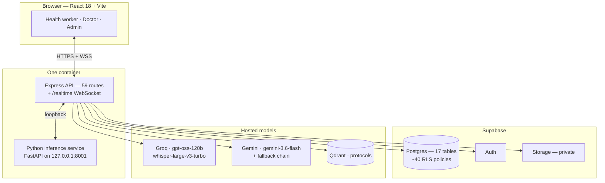

# AI-Powered Virtual Village Clinic

**A trained health worker at a village sub-centre. No resident doctor. This
platform closes that gap.**

> **Core product principle:** AI prepares the case. The doctor makes the medical
> decision.

Built for **Smart India Hackathon 2026 — Problem Statement 3: AI-Powered Virtual
Clinic for Rural Healthcare.**

---

## What it does

A health worker registers a patient by Aadhaar, records symptoms by voice in
Hindi or another Indian language, enters vitals, photographs the patient's paper
prescription and any visible injury, and runs an assessment.

A deterministic rule engine tiers the case. A classifier trained on 244,938
labelled symptom vectors proposes ranked disease candidates. A language model
writes the doctor-ready summary — and is forbidden from naming a diagnosis or a
medicine. The case is handed to a named doctor in the same district, who reviews
it, consults over video if needed, and signs the prescription.

High-risk cases skip all of that and go straight to the nearest of 75 real
district hospitals.

---

## Why it is different

Most entries to a problem like this wire a public LLM to a prompt. This one has a
trained model, deterministic clinical rules that override it, and safety
boundaries enforced in code rather than asserted in a slide.

| | |
|---|---|
| **A model with a measured accuracy** | Bernoulli Naive Bayes over 244,938 labelled symptom vectors — 377 symptoms, 582 diseases. **Top-1 0.854, top-5 0.974** on 48,988 held-out cases. The artifact is committed to this repository |
| **The LLM is bounded by the trained model** | It may re-rank and reject the classifier's candidates. It may not introduce a disease outside them. Output stays traceable to training data, not to the model's imagination |
| **Rules override the model, always** | `final_tier = MAX(rule, vision, model)`. A model can raise a tier and can never lower one |
| **Medication is withheld from the health worker entirely** | The problem statement permits protocol-based OTC suggestions. This system builds that engine, gates it eight ways, tests it — and then does not show it to the operator. A health worker acting on a drug name from an automated summary is the specific outcome this prevents |
| **Nothing is ever fabricated** | Silence returns no transcript, not a plausible sentence. An unreadable document returns no extraction. No hospital bed count is displayed, because no real-time feed exists |
| **It says what it does not know** | A flat posterior over 582 classes reports `confident: false` rather than five near-tied guesses presented as a shortlist |
| **Honest about what is not validated** | The triage thresholds and the formulary are drawn from published guidance and have **not** been reviewed by a registered practitioner for this deployment. The system says so on its own pages |

---

## Key features

**Multilingual speech capture** — Hindi, English, Tamil, Telugu, Marathi,
Bengali, Gujarati, auto-detected. Three independent gates reject Whisper's
hallucinations on silence, because a fabricated symptom is worse than a missing
one.

**Document OCR with mandatory human verification** — prescriptions and multi-page
lab reports, read natively including PDFs, with all pages in one model call so
cross-page context survives. An extraction is a **draft** until a human confirms
it.

**Health-card reading** — an ABHA or health card photograph pre-fills
registration as a proposal the operator accepts field by field. Stores nothing.
A name of pure digits, a future date of birth or an unknown gender is refused,
and the API reports which fields it refused.

**Wound-photo observation** — observational only, never diagnostic, confidence
capped at "moderate" in code as well as in the prompt. Photographs live in a
private bucket behind one-hour signed URLs.

**Deterministic clinical triage** — seven age bands from PALS and WHO IMNCI,
automatic Celsius conversion, IMNCI dehydration assessed as a syndrome, and the
rule that a reading of `0` is a reading rather than an absence.

**Doctor queue and review** — worst-first, day-wise, scoped to cases assigned to
that doctor. A review requires a diagnosis. The decision travels back to the
health worker in real time.

**Video consultation** — peer-to-peer WebRTC over the platform's own
authenticated WebSocket. No third-party SDK, no per-minute cost, and consultation
media never traverses a vendor.

**Emergency referral** — 75 UP district hospitals by real coordinates, nearest
computed locally, no paid mapping API. Works when the link is bad, which is when
it is needed.

**Six-role administration** — super, state and district admins, doctors, health
workers and a read-only auditor, each scoped by a database column rather than a
UI filter. **Administrators cannot read a patient record at all** — enforced at
the router and again in row-level security.

---

## Architecture



The assessment pipeline, in order — the order **is** the safety argument:

```
deterministic rules  →  vision severity  →  trained classifier
      ↓                      ↓                     ↓
   sets the floor      may raise only        bounded candidates
                              ↓
                  LLM synthesis — may raise, never lower;
                  may re-rank candidates, never invent one;
                  may not name a medicine
                              ↓
              medication deleted from every source
                              ↓
                  doctor-ready handoff + tier workflow
```

---

## Tech stack

| Layer | Choice |
|---|---|
| Backend | Node.js 22, Express 4, ESM |
| Database | PostgreSQL via Supabase — 17 tables, ~40 RLS policies |
| Auth | Supabase Auth for passwords, own 12-hour JWT for sessions |
| Frontend | React 18, Vite 5, Tailwind 3, Three.js (landing page only) |
| Realtime | One authenticated WebSocket carrying notifications **and** call signalling |
| Video | Peer-to-peer WebRTC with perfect negotiation |
| Inference | Python 3.11, FastAPI, scikit-learn |
| Models | Groq `openai/gpt-oss-120b`, `whisper-large-v3-turbo`; Google `gemini-3.6-flash` |
| Retrieval | Qdrant Cloud, filtered on `approved = true` |
| OCR | Gemini multimodal, with a Tesseract.js fallback |
| PDF | pdfkit, server-side |
| Tests | Jest — **135 tests, 9 suites** — plus pytest for the symptom matcher |
| Deploy | Railway + Nixpacks, one container |

Every choice, and the alternative it was made over, is in
[Tech Stack](PROJECT_DOCUMENTATION/07-tech-stack.md).

---

## Quick start

**Prerequisites:** Node.js ≥ 22, Python 3.11, a Supabase project, a Groq key, a
Gemini key.

```bash
git clone https://github.com/PriyamMishra853/RURALAI-.git
cd RURALAI-
```

```bash
cp backend/.env.example  backend/.env
cp frontend/.env.example frontend/.env
```

Fill both in — every variable is documented with its purpose in
[Setup Guide §4](PROJECT_DOCUMENTATION/01-setup-guide.md#4-environment-variables).

```bash
cd backend && npm install
cd ../frontend && npm install
cd .. && bash ./build-ai.sh
```

Apply the database, **in order**:

```bash
cd backend
npm run inspect                  # what is in the target now
npm run db:apply -- --confirm    # DESTRUCTIVE — runs 01–06
```

> ⚠️ `db:apply` currently stops at migration 06. Apply
> `database/v2/07_case_handoff.sql` through `10_admin_analytics.sql` by hand —
> see [Setup Guide §6](PROJECT_DOCUMENTATION/01-setup-guide.md#6-database-migration-order).
> Without them, case handoff, case withdrawal, emergency registration and the
> admin dashboard are all broken.

Seed and run:

```bash
npm run seed             # 36 states, 75 UP districts, 375 doctors, 1,875 patients
npm run seed:schedules   # without these, every booking date reads "Closed"
npm run seed:daily       # 5 cases per doctor, deterministic per date

ROOT_ADMIN_EMAIL=you@example.com ROOT_ADMIN_PASSWORD='a long unique password' npm run seed:root

cd ../frontend && npm run build
cd .. && bash ./start.sh          # http://localhost:5000
```

Verify:

```bash
cd backend
npm test          # 135 tests. No network, no AI quota spent
npm run check     # every external service reachable, models still exist
npm run preflight # is the system demo-ready right now?
```

Full instructions, including production deployment:
**[Setup Guide](PROJECT_DOCUMENTATION/01-setup-guide.md)**.

---

## Documentation

Complete technical documentation is in
**[`PROJECT_DOCUMENTATION/`](PROJECT_DOCUMENTATION/README.md)** — written from
the code, with every claim naming the file, table, endpoint or script that backs
it.

| | |
|---|---|
| [00 — Project Overview](PROJECT_DOCUMENTATION/00-project-overview.md) | Every built feature, the problem-statement coverage table, feasibility, scalability, sustainability, government-integration path |
| [01 — Setup Guide](PROJECT_DOCUMENTATION/01-setup-guide.md) | Clone to production, followable from zero |
| [02 — Dependencies](PROJECT_DOCUMENTATION/02-dependencies.md) | Every package, with the reason it is there and what breaks without it |
| [03 — Data Flow](PROJECT_DOCUMENTATION/03-data-flow.md) | Speech, OCR, image, triage and realtime paths, traced separately |
| [04 — Workflow](PROJECT_DOCUMENTATION/04-workflow.md) | The clinical journey, and each role's own sequence |
| [05 — Directory Structure](PROJECT_DOCUMENTATION/05-directory-structure.md) | Annotated tree, every significant file in one line |
| [06 — Database Schema](PROJECT_DOCUMENTATION/06-database-schema.md) | Every table, column, constraint, enum and index; ER diagram; migration history |
| [07 — Tech Stack](PROJECT_DOCUMENTATION/07-tech-stack.md) | Every technology and the alternative it beat |
| [08 — Security](PROJECT_DOCUMENTATION/08-security.md) | Including an explicit current-limitations section |
| [09 — Authentication](PROJECT_DOCUMENTATION/09-authentication.md) | Tokens, sessions, socket authentication |
| [10 — Authorisation](PROJECT_DOCUMENTATION/10-authorisation.md) | Full permission matrix; what each role is refused |
| [11 — AI Model Training](PROJECT_DOCUMENTATION/11-ai-model-training.md) | Datasets, training, measured accuracy, the matcher, the rule engine |
| [12 — Next-Generation Model — **roadmap**](PROJECT_DOCUMENTATION/12-next-generation-model-roadmap.md) | **In progress, not deployed.** The in-house clinical model programme |
| [13 — API Reference](PROJECT_DOCUMENTATION/13-api-reference.md) | All 59 routes and the WebSocket protocol |
| [14 — Testing and Quality](PROJECT_DOCUMENTATION/14-testing-and-quality.md) | What the 135 tests assert, and what is not covered |
| [15 — Error Handling and Observability](PROJECT_DOCUMENTATION/15-error-handling-and-observability.md) | Failure taxonomy, degradation ladder, performance |
| [16 — Known Limitations and Risks](PROJECT_DOCUMENTATION/16-known-limitations-and-risks.md) | Every gap and defect, unsoftened |
| [17 — Architecture Decision Record](PROJECT_DOCUMENTATION/17-architecture-decision-record.md) | 18 decisions; 11 forced by a specific failure |
| [18 — Glossary](PROJECT_DOCUMENTATION/18-glossary.md) | Clinical, Indian health-system and project terms |
| [19 — Contributing](PROJECT_DOCUMENTATION/19-contributing-and-conventions.md) | Conventions, the eight invariants, review checklist |

---

## Scale demonstrated

| | |
|---|---:|
| States and union territories | 36 |
| Districts (Uttar Pradesh) | 75 |
| District hospitals with real coordinates | 75 |
| Doctors | 375 |
| Health workers | 75 |
| Patients | 1,875 |
| Visits, risk-tiered | 1,875 |
| Disease classes | 582 |
| Symptom vocabulary | 377 |
| Clinical alias mappings | 280 |
| Labelled training vectors | 244,938 |
| API routes | 59 |
| Database tables | 17 |
| Automated tests | 135 |

---

## Status and honesty

This is a working system, deployed and answering. It is also a **demonstration
system**, and the documentation is explicit about the difference.

**Not yet validated:** the triage thresholds and the five-entry formulary are
drawn from WHO EML, NLEM, NEWS2, PALS and WHO IMNCI, and have **not** been
reviewed by a registered medical practitioner for this deployment. Medication
output is therefore suppressed by default in production, and the platform carries
a "not for clinical use" notice on its public pages.

**Known gaps** — including defects found while writing the documentation — are
listed in
[Known Limitations and Risks](PROJECT_DOCUMENTATION/16-known-limitations-and-risks.md),
with severity and what would close each one.

**Section 12 is a roadmap.** No fine-tuned model exists, no GPU has been
provisioned, and no clinical evaluation has been run. It says so in its own
opening lines.

---

## Safety and legal notice

> AI assistance does not replace professional medical diagnosis or treatment. All
> clinical decisions, prescriptions and referrals are made by qualified
> healthcare professionals registered under the National Medical Commission of
> India.
>
> This is a demonstration system. Its triage thresholds and medication list are
> drawn from published guidance but have not been reviewed or approved by a
> registered medical practitioner for this deployment.

---

## Credits

**Priyam Mishra — Core Developer**

- YouTube: <https://www.youtube.com/@XyzMishra-b8u>
- GitHub: <https://github.com/PriyamMishra853>
- LinkedIn: <https://www.linkedin.com/in/priyam-mishra-331177339/>
- Email: xyzmishra220@gmail.com

---

## License

MIT.
